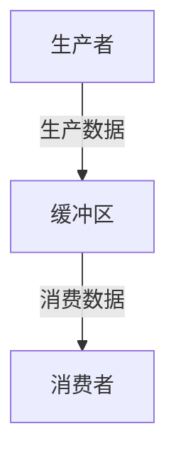

## 介绍

在多线程编程中，线程通信是一个核心概念。线程通信指的是多个线程之间如何交换信息或协调工作。操作系统提供了多种机制来实现线程通信，包括共享内存、消息传递、信号量等。理解这些机制对于编写高效、可靠的多线程程序至关重要。

## 线程通信机制

### 1. 共享内存

共享内存是最常见的线程通信方式之一。多个线程可以访问同一块内存区域，通过读写该区域来交换信息。

```python
import threading

shared_data = []

def producer():
    for i in range(5):
        shared_data.append(i)
        print(f"Produced: {i}")

def consumer():
    while len(shared_data) > 0:
        item = shared_data.pop(0)
        print(f"Consumed: {item}")

producer_thread = threading.Thread(target=producer)
consumer_thread = threading.Thread(target=consumer)

producer_thread.start()
consumer_thread.start()

producer_thread.join()
consumer_thread.join()
```

**输出：**
```
Produced: 0
Produced: 1
Produced: 2
Produced: 3
Produced: 4
Consumed: 0
Consumed: 1
Consumed: 2
Consumed: 3
Consumed: 4
```

:::note
共享内存虽然简单高效，但需要小心处理线程同步问题，否则可能导致数据竞争或死锁。
:::

### 2. 消息传递

消息传递是另一种常见的线程通信方式。线程通过发送和接收消息来交换信息。Python 中的 `queue.Queue` 是一个常用的消息传递工具。

```python
import threading
import queue

q = queue.Queue()

def producer():
    for i in range(5):
        q.put(i)
        print(f"Produced: {i}")

def consumer():
    while not q.empty():
        item = q.get()
        print(f"Consumed: {item}")

producer_thread = threading.Thread(target=producer)
consumer_thread = threading.Thread(target=consumer)

producer_thread.start()
consumer_thread.start()

producer_thread.join()
consumer_thread.join()
```

**输出：**
```
Produced: 0
Produced: 1
Produced: 2
Produced: 3
Produced: 4
Consumed: 0
Consumed: 1
Consumed: 2
Consumed: 3
Consumed: 4
```

:::tip
消息传递机制通常比共享内存更安全，因为它避免了直接的内存访问冲突。
:::

### 3. 信号量

信号量是一种用于控制多个线程对共享资源访问的同步机制。它通过计数器来控制线程的访问权限。

```python
import threading

semaphore = threading.Semaphore(1)

def critical_section():
    semaphore.acquire()
    print("Entering critical section")
    # 模拟临界区操作
    print("Exiting critical section")
    semaphore.release()

threads = []
for i in range(5):
    t = threading.Thread(target=critical_section)
    threads.append(t)
    t.start()

for t in threads:
    t.join()
```

**输出：**
```
Entering critical section
Exiting critical section
Entering critical section
Exiting critical section
Entering critical section
Exiting critical section
Entering critical section
Exiting critical section
Entering critical section
Exiting critical section
```

:::caution
信号量需要谨慎使用，过多的信号量可能导致性能下降或死锁。
:::

## 实际案例

### 生产者-消费者问题

生产者-消费者问题是经典的线程通信问题。生产者线程生成数据并将其放入缓冲区，消费者线程从缓冲区中取出数据并处理。



```python
import threading
import queue
import time

buffer = queue.Queue(maxsize=10)

def producer():
    for i in range(10):
        buffer.put(i)
        print(f"Produced: {i}")
        time.sleep(0.1)

def consumer():
    while True:
        item = buffer.get()
        print(f"Consumed: {item}")
        buffer.task_done()
        if item == 9:
            break

producer_thread = threading.Thread(target=producer)
consumer_thread = threading.Thread(target=consumer)

producer_thread.start()
consumer_thread.start()

producer_thread.join()
consumer_thread.join()
```

**输出：**
```
Produced: 0
Consumed: 0
Produced: 1
Consumed: 1
...
Produced: 9
Consumed: 9
```

:::warning
在实际应用中，生产者-消费者问题需要处理缓冲区满或空的情况，以避免线程阻塞。
:::

## 总结

线程通信是多线程编程中的核心概念。通过共享内存、消息传递和信号量等机制，线程可以有效地交换信息和协调工作。理解这些机制并正确使用它们，可以帮助你编写高效、可靠的多线程程序。

## 附加资源

- [Python 官方文档 - threading](https://docs.python.org/3/library/threading.html)
- [操作系统线程通信 - Wikipedia](https://en.wikipedia.org/wiki/Thread_(computing)#Inter-thread_communication)

## 练习

1. 修改生产者-消费者问题的代码，使其能够处理缓冲区满和空的情况。
2. 使用信号量实现一个简单的线程池，控制同时运行的线程数量。
3. 研究并实现一个使用消息传递的多线程聊天程序。
