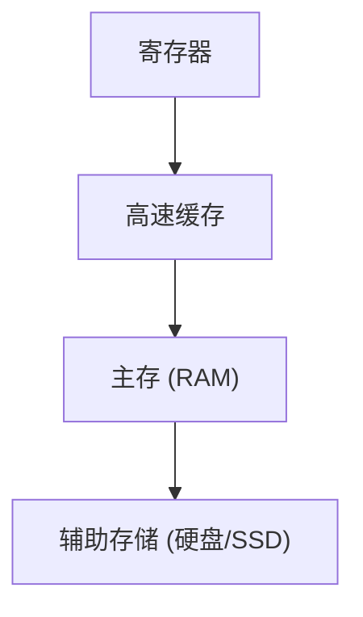

## 介绍

在计算机系统中，内存管理是操作系统的核心功能之一。为了高效地管理内存资源，操作系统采用了**内存层次结构**。内存层次结构是一种分层存储系统，旨在通过利用不同存储介质的特性（如速度、容量和成本）来优化性能。

内存层次结构通常包括多个层次，从最快的、容量最小的存储（如寄存器）到最慢的、容量最大的存储（如硬盘）。理解内存层次结构对于编写高效的程序至关重要，因为它直接影响程序的执行速度和资源利用率。

## 内存层次结构

内存层次结构通常分为以下几层：

1. **寄存器**：最快的存储介质，位于 CPU 内部，用于存储当前正在执行的指令和数据。
2. **高速缓存（Cache）**：分为 L1、L2 和 L3 缓存，速度仅次于寄存器，用于存储频繁访问的数据。
3. **主存（RAM）**：速度较慢但容量较大，用于存储正在运行的程序和数据。
4. **辅助存储（如硬盘、SSD）**：速度最慢但容量最大，用于长期存储数据。

以下是一个典型的内存层次结构图：



:::note
**注意**：内存层次结构中的每一层都比上一层速度更慢、容量更大、成本更低。
:::

## 内存层次的工作原理

内存层次结构的工作原理基于**局部性原理**，包括时间局部性和空间局部性：

- **时间局部性**：如果一个数据被访问过，那么它很可能在不久的将来再次被访问。
- **空间局部性**：如果一个数据被访问过，那么它附近的数据也很可能被访问。

操作系统利用这些原理，将频繁访问的数据存储在速度更快的存储介质中，从而提高系统的整体性能。

### 示例：缓存命中与未命中

假设我们有一个简单的程序，访问一个数组中的元素：

```c
#include <stdio.h>

int main() {
    int array[1000];
    for (int i = 0; i < 1000; i++) {
        array[i] = i;
    }
    return 0;
}
```

在这个例子中，数组 `array` 的数据会被加载到高速缓存中。如果程序多次访问 `array` 中的元素，这些访问可能会在高速缓存中命中，从而加快访问速度。如果数据不在高速缓存中，则需要从主存中加载，这会导致**缓存未命中**，从而增加访问时间。

## 实际应用场景

### 1. 数据库管理系统

在数据库管理系统中，内存层次结构对性能至关重要。数据库系统通常会使用高速缓存来存储频繁访问的数据（如索引和热点数据），从而减少对硬盘的访问次数，提高查询速度。

### 2. 游戏开发

在游戏开发中，内存层次结构直接影响游戏的加载速度和运行性能。游戏引擎会利用高速缓存来存储纹理、模型等资源，以减少从硬盘加载数据的时间。

## 总结

内存层次结构是操作系统内存管理的核心概念之一。通过将数据存储在不同层次的存储介质中，操作系统能够优化性能并提高资源利用率。理解内存层次结构不仅有助于编写高效的程序，还能帮助开发者更好地理解计算机系统的工作原理。

## 附加资源与练习

### 附加资源
- 《操作系统概念》（原书第10版）—— Abraham Silberschatz 等
- [Understanding Memory Hierarchy](https://www.geeksforgeeks.org/memory-hierarchy-in-computers/) —— GeeksforGeeks

### 练习
1. 编写一个程序，测试不同大小的数组对缓存命中率的影响。
2. 研究并比较不同操作系统（如 Windows 和 Linux）在内存管理上的差异。
3. 使用性能分析工具（如 `perf` 或 `Valgrind`）分析程序的内存访问模式。

:::tip
**提示**：在实际编程中，尽量利用局部性原理来优化代码，例如通过循环展开、数据对齐等技术来提高缓存命中率。
:::