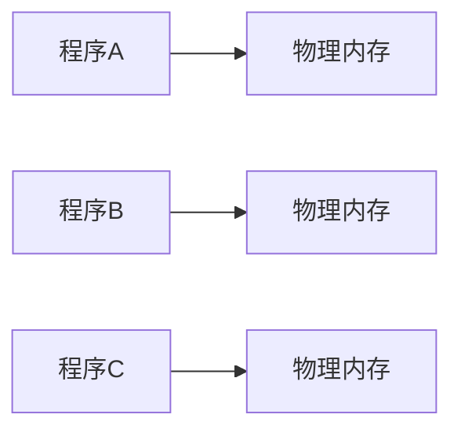

# 操作系统内存保护

## 介绍

在操作系统中，内存保护是一种关键机制，用于防止程序访问未授权的内存区域。每个程序在运行时都需要使用内存来存储数据和指令，但如果一个程序可以随意访问其他程序的内存，可能会导致数据损坏、系统崩溃甚至安全漏洞。因此，操作系统通过内存保护机制来确保每个程序只能访问其被分配的内存区域。

内存保护的核心目标是：
1. **隔离性**：确保每个程序的内存空间是独立的，互不干扰。
2. **安全性**：防止恶意程序或错误程序访问或修改其他程序的内存。
3. **稳定性**：避免因内存访问错误导致的系统崩溃。

## 内存保护的基本原理

操作系统通过硬件和软件的结合来实现内存保护。以下是内存保护的几个关键机制：

### 1. 地址空间隔离

每个程序在运行时都有自己的虚拟地址空间，操作系统通过内存管理单元（MMU）将虚拟地址映射到物理地址。这样，即使两个程序使用相同的虚拟地址，它们实际上访问的是不同的物理内存区域。


### 2. 内存分段和分页

操作系统使用分段和分页技术来管理内存。分段将内存划分为逻辑段（如代码段、数据段等），而分页则将内存划分为固定大小的页。通过分段和分页，操作系统可以更灵活地管理内存，并为每个程序分配独立的内存区域。


### 3. 权限控制

操作系统为每个内存页或段设置访问权限（如读、写、执行）。当程序试图访问某个内存区域时，硬件会检查该区域的权限。如果程序没有相应的权限，操作系统会触发一个异常，阻止程序继续执行。

:::note
**权限控制示例**：
- 代码段通常具有“读”和“执行”权限，但不允许“写”。
- 数据段通常具有“读”和“写”权限，但不允许“执行”。
:::

## 实际案例

### 案例1：缓冲区溢出攻击

缓冲区溢出是一种常见的安全漏洞，攻击者通过向程序的缓冲区写入超出其容量的数据，覆盖相邻的内存区域，从而执行恶意代码。内存保护机制可以防止这种攻击。

```c
#include <stdio.h>
#include <string.h>

void vulnerable_function(char *input) {
    char buffer[10];
    strcpy(buffer, input);  // 这里可能发生缓冲区溢出
}

int main() {
    char large_input[20] = "This is a large input";
    vulnerable_function(large_input);
    return 0;
}
```

在上述代码中，`buffer`的大小为10字节，但`large_input`的大小为20字节。如果没有内存保护机制，`strcpy`函数可能会覆盖`buffer`之后的内存区域，导致程序崩溃或执行恶意代码。

### 案例2：多任务环境中的内存隔离

在多任务操作系统中，多个程序同时运行。如果没有内存保护机制，一个程序可能会意外或故意访问另一个程序的内存，导致数据泄露或系统崩溃。



通过内存保护机制，操作系统确保每个程序只能访问其被分配的内存区域，从而避免程序之间的相互干扰。

## 总结

内存保护是操作系统中的一项重要机制，它通过地址空间隔离、分段和分页、权限控制等技术，确保每个程序只能访问其被分配的内存区域。这不仅提高了系统的稳定性和安全性，还防止了恶意程序或错误程序对其他程序或系统内存的破坏。

## 附加资源与练习

### 附加资源
- [操作系统内存管理 - Wikipedia](https://en.wikipedia.org/wiki/Memory_management_(operating_systems))
- [Understanding Memory Protection in Operating Systems](https://www.geeksforgeeks.org/memory-protection-in-operating-systems/)

### 练习
1. 编写一个简单的C程序，尝试访问未分配的内存区域，观察操作系统的反应。
2. 研究Linux操作系统中的`mmap`系统调用，了解如何使用它来分配和保护内存区域。
3. 思考：在多任务操作系统中，如果没有内存保护机制，可能会出现哪些问题？

通过学习和实践，你将更深入地理解操作系统内存保护的重要性及其实现方式。