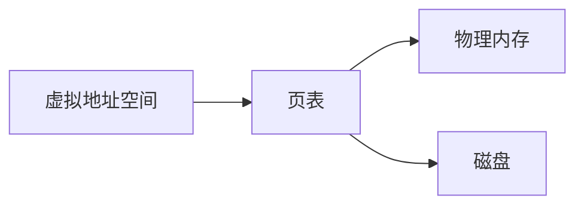

# 操作系统虚拟地址

在现代操作系统中，虚拟地址是一个关键概念，它为程序提供了独立的内存空间，使得每个程序都认为自己独占整个内存资源。本文将详细介绍虚拟地址的概念、工作原理及其实际应用。

## 什么是虚拟地址？

虚拟地址是操作系统为每个进程提供的一种抽象内存地址。每个进程都认为自己拥有一段连续的内存空间，但实际上，这些内存地址可能映射到物理内存的不同位置，甚至可能存储在磁盘上。这种机制使得操作系统能够更高效地管理内存资源，并提供了内存保护和隔离的功能。

## 虚拟地址的工作原理

虚拟地址通过**页表**（Page Table）映射到物理地址。页表是由操作系统维护的数据结构，它将虚拟地址空间划分为固定大小的页（通常为4KB），并将这些页映射到物理内存或磁盘上的页帧。



### 虚拟地址到物理地址的转换

当程序访问一个虚拟地址时，操作系统会通过页表将其转换为物理地址。如果该页不在物理内存中（即发生了**页错误**），操作系统会从磁盘中加载该页到物理内存，并更新页表。

:::note
**页错误**：当程序访问的虚拟地址对应的页不在物理内存中时，操作系统会触发页错误，并从磁盘中加载该页。
:::

## 虚拟地址的实际应用

### 1. 内存保护

虚拟地址使得每个进程都有自己独立的内存空间，操作系统可以通过页表控制每个进程的内存访问权限，从而防止一个进程访问或修改另一个进程的内存。

### 2. 内存共享

虚拟地址机制还允许不同进程共享同一段物理内存。例如，多个进程可以共享同一个动态链接库的代码段，从而节省内存资源。

### 3. 内存扩展

通过虚拟地址，操作系统可以将不常用的内存页交换到磁盘上，从而为其他进程腾出物理内存空间。这种机制称为**交换空间**（Swap Space），它使得系统能够运行比物理内存更大的程序。

## 代码示例

以下是一个简单的C语言程序，展示了如何通过指针访问虚拟地址：

```c
#include <stdio.h>

int main() {
    int a = 10;
    int *ptr = &a;

    printf("虚拟地址: %p\n", (void*)ptr);
    printf("值: %d\n", *ptr);

    return 0;
}
```

**输出：**
```
虚拟地址: 0x7ffee4b5c9a4
值: 10
```

在这个示例中，`ptr` 是一个指向变量 `a` 的指针，它存储的是变量 `a` 的虚拟地址。操作系统会通过页表将这个虚拟地址转换为物理地址，从而访问实际的内存数据。

## 总结

虚拟地址是操作系统内存管理的核心概念之一，它为每个进程提供了独立的内存空间，并通过页表机制实现了内存保护、共享和扩展。理解虚拟地址的工作原理对于深入学习操作系统和内存管理至关重要。

## 附加资源与练习

- **推荐阅读**：
  - 《操作系统概念》（Operating System Concepts）第9章：虚拟内存
  - 《深入理解计算机系统》（Computer Systems: A Programmer's Perspective）第9章：虚拟内存

- **练习**：
  1. 编写一个C程序，打印出多个变量的虚拟地址，并观察它们的分布。
  2. 研究Linux系统中的`/proc/[pid]/maps`文件，了解进程的虚拟内存布局。

通过本文的学习，你应该对虚拟地址有了初步的理解。继续探索和实践，你将更深入地掌握这一重要概念。