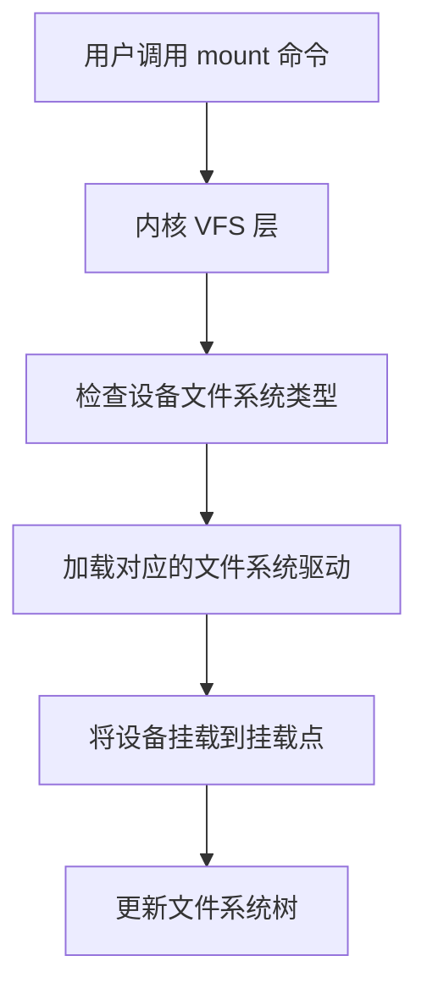

## 介绍

在操作系统中，**文件系统挂载**是指将一个存储设备（如硬盘分区、USB 驱动器或网络文件系统）连接到文件系统树中的某个目录，使得该设备中的文件和目录可以被访问。挂载点是文件系统树中的一个目录，挂载后，该目录的内容将被替换为挂载设备的内容。

通过挂载，操作系统可以将多个存储设备统一管理，形成一个逻辑上的文件系统树。这对于管理磁盘空间、访问外部设备以及共享文件系统至关重要。

---

## 文件系统挂载的基本概念

### 什么是挂载点？

挂载点是一个目录，用于将存储设备连接到文件系统树中。例如，将一个 USB 驱动器挂载到 `/mnt/usb` 目录后，访问 `/mnt/usb` 就相当于访问 USB 驱动器中的内容。

### 挂载的作用

- **统一管理**：将多个存储设备整合到一个文件系统树中，方便用户访问。
- **动态扩展**：可以在运行时挂载或卸载设备，无需重启系统。
- **资源共享**：通过网络文件系统（如 NFS）挂载远程文件系统，实现资源共享。

---

## 挂载命令

在 Linux 系统中，常用的挂载命令是 `mount`，卸载命令是 `umount`。

### 挂载设备

要将一个设备挂载到某个目录，可以使用以下命令：

```bash
sudo mount /dev/sdb1 /mnt/usb
```

- `/dev/sdb1` 是设备文件路径，表示要挂载的存储设备。
- `/mnt/usb` 是挂载点目录。

### 卸载设备

卸载设备时，使用 `umount` 命令：

```bash
sudo umount /mnt/usb
```

:::note
卸载设备时，确保没有进程正在使用该挂载点，否则会报错。
:::

---

## 挂载选项

`mount` 命令支持多种选项，用于控制挂载行为。以下是一些常用选项：

- `-t`：指定文件系统类型，例如 `ext4`、`ntfs`、`vfat` 等。
- `-o`：指定挂载选项，例如 `ro`（只读）、`rw`（读写）、`noexec`（禁止执行）等。

示例：

```bash
sudo mount -t ext4 -o ro /dev/sdb1 /mnt/usb
```

以上命令将 `/dev/sdb1` 以只读方式挂载到 `/mnt/usb`。

---

## 实际案例

### 案例 1：挂载 USB 驱动器

假设你插入了一个 USB 驱动器，设备文件为 `/dev/sdc1`，文件系统类型为 `vfat`。你可以将其挂载到 `/mnt/usb`：

```bash
sudo mount -t vfat /dev/sdc1 /mnt/usb
```

挂载后，访问 `/mnt/usb` 即可查看 USB 驱动器中的内容。

### 案例 2：挂载网络文件系统（NFS）

假设你有一台远程服务器，其共享目录为 `/shared`，IP 地址为 `192.168.1.100`。你可以通过 NFS 挂载该目录：

```bash
sudo mount -t nfs 192.168.1.100:/shared /mnt/nfs
```

挂载后，访问 `/mnt/nfs` 即可访问远程服务器上的共享文件。

---

## 挂载的底层原理

挂载的底层实现依赖于操作系统的 **VFS（虚拟文件系统）** 层。VFS 提供了一个抽象接口，使得不同的文件系统（如 ext4、NTFS、NFS）可以统一管理。

以下是一个简化的挂载流程：



---

## 总结

文件系统挂载是操作系统中管理存储设备的核心机制。通过挂载，用户可以将多个存储设备整合到一个统一的文件系统树中，方便访问和管理。掌握挂载命令和选项，能够帮助你更好地管理磁盘空间和外部设备。

---

## 附加资源与练习

### 资源
- [Linux mount 命令手册](https://man7.org/linux/man-pages/man8/mount.8.html)
- [VFS 虚拟文件系统详解](https://www.kernel.org/doc/html/latest/filesystems/vfs.html)

### 练习
1. 尝试将一个 USB 驱动器挂载到 `/mnt/usb`，并查看其内容。
2. 使用 `-o` 选项以只读方式挂载一个设备，并尝试写入文件，观察结果。
3. 研究如何通过 `/etc/fstab` 文件实现开机自动挂载。
