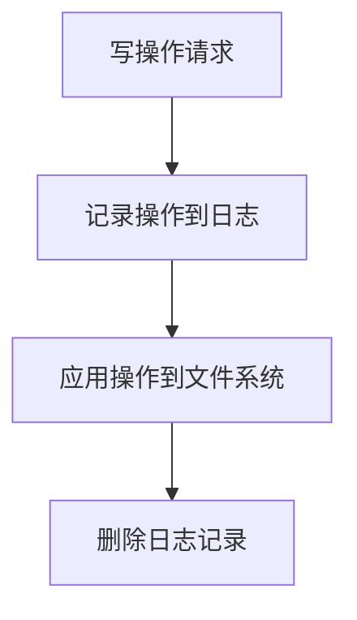

# 操作系统日志文件系统

日志文件系统（Journaling File System）是现代操作系统中广泛使用的一种文件系统类型。它的主要目的是提高文件系统的可靠性和恢复能力，特别是在系统崩溃或断电等意外情况下。本文将详细介绍日志文件系统的工作原理、优势以及实际应用场景。

## 什么是日志文件系统？

日志文件系统是一种在写入数据之前，先将操作记录到日志中的文件系统。这种机制可以确保在系统崩溃或断电时，文件系统能够快速恢复到一致状态，而无需进行长时间的文件系统检查（如 `fsck`）。

### 日志文件系统的工作原理

日志文件系统的核心思想是**记录操作**。当文件系统需要执行写操作时，它首先将这些操作记录到一个特殊的日志区域（称为日志或日志文件）。只有在日志记录完成后，文件系统才会将这些操作应用到实际的文件系统中。

这种机制的好处是，如果系统在写操作过程中崩溃，文件系统可以通过检查日志来恢复未完成的操作，从而避免数据损坏。



### 日志文件系统的优势

1. **快速恢复**：在系统崩溃后，日志文件系统可以通过检查日志快速恢复到一致状态，而不需要扫描整个文件系统。
2. **数据一致性**：日志文件系统可以确保在崩溃后，文件系统仍然保持一致性，减少数据丢失的风险。
3. **性能优化**：虽然日志记录会增加一些开销，但在大多数情况下，这种开销被快速恢复的优势所抵消。

## 日志文件系统的实际应用

日志文件系统在现代操作系统中得到了广泛应用。以下是一些常见的日志文件系统：

- **ext3/ext4**：Linux 系统中常用的日志文件系统。
- **NTFS**：Windows 系统中使用的文件系统，支持日志功能。
- **HFS+**：macOS 中使用的文件系统，也支持日志功能。

### 示例：ext4 文件系统的日志功能

在 Linux 系统中，`ext4` 文件系统默认启用了日志功能。以下是一个简单的示例，展示如何在 `ext4` 文件系统上创建一个文件并查看日志记录。

```bash
# 创建一个 ext4 文件系统
sudo mkfs.ext4 /dev/sdX1

# 挂载文件系统
sudo mount /dev/sdX1 /mnt

# 创建一个文件
echo "Hello, Journaling File System!" > /mnt/testfile.txt

# 查看文件系统日志
sudo dumpe2fs /dev/sdX1 | grep Journal
```

输出可能类似于以下内容：

```
Journal inode:            8
Journal backup:           inode blocks
Journal features:         journal_64bit
```

### 实际案例：数据库系统

日志文件系统在数据库系统中尤为重要。数据库系统通常需要频繁地写入数据，而日志文件系统可以确保在系统崩溃时，数据库能够快速恢复到一致状态，避免数据丢失。

例如，MySQL 数据库系统使用日志文件系统来记录事务日志（Transaction Log），以确保在崩溃后能够恢复未完成的事务。

## 总结

日志文件系统通过记录操作日志，提高了文件系统的可靠性和恢复能力。它在现代操作系统中得到了广泛应用，特别是在需要高数据一致性和快速恢复的场景中。

### 附加资源

- [ext4 文件系统文档](https://www.kernel.org/doc/Documentation/filesystems/ext4.txt)
- [NTFS 文件系统概述](https://docs.microsoft.com/en-us/windows/win32/fileio/ntfs-overview)
- [HFS+ 文件系统介绍](https://developer.apple.com/library/archive/documentation/FileManagement/Conceptual/APFS_Guide/Introduction/Introduction.html)

### 练习

1. 在 Linux 系统上创建一个 `ext4` 文件系统，并尝试在系统崩溃后恢复文件系统。
2. 研究其他日志文件系统（如 NTFS 或 HFS+），并比较它们与 `ext4` 的异同。

通过本文的学习，你应该对日志文件系统有了基本的了解，并能够在实际应用中识别和使用它。