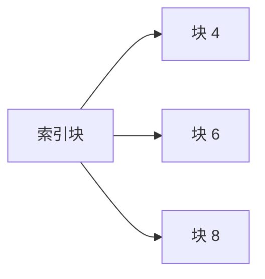

# 操作系统文件分配

在操作系统中，文件分配是指操作系统如何将文件存储在磁盘或其他存储设备上的方法。文件分配策略直接影响文件的访问速度、存储空间的利用率和系统的整体性能。本文将详细介绍几种常见的文件分配方法，并通过实际案例帮助你更好地理解这些概念。

## 文件分配的基本概念

文件分配的主要目标是有效地管理磁盘空间，同时确保文件能够快速访问。操作系统通常使用以下几种文件分配方法：

1. **连续分配**
2. **链接分配**
3. **索引分配**

接下来，我们将逐一介绍这些方法。

---

## 1. 连续分配

连续分配是最简单的文件分配方法。在这种方法中，文件被存储在磁盘上连续的物理块中。每个文件都有一个起始块地址和长度，操作系统通过这些信息来访问文件。

### 优点
- **访问速度快**：由于文件是连续存储的，顺序访问非常高效。
- **简单易实现**：文件的管理逻辑简单，易于实现。

### 缺点
- **外部碎片**：随着文件的创建和删除，磁盘上可能会出现许多不连续的空闲块，导致外部碎片。
- **文件扩展困难**：如果文件需要扩展，可能没有足够的连续空间。

### 实际案例
假设我们有一个文件 `file1`，它需要占用 3 个磁盘块。操作系统会在磁盘上找到 3 个连续的块来存储这个文件。

在这个例子中，`file1` 被存储在块 0、块 1 和块 2 中。

---

## 2. 链接分配

链接分配通过链表的方式将文件的各个块链接在一起。每个块包含一个指向下一个块的指针，文件的最后一个块指向一个特殊的结束标记。

### 优点
- **无外部碎片**：文件可以分散存储在磁盘的任何位置，不会产生外部碎片。
- **文件扩展方便**：文件可以轻松扩展，只需找到空闲块并更新指针即可。

### 缺点
- **访问速度慢**：由于文件块是分散的，顺序访问需要遍历链表，速度较慢。
- **指针占用空间**：每个块都需要存储指针，这会占用一定的存储空间。

### 实际案例
假设我们有一个文件 `file2`，它被存储在块 3、块 5 和块 7 中。每个块包含一个指向下一个块的指针。

在这个例子中，`file2` 的块通过指针链接在一起。

---

## 3. 索引分配

索引分配通过一个索引块来管理文件的各个块。索引块中存储了文件所有块的地址，文件的实际数据块可以分散存储在磁盘的任何位置。

### 优点
- **访问速度快**：通过索引块可以快速定位文件的各个块。
- **无外部碎片**：文件块可以分散存储，不会产生外部碎片。

### 缺点
- **索引块占用空间**：每个文件都需要一个索引块，这会占用一定的存储空间。
- **大文件管理复杂**：对于非常大的文件，可能需要多级索引，增加了管理的复杂性。

### 实际案例
假设我们有一个文件 `file3`，它被存储在块 4、块 6 和块 8 中。索引块中存储了这些块的地址。

在这个例子中，`file3` 的块通过索引块进行管理。

---

## 实际应用场景

文件分配方法的选择取决于具体的应用场景。例如：

- **连续分配** 适用于需要频繁顺序访问的文件，如视频文件。
- **链接分配** 适用于需要频繁扩展的文件，如日志文件。
- **索引分配** 适用于需要快速随机访问的文件，如数据库文件。

---

## 总结

文件分配是操作系统中非常重要的概念，不同的分配方法各有优缺点。连续分配适合顺序访问，但容易产生外部碎片；链接分配解决了碎片问题，但访问速度较慢；索引分配提供了快速的随机访问，但需要额外的存储空间。

在实际应用中，操作系统通常会根据文件的特点选择合适的分配方法，以达到最佳的性能和存储效率。

---

## 附加资源与练习

### 附加资源
- [操作系统文件管理 - 维基百科](https://zh.wikipedia.org/wiki/文件系统)
- [文件分配方法详解 - GeeksforGeeks](https://www.geeksforgeeks.org/file-allocation-methods/)

### 练习
1. 假设你有一个需要频繁扩展的文件，你会选择哪种文件分配方法？为什么？
2. 设计一个简单的文件系统，使用索引分配方法管理文件。编写伪代码实现文件的读取和写入操作。

:::tip
**提示**：在实现文件系统时，考虑如何管理索引块和文件块的分配与释放。
:::