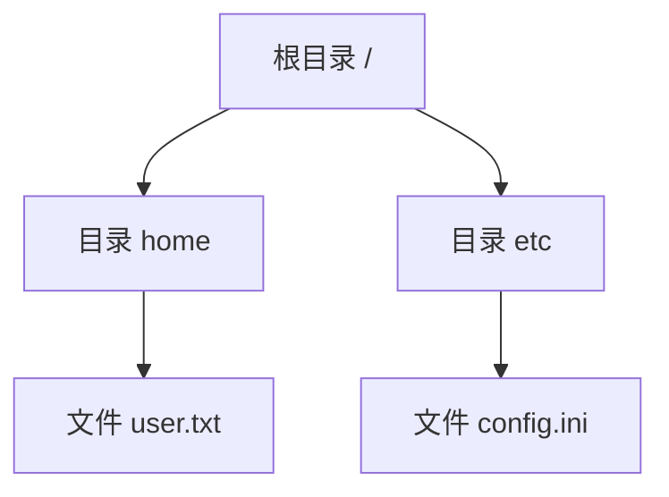

## 介绍

文件系统是操作系统中用于管理存储设备（如硬盘、SSD）上数据的重要组成部分。它负责组织、存储和检索文件，同时提供对文件的访问控制和权限管理。文件系统的实现涉及数据结构、算法和硬件交互，是操作系统设计的核心模块之一。

本文将逐步讲解文件系统的基本概念、实现原理以及实际应用场景，帮助你从零开始理解文件系统的运作方式。

---

## 文件系统的基本概念

### 1. 文件与目录
文件是存储在存储设备上的数据集合，通常具有名称、大小和类型等属性。目录（也称为文件夹）是文件的容器，用于组织文件和其他目录。

### 2. 文件系统的层次结构
文件系统通常采用树状结构，根目录（`/`）位于顶层，子目录和文件嵌套在其下。例如：



### 3. 文件系统的功能
- **存储管理**：分配和回收存储空间。
- **文件管理**：创建、删除、读取和写入文件。
- **权限控制**：管理用户对文件的访问权限。
- **数据一致性**：确保数据在崩溃或断电时不会损坏。

---

## 文件系统的实现原理

### 1. 磁盘分区与格式化
文件系统通常建立在磁盘分区上。分区是物理磁盘的逻辑划分，格式化则是为分区创建文件系统的过程。常见的文件系统类型包括：
- **FAT32**：适用于小型存储设备。
- **NTFS**：Windows 系统的默认文件系统。
- **ext4**：Linux 系统的默认文件系统。

### 2. 文件系统的数据结构
文件系统使用多种数据结构来管理文件和存储空间：
- **超级块（Superblock）**：存储文件系统的元数据，如大小、块大小等。
- **索引节点（Inode）**：存储文件的元数据，如权限、大小、位置等。
- **目录项（Directory Entry）**：存储文件名和对应的索引节点号。

### 3. 文件存储与分配
文件系统需要将文件数据存储在磁盘块中。常见的分配策略包括：
- **连续分配**：文件存储在连续的磁盘块中。
- **链式分配**：每个磁盘块包含指向下一个块的指针。
- **索引分配**：使用索引块存储文件的所有磁盘块指针。

---

## 代码示例：模拟文件系统操作

以下是一个简单的 Python 示例，模拟文件系统的基本操作：

```python
class FileSystem:
    def __init__(self):
        self.files = {}

    def create_file(self, name, content):
        self.files[name] = content
        print(f"文件 '{name}' 创建成功。")

    def read_file(self, name):
        if name in self.files:
            print(f"文件 '{name}' 的内容：{self.files[name]}")
        else:
            print(f"文件 '{name}' 不存在。")

    def delete_file(self, name):
        if name in self.files:
            del self.files[name]
            print(f"文件 '{name}' 删除成功。")
        else:
            print(f"文件 '{name}' 不存在。")

# 示例用法
fs = FileSystem()
fs.create_file("test.txt", "Hello, World!")
fs.read_file("test.txt")
fs.delete_file("test.txt")
```

**输出：**
```
文件 'test.txt' 创建成功。
文件 'test.txt' 的内容：Hello, World!
文件 'test.txt' 删除成功。
```

---

## 实际应用场景

### 1. 数据库管理系统
数据库系统通常依赖文件系统来存储数据文件和日志文件。文件系统的高效管理直接影响数据库的性能。

### 2. 云存储服务
云存储服务（如 Google Drive、Dropbox）使用分布式文件系统来存储用户数据，并提供高可用性和可扩展性。

### 3. 嵌入式系统
嵌入式设备（如智能家居设备）通常使用轻量级文件系统（如 FAT32）来管理配置文件和固件。

---

## 总结

文件系统是操作系统中不可或缺的一部分，它通过高效的数据结构和算法管理存储设备上的数据。本文介绍了文件系统的基本概念、实现原理以及实际应用场景，并通过代码示例帮助你理解其运作方式。

---

## 附加资源与练习

### 推荐资源
- 《操作系统概念》（Abraham Silberschatz 等）
- [Linux 文件系统文档](https://www.kernel.org/doc/html/latest/filesystems/index.html)

### 练习
1. 修改上述 Python 示例，添加对目录的支持。
2. 研究 ext4 文件系统的超级块结构，并尝试解析其内容。
3. 实现一个简单的链式分配策略，模拟文件存储过程。

:::tip
如果你对文件系统的底层实现感兴趣，可以尝试阅读 Linux 内核源码中的文件系统模块！
:::