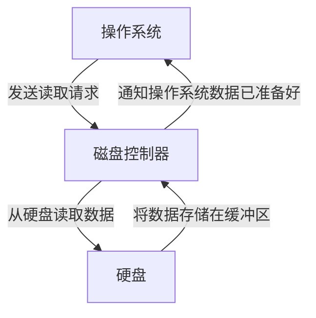

## 介绍

在操作系统中，**设备控制器**是硬件和操作系统之间的桥梁。它负责管理硬件设备（如键盘、鼠标、打印机、磁盘等）的操作，并将设备的输入/输出请求传递给操作系统。设备控制器是计算机系统中不可或缺的一部分，因为它使得操作系统能够以统一的方式与各种硬件设备进行交互。

设备控制器通常是一个独立的硬件组件，它包含自己的处理器、内存和寄存器。操作系统通过设备驱动程序与设备控制器通信，从而控制硬件设备的行为。

## 设备控制器的功能

设备控制器的主要功能包括：

1. **设备管理**：设备控制器负责管理硬件设备的操作，包括启动、停止、读取和写入数据。
2. **数据缓冲**：设备控制器通常包含一个缓冲区，用于临时存储从设备读取或写入设备的数据。
3. **错误检测与纠正**：设备控制器能够检测设备操作中的错误，并尝试纠正这些错误。
4. **中断处理**：当设备完成操作或发生错误时，设备控制器会向操作系统发送中断信号，通知操作系统进行处理。

## 设备控制器与操作系统的交互

操作系统通过设备驱动程序与设备控制器进行交互。设备驱动程序是操作系统的一部分，它知道如何与特定的设备控制器通信。当应用程序需要访问硬件设备时，它会向操作系统发出请求，操作系统则通过设备驱动程序将请求传递给设备控制器。

### 代码示例

以下是一个简单的伪代码示例，展示了操作系统如何通过设备驱动程序与设备控制器交互：

```c
// 假设我们有一个设备驱动程序，用于控制打印机
void print_document(const char* document) {
    // 1. 向设备控制器发送启动命令
    send_command_to_controller(START_PRINTING);

    // 2. 将文档数据发送到设备控制器的缓冲区
    send_data_to_controller(document);

    // 3. 等待设备控制器完成打印
    wait_for_controller_to_finish();

    // 4. 检查是否有错误发生
    if (check_for_errors()) {
        handle_error();
    } else {
        // 打印成功
        printf("Document printed successfully.\n");
    }
}
```

在这个示例中，`send_command_to_controller` 和 `send_data_to_controller` 是设备驱动程序的函数，它们负责与设备控制器通信。`wait_for_controller_to_finish` 函数等待设备控制器完成操作，而 `check_for_errors` 函数则检查是否有错误发生。

## 实际案例

### 案例：磁盘控制器

磁盘控制器是设备控制器的一个典型例子。它负责管理硬盘驱动器的操作，包括读取和写入数据。当操作系统需要从硬盘读取数据时，它会向磁盘控制器发送读取请求。磁盘控制器会从硬盘中读取数据，并将其存储在缓冲区中，然后通知操作系统数据已准备好。



在这个案例中，磁盘控制器充当了操作系统和硬盘之间的中介，使得操作系统能够以统一的方式访问硬盘。

## 总结

设备控制器是操作系统与硬件设备之间的关键组件。它负责管理设备的操作、处理数据缓冲、检测错误并处理中断。通过设备驱动程序，操作系统能够与设备控制器进行通信，从而控制硬件设备的行为。

理解设备控制器的工作原理对于深入学习操作系统和硬件交互至关重要。希望本文能够帮助你更好地理解这一概念。

## 附加资源与练习

- **练习**：尝试编写一个简单的设备驱动程序伪代码，用于控制鼠标设备。
- **资源**：阅读操作系统教材中关于设备管理和设备控制器的章节，进一步了解其工作原理。
- **挑战**：研究现代操作系统中的设备控制器如何支持即插即用（Plug and Play）功能。

:::tip
如果你对设备控制器的实现细节感兴趣，可以深入研究 Linux 内核中的设备驱动程序代码，了解实际的操作系统是如何与硬件设备交互的。
:::