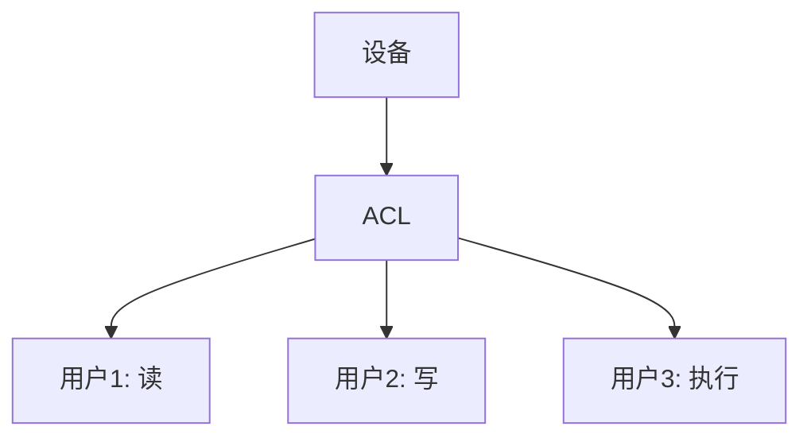

# 操作系统设备保护

在现代计算机系统中，设备（如硬盘、打印机、网络接口等）是操作系统管理的重要资源。为了保护这些设备免受未经授权的访问和滥用，操作系统实现了一系列设备保护机制。本文将详细介绍这些机制，并通过实际案例帮助初学者理解其重要性。

## 什么是设备保护？

设备保护是指操作系统通过硬件和软件机制，确保只有经过授权的进程或用户才能访问和使用系统中的设备。这种保护机制可以防止恶意软件或错误操作对设备造成损害，同时确保系统的安全性和稳定性。

## 设备保护的必要性

1. **防止未经授权的访问**：未经授权的用户或进程可能会滥用设备，导致数据泄露或设备损坏。
2. **避免资源冲突**：多个进程同时访问同一设备可能导致资源冲突，影响系统性能。
3. **确保系统稳定性**：错误的设备操作可能导致系统崩溃或数据丢失。

## 设备保护的实现机制

### 1. 设备驱动程序

设备驱动程序是操作系统与硬件设备之间的桥梁。操作系统通过设备驱动程序管理设备的访问权限。每个设备驱动程序都实现了特定的接口，操作系统通过这些接口控制设备的访问。

```c
// 示例：简单的设备驱动程序接口
int open_device(const char *device_name) {
    // 检查权限
    if (!check_permission(device_name)) {
        return -1; // 权限不足
    }
    // 打开设备
    return open(device_name, O_RDWR);
}
```

### 2. 访问控制列表（ACL）

访问控制列表是一种用于管理设备访问权限的机制。每个设备都有一个ACL，列出了哪些用户或进程可以访问该设备以及可以执行的操作（如读、写、执行）。



### 3. 设备隔离

操作系统通过虚拟化技术将设备隔离，确保每个进程只能访问其分配的设备。例如，虚拟机监控程序（Hypervisor）可以为每个虚拟机分配独立的虚拟设备，防止虚拟机之间的设备冲突。

### 4. 设备权限管理

操作系统通过权限管理机制控制设备的访问权限。例如，在Linux系统中，设备的访问权限可以通过文件系统的权限位来控制。

```bash
# 示例：查看设备的权限
$ ls -l /dev/sda
brw-rw---- 1 root disk 8, 0 Oct 1 12:34 /dev/sda
```

在上面的示例中，`/dev/sda` 设备的权限为 `brw-rw----`，表示只有 `root` 用户和 `disk` 组的用户才能读写该设备。

## 实际案例

### 案例1：打印机设备的保护

在一个多用户系统中，打印机是一个共享设备。为了防止未经授权的用户滥用打印机，操作系统可以通过以下方式保护打印机设备：

1. **权限控制**：只有特定用户组的成员才能使用打印机。
2. **打印队列管理**：操作系统管理打印队列，确保每个用户的打印任务按顺序执行，避免资源冲突。

```bash
# 示例：设置打印机权限
$ sudo chown root:lp /dev/lp0
$ sudo chmod 660 /dev/lp0
```

### 案例2：网络接口的保护

网络接口是系统中重要的设备之一，未经授权的访问可能导致数据泄露或网络攻击。操作系统可以通过以下方式保护网络接口：

1. **防火墙**：通过防火墙规则限制网络接口的访问。
2. **权限管理**：只有具有特定权限的用户才能配置网络接口。

```bash
# 示例：配置网络接口权限
$ sudo chown root:netdev /etc/network/interfaces
$ sudo chmod 640 /etc/network/interfaces
```

## 总结

设备保护是操作系统确保系统安全性和稳定性的重要机制。通过设备驱动程序、访问控制列表、设备隔离和权限管理等机制，操作系统可以有效防止未经授权的访问和资源冲突。理解这些机制对于初学者掌握操作系统的基本原理至关重要。

## 附加资源与练习

- **资源**：
  - [操作系统概念](https://www.os-book.com/) - 一本详细介绍操作系统原理的书籍。
  - [Linux设备驱动程序](https://lwn.net/Kernel/LDD3/) - 学习如何编写Linux设备驱动程序。

- **练习**：
  1. 在Linux系统中，尝试修改一个设备的权限，并观察其效果。
  2. 编写一个简单的设备驱动程序，实现基本的设备保护机制。
