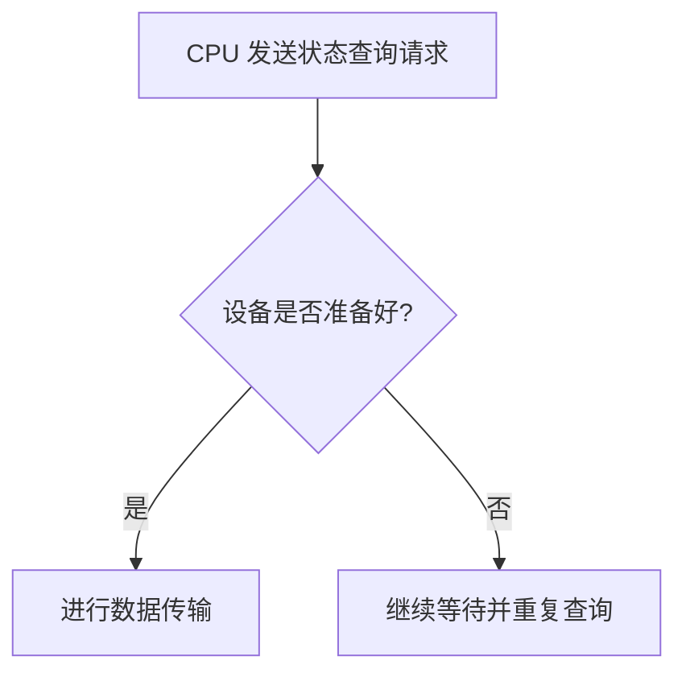

## 什么是操作系统轮询？

轮询（Polling）是操作系统中一种常见的输入输出（I/O）处理机制。它的核心思想是让 CPU 定期检查设备的状态，以确定设备是否准备好进行数据传输。轮询是一种**主动**的 I/O 处理方式，CPU 需要不断询问设备的状态，直到设备准备好为止。

与轮询相对的是**中断**机制，中断是被动的，设备准备好时会主动通知 CPU。轮询的优点是实现简单，但缺点是会占用大量 CPU 资源，尤其是在设备未准备好时，CPU 会一直处于忙碌等待状态。

## 轮询的工作原理

轮询的基本流程如下：

1. CPU 向设备发送一个状态查询请求。
2. 设备返回当前状态（例如，是否准备好）。
3. 如果设备未准备好，CPU 会继续等待并重复查询。
4. 如果设备准备好，CPU 开始进行数据传输。

以下是一个简单的轮询流程图：



## 轮询的代码示例

以下是一个简单的轮询机制的伪代码示例，假设我们有一个设备需要读取数据：

```python
def poll_device(device):
    while True:
        status = device.check_status()  # 检查设备状态
        if status == "READY":
            data = device.read_data()  # 读取数据
            return data
        else:
            time.sleep(0.1)  # 等待一段时间后再次查询
```

### 输入和输出

- **输入**：设备的状态（例如，`READY` 或 `BUSY`）。
- **输出**：从设备读取的数据。

:::note
在实际编程中，轮询通常会结合超时机制，以避免无限等待。例如，可以设置一个最大轮询次数或最大等待时间。
:::

## 轮询的实际应用场景

轮询机制在以下场景中非常常见：

1. **嵌入式系统**：在资源有限的嵌入式设备中，轮询是一种简单且有效的 I/O 处理方式。
2. **网络通信**：在某些网络协议中，客户端会定期向服务器发送请求以检查是否有新数据。
3. **硬件设备控制**：例如，打印机、扫描仪等设备的状态检查通常使用轮询机制。

### 案例：网络服务器的心跳检测

假设我们有一个网络服务器，客户端需要定期向服务器发送心跳包以确认连接状态。服务器可以使用轮询机制来检查客户端是否在线：

```python
def check_client_heartbeat(client):
    while True:
        status = client.get_status()  # 获取客户端状态
        if status == "ONLINE":
            print("客户端在线")
        else:
            print("客户端离线")
        time.sleep(10)  # 每 10 秒检查一次
```

## 轮询的优缺点

### 优点
- **实现简单**：轮询的逻辑非常直观，易于理解和实现。
- **无需额外硬件支持**：与中断机制不同，轮询不需要硬件支持。

### 缺点
- **占用 CPU 资源**：轮询会占用大量 CPU 时间，尤其是在设备未准备好时。
- **效率低**：轮询的效率通常低于中断机制，尤其是在高负载场景下。

:::caution
在高性能系统中，轮询可能会导致 CPU 资源浪费，因此需要谨慎使用。
:::

## 总结

轮询是操作系统中一种简单但重要的 I/O 处理机制。它通过定期检查设备状态来实现数据传输，适用于资源有限或对实时性要求不高的场景。然而，轮询的缺点也很明显，即会占用大量 CPU 资源。在实际开发中，需要根据具体需求选择合适的 I/O 处理方式。

## 附加资源与练习

### 推荐阅读
- 《操作系统概念》—— Abraham Silberschatz 等
- 《深入理解计算机系统》—— Randal E. Bryant 等

### 练习
1. 编写一个轮询程序，模拟从传感器读取数据的过程。
2. 比较轮询和中断机制的优缺点，并尝试在代码中实现中断机制。
3. 设计一个超时机制，避免轮询进入无限等待状态。

:::tip
尝试在实际项目中应用轮询机制，并观察其对系统性能的影响。
:::