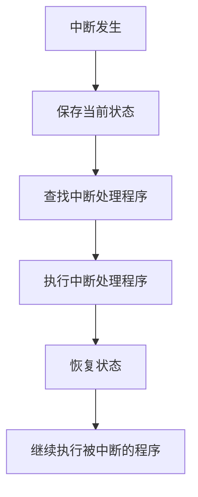

## 介绍

在计算机系统中，**中断**是一种重要的机制，用于处理外部事件或内部异常。中断允许操作系统暂停当前正在执行的任务，转而处理更高优先级的任务或事件。这种机制使得计算机能够高效地管理资源，并对外部事件做出快速响应。

中断可以分为两类：
1. **硬件中断**：由硬件设备触发，例如键盘输入、鼠标点击或网络数据包到达。
2. **软件中断**：由程序主动触发，例如系统调用或异常处理。

## 中断的工作原理

当硬件设备或软件需要操作系统处理某个事件时，它会发送一个中断信号。操作系统接收到中断信号后，会执行以下步骤：

1. **保存当前状态**：操作系统会保存当前正在执行的程序的上下文（例如寄存器状态、程序计数器等）。
2. **查找中断处理程序**：根据中断类型，操作系统会查找对应的中断处理程序（也称为中断服务例程，ISR）。
3. **执行中断处理程序**：操作系统执行 ISR 来处理中断事件。
4. **恢复状态**：处理完中断后，操作系统恢复之前保存的状态，继续执行被中断的程序。

以下是一个简化的流程图，展示了中断处理的过程：



## 中断的实际应用

### 硬件中断示例

假设用户按下键盘上的一个键，键盘控制器会发送一个中断信号给 CPU。操作系统接收到中断信号后，会执行以下步骤：

1. 保存当前正在运行的程序的状态。
2. 查找键盘中断的处理程序。
3. 执行键盘中断处理程序，读取按键数据并更新系统状态。
4. 恢复之前保存的状态，继续执行被中断的程序。

### 软件中断示例

在编程中，软件中断通常用于系统调用。例如，在 Linux 系统中，程序可以通过 `int 0x80` 指令触发一个软件中断，请求操作系统执行某个功能（如文件读写）。

以下是一个简单的汇编代码示例，展示了如何使用软件中断进行系统调用：

```asm
section .data
    msg db 'Hello, World!', 0xA
    len equ $ - msg

section .text
    global _start

_start:
    ; 系统调用号 (sys_write)
    mov eax, 4
    ; 文件描述符 (stdout)
    mov ebx, 1
    ; 消息地址
    mov ecx, msg
    ; 消息长度
    mov edx, len
    ; 触发软件中断
    int 0x80

    ; 系统调用号 (sys_exit)
    mov eax, 1
    ; 退出状态码
    mov ebx, 0
    ; 触发软件中断
    int 0x80
```

在这个例子中，程序通过 `int 0x80` 指令触发软件中断，请求操作系统执行 `sys_write` 和 `sys_exit` 系统调用。

## 中断的优先级

在计算机系统中，中断通常具有不同的优先级。高优先级的中断可以打断低优先级的中断处理程序。这种机制确保了关键任务能够及时得到处理。

例如，在实时操作系统中，硬件中断（如定时器中断）通常具有较高的优先级，以确保系统能够按时完成任务。

## 总结

中断是操作系统中的核心机制之一，它使得计算机能够高效地处理外部事件和内部异常。通过中断，操作系统可以在多个任务之间快速切换，确保系统的响应性和稳定性。

理解中断的工作原理对于学习操作系统和底层编程至关重要。希望本文能够帮助你更好地掌握这一概念。

## 附加资源与练习

- **推荐阅读**：
  - 《操作系统概念》（Operating System Concepts）
  - 《深入理解计算机系统》（Computer Systems: A Programmer's Perspective）
- **练习**：
  - 编写一个简单的汇编程序，使用软件中断实现文件读写操作。
  - 研究 Linux 内核中的中断处理机制，并尝试编写一个简单的内核模块来处理硬件中断。

:::tip
如果你对中断机制还有疑问，可以尝试在模拟器（如 QEMU）中运行一些简单的操作系统代码，观察中断的处理过程。
:::