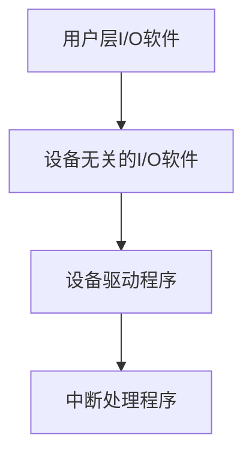

## 介绍

在操作系统中，输入输出（I/O）系统是计算机与外部设备（如键盘、鼠标、显示器、硬盘等）进行数据交换的关键部分。I/O软件层是操作系统中的一个重要组成部分，它负责管理和协调这些设备与计算机之间的通信。通过I/O软件层，操作系统能够高效地处理来自不同设备的请求，并为应用程序提供统一的接口。

本文将逐步讲解I/O软件层的结构、功能以及实际应用场景，帮助你理解这一概念。

## I/O软件层的结构

I/O软件层通常分为以下几个部分：

1. **用户层I/O软件**：这是最上层的I/O软件，通常由应用程序直接调用。它提供了简单的接口，如C语言中的`printf`和`scanf`函数。
2. **设备无关的I/O软件**：这一层负责处理与设备无关的操作，如缓冲、错误处理和设备命名。它确保应用程序不需要关心具体的硬件细节。
3. **设备驱动程序**：这是与硬件直接交互的软件层。每个设备都有其特定的驱动程序，负责将操作系统的请求转换为硬件能够理解的指令。
4. **中断处理程序**：当设备完成一个I/O操作时，它会通过中断通知操作系统。中断处理程序负责处理这些中断，并将控制权返回给操作系统。



## 代码示例

以下是一个简单的C语言程序，展示了如何使用用户层I/O软件进行输入和输出操作：

```c
#include <stdio.h>

int main() {
    char name[50];
    printf("请输入你的名字: ");
    scanf("%s", name);
    printf("你好, %s!\n", name);
    return 0;
}
```

### 输入输出示例

假设用户输入的名字是`Alice`，程序的输出将是：

```
请输入你的名字: Alice
你好, Alice!
```

## 实际应用场景

### 1. 文件读写

在文件系统中，I/O软件层负责管理文件的读写操作。例如，当你使用`fopen`函数打开一个文件时，操作系统会通过I/O软件层与硬盘驱动程序进行通信，读取文件内容并将其返回给应用程序。

```c
#include <stdio.h>

int main() {
    FILE *file = fopen("example.txt", "r");
    if (file == NULL) {
        printf("无法打开文件\n");
        return 1;
    }

    char buffer[100];
    while (fgets(buffer, 100, file) != NULL) {
        printf("%s", buffer);
    }

    fclose(file);
    return 0;
}
```

### 2. 网络通信

在网络通信中，I/O软件层负责管理网络接口卡（NIC）与操作系统之间的数据传输。例如，当你使用`socket`函数进行网络通信时，操作系统会通过I/O软件层与网络驱动程序进行交互，发送和接收数据包。

```c
#include <stdio.h>
#include <sys/socket.h>
#include <netinet/in.h>
#include <string.h>

int main() {
    int sockfd = socket(AF_INET, SOCK_STREAM, 0);
    if (sockfd < 0) {
        printf("无法创建套接字\n");
        return 1;
    }

    struct sockaddr_in server_addr;
    server_addr.sin_family = AF_INET;
    server_addr.sin_port = htons(8080);
    server_addr.sin_addr.s_addr = INADDR_ANY;

    if (bind(sockfd, (struct sockaddr *)&server_addr, sizeof(server_addr)) < 0) {
        printf("绑定失败\n");
        return 1;
    }

    listen(sockfd, 5);
    printf("服务器正在监听...\n");

    return 0;
}
```

## 总结

I/O软件层是操作系统中不可或缺的一部分，它负责管理和协调计算机与外部设备之间的通信。通过本文的学习，你应该对I/O软件层的结构、功能以及实际应用场景有了初步的了解。

:::tip
如果你想进一步深入学习，可以尝试编写一个简单的设备驱动程序，或者研究操作系统中I/O调度的算法。
:::

## 附加资源

- 《操作系统概念》—— Abraham Silberschatz, Peter B. Galvin, Greg Gagne
- [Linux设备驱动程序开发指南](https://www.kernel.org/doc/html/latest/driver-api/index.html)

## 练习

1. 编写一个C语言程序，使用`fopen`和`fwrite`函数将用户输入的内容写入文件。
2. 研究Linux中的`/dev`目录，了解设备文件的作用。
3. 尝试编写一个简单的网络服务器，使用`socket`函数进行通信。
