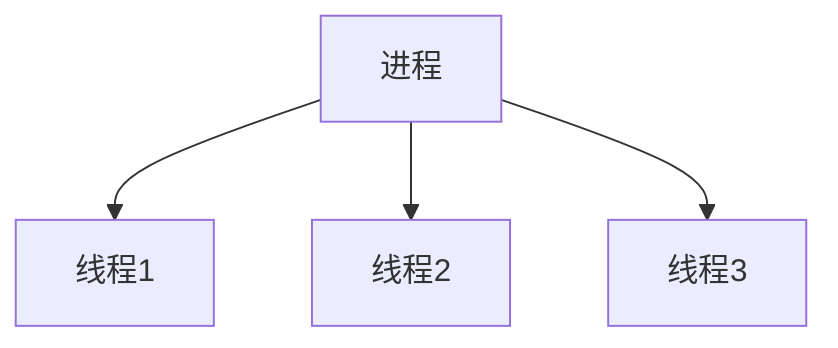

## 介绍

在现代操作系统中，**并发**是一个核心概念。它允许多个任务在同一时间段内交替执行，从而提高系统的效率和响应速度。并发模式是操作系统管理多个任务的方式，确保它们能够高效、安全地共享资源。

并发模式的核心在于**同步**和**互斥**。同步是指多个任务按照一定的顺序执行，而互斥则是确保同一时间只有一个任务访问共享资源。理解这些概念对于编写高效、稳定的程序至关重要。

## 并发模式的基本概念

### 1. 进程与线程

在操作系统中，**进程**是资源分配的基本单位，而**线程**是 CPU 调度的基本单位。一个进程可以包含多个线程，这些线程共享进程的资源，但每个线程有自己的执行路径。



### 2. 并发与并行

- **并发**：多个任务在同一时间段内交替执行，看起来像是同时进行。
- **并行**：多个任务真正同时执行，通常需要多核处理器的支持。

:::tip
并发是逻辑上的同时执行，而并行是物理上的同时执行。
:::

## 常见的并发模式

### 1. 生产者-消费者模式

生产者-消费者模式是一种经典的并发模式，用于解决生产者和消费者之间的同步问题。生产者生成数据并将其放入缓冲区，消费者从缓冲区中取出数据进行处理。

```python
from threading import Thread, Lock
import time
import random

buffer = []
buffer_size = 5
lock = Lock()

def producer():
    global buffer
    while True:
        lock.acquire()
        if len(buffer) < buffer_size:
            item = random.randint(1, 100)
            buffer.append(item)
            print(f"Produced {item}")
        lock.release()
        time.sleep(random.random())

def consumer():
    global buffer
    while True:
        lock.acquire()
        if len(buffer) > 0:
            item = buffer.pop(0)
            print(f"Consumed {item}")
        lock.release()
        time.sleep(random.random())

producer_thread = Thread(target=producer)
consumer_thread = Thread(target=consumer)

producer_thread.start()
consumer_thread.start()

producer_thread.join()
consumer_thread.join()
```

:::note
在这个例子中，`Lock` 用于确保生产者和消费者不会同时访问缓冲区，从而避免竞争条件。
:::

### 2. 读者-写者问题

读者-写者问题是另一个经典的并发问题，涉及到多个读者和写者访问共享资源。读者可以同时读取数据，但写者必须独占资源。

```python
from threading import Thread, Lock, Semaphore
import time

data = 0
readers_count = 0
mutex = Lock()
write_lock = Semaphore(1)

def reader(id):
    global readers_count, data
    while True:
        mutex.acquire()
        readers_count += 1
        if readers_count == 1:
            write_lock.acquire()
        mutex.release()

        print(f"Reader {id} reads data: {data}")

        mutex.acquire()
        readers_count -= 1
        if readers_count == 0:
            write_lock.release()
        mutex.release()

        time.sleep(random.random())

def writer(id):
    global data
    while True:
        write_lock.acquire()
        data += 1
        print(f"Writer {id} writes data: {data}")
        write_lock.release()
        time.sleep(random.random())

for i in range(5):
    Thread(target=reader, args=(i,)).start()

for i in range(2):
    Thread(target=writer, args=(i,)).start()
```

:::caution
在这个例子中，`Semaphore` 用于确保写者独占资源，而 `Lock` 用于保护读者计数器的更新。
:::

## 实际应用场景

### 1. 多线程下载器

多线程下载器是一个常见的并发应用。通过将文件分成多个部分，每个线程负责下载一部分，可以显著提高下载速度。

### 2. 数据库连接池

数据库连接池是另一个并发应用的例子。通过维护一组数据库连接，多个线程可以共享这些连接，从而减少创建和销毁连接的开销。

## 总结

并发模式是操作系统中的核心概念，理解这些模式对于编写高效、稳定的程序至关重要。通过生产者-消费者模式、读者-写者问题等经典案例，我们可以更好地掌握并发编程的基本原理。

## 附加资源与练习

- **练习**：尝试实现一个多线程爬虫，使用生产者-消费者模式来管理待爬取的 URL 和已爬取的数据。
- **资源**：
  - [操作系统概念](https://www.os-book.com/) - 一本深入讲解操作系统原理的经典书籍。
  - [Python 并发编程指南](https://docs.python.org/3/library/concurrency.html) - Python 官方文档中的并发编程部分。

:::warning
并发编程虽然强大，但也容易引入难以调试的问题，如死锁和竞争条件。务必在编写并发程序时保持谨慎。
:::