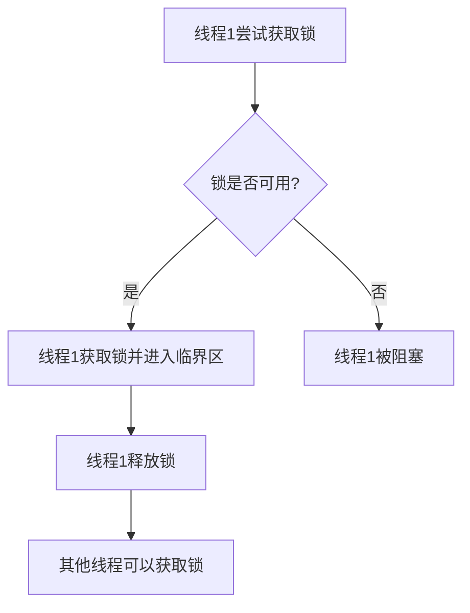

# 操作系统互斥锁

在并发编程中，多个线程或进程可能会同时访问共享资源，这可能导致数据不一致或竞争条件（Race Condition）。为了避免这些问题，操作系统提供了**互斥锁（Mutex）**机制。互斥锁是一种同步原语，用于确保同一时间只有一个线程可以访问共享资源。

## 什么是互斥锁？

互斥锁（Mutex，全称 Mutual Exclusion）是一种用于保护共享资源的锁机制。当一个线程获取了互斥锁后，其他线程必须等待该锁被释放后才能继续执行。互斥锁的核心思想是确保**临界区（Critical Section）**的互斥访问，即同一时间只有一个线程可以进入临界区。

:::note
**临界区**：一段代码或资源，多个线程或进程可能会同时访问，且需要互斥访问以避免数据不一致。
:::

## 互斥锁的工作原理

互斥锁通常有两个基本操作：
1. **加锁（Lock）**：当一个线程需要访问共享资源时，它会尝试获取互斥锁。如果锁已被其他线程持有，当前线程将被阻塞，直到锁被释放。
2. **解锁（Unlock）**：当线程完成对共享资源的访问后，它会释放互斥锁，允许其他线程获取锁并访问资源。



## 互斥锁的使用示例

以下是一个使用互斥锁的简单示例，展示了如何在多线程环境中保护共享资源。

```python
import threading

# 共享资源
counter = 0
# 创建互斥锁
mutex = threading.Lock()

def increment_counter():
    global counter
    for _ in range(100000):
        # 获取锁
        mutex.acquire()
        counter += 1
        # 释放锁
        mutex.release()

# 创建两个线程
thread1 = threading.Thread(target=increment_counter)
thread2 = threading.Thread(target=increment_counter)

# 启动线程
thread1.start()
thread2.start()

# 等待线程完成
thread1.join()
thread2.join()

print(f"Final counter value: {counter}")
```

**输出：**
```
Final counter value: 200000
```

在这个示例中，两个线程同时尝试增加 `counter` 的值。如果没有互斥锁，`counter` 的最终值可能会小于 200000，因为两个线程可能会同时读取和写入 `counter`，导致数据丢失。通过使用互斥锁，我们确保了每次只有一个线程可以修改 `counter`，从而避免了竞争条件。

## 互斥锁的实际应用场景

互斥锁在现实世界中有许多应用场景，以下是一些常见的例子：

1. **数据库事务**：在数据库中，多个事务可能会同时访问同一数据。使用互斥锁可以确保事务的原子性和一致性。
2. **文件系统操作**：多个进程可能会同时读写同一文件。互斥锁可以防止文件数据被破坏。
3. **多线程服务器**：在多线程服务器中，多个线程可能会同时处理客户端请求。互斥锁可以保护共享资源，如连接池或缓存。

## 总结

互斥锁是并发编程中非常重要的工具，用于保护共享资源，避免竞争条件和数据不一致。通过加锁和解锁操作，互斥锁确保了同一时间只有一个线程可以访问临界区。在实际应用中，互斥锁广泛用于数据库、文件系统和多线程服务器等场景。

:::tip
**练习**：尝试编写一个多线程程序，模拟多个线程同时访问一个共享队列。使用互斥锁保护队列的入队和出队操作，确保数据的一致性。
:::

## 附加资源

- [Python 官方文档 - threading 模块](https://docs.python.org/3/library/threading.html)
- [操作系统中的同步机制](https://en.wikipedia.org/wiki/Synchronization_(computer_science))
- [并发编程中的常见问题与解决方案](https://www.geeksforgeeks.org/common-concurrency-problems-in-java/)

通过学习和实践，你将能够更好地理解互斥锁的工作原理，并在实际项目中应用它来解决并发问题。