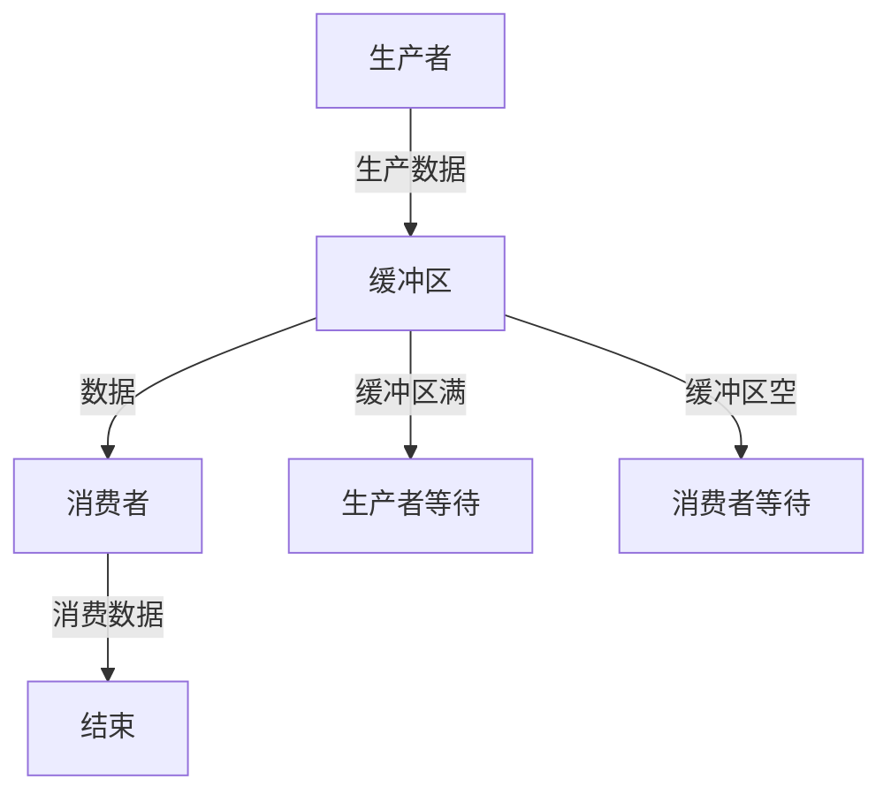

## 什么是管程？

管程（Monitor）是操作系统和并发编程中的一个重要概念，用于管理多个线程或进程对共享资源的访问。管程提供了一种结构化的方式来实现线程同步，确保在任何时刻只有一个线程可以执行管程中的代码，从而避免竞争条件和数据不一致的问题。

管程的核心思想是将共享资源和对资源的操作封装在一起，并通过条件变量（Condition Variables）来实现线程的等待和唤醒机制。

## 管程的基本结构

一个典型的管程包含以下几个部分：

1. **共享变量**：管程内部维护的共享资源或状态。
2. **操作函数**：对共享资源进行操作的方法或函数。
3. **条件变量**：用于线程间的同步，允许线程在特定条件下等待或被唤醒。

### 管程的伪代码表示

```pseudo
monitor ExampleMonitor {
    // 共享变量
    int sharedResource;

    // 条件变量
    condition conditionVar;

    // 操作函数
    procedure operation1() {
        while (/* 条件不满足 */) {
            wait(conditionVar); // 等待条件满足
        }
        // 操作共享资源
        sharedResource = ...;
        signal(conditionVar); // 唤醒等待的线程
    }

    procedure operation2() {
        // 操作共享资源
        sharedResource = ...;
        signal(conditionVar); // 唤醒等待的线程
    }
}
```

## 管程的工作原理

管程通过互斥锁（Mutex）确保在任何时刻只有一个线程可以进入管程执行操作。当一个线程进入管程时，它会自动获取互斥锁；当线程退出管程时，它会释放互斥锁。如果多个线程试图同时进入管程，只有一个线程能够成功，其他线程将被阻塞，直到互斥锁被释放。

### 条件变量的使用

条件变量是管程中用于线程同步的关键机制。线程可以通过 `wait()` 方法在条件变量上等待，直到其他线程通过 `signal()` 或 `broadcast()` 方法唤醒它。

- `wait(conditionVar)`：释放互斥锁并进入等待状态，直到被唤醒。
- `signal(conditionVar)`：唤醒一个等待在条件变量上的线程。
- `broadcast(conditionVar)`：唤醒所有等待在条件变量上的线程。

## 实际案例：生产者-消费者问题

生产者-消费者问题是并发编程中的一个经典问题，通常用于展示管程的使用。在这个问题中，生产者线程生成数据并将其放入缓冲区，而消费者线程从缓冲区中取出数据。管程可以确保生产者和消费者之间的同步，避免缓冲区溢出或下溢。

### 生产者-消费者问题的管程实现

```pseudo
monitor ProducerConsumer {
    int buffer[MAX_SIZE];
    int count = 0;
    int in = 0, out = 0;

    condition notFull, notEmpty;

    procedure produce(int item) {
        while (count == MAX_SIZE) {
            wait(notFull); // 等待缓冲区不满
        }
        buffer[in] = item;
        in = (in + 1) % MAX_SIZE;
        count++;
        signal(notEmpty); // 唤醒消费者
    }

    procedure consume() returns int {
        while (count == 0) {
            wait(notEmpty); // 等待缓冲区不空
        }
        int item = buffer[out];
        out = (out + 1) % MAX_SIZE;
        count--;
        signal(notFull); // 唤醒生产者
        return item;
    }
}
```

### 生产者-消费者问题的流程图



## 总结

管程是操作系统和并发编程中用于管理共享资源访问的重要工具。通过将共享资源和操作封装在一起，并使用条件变量实现线程同步，管程能够有效地避免竞争条件和数据不一致的问题。生产者-消费者问题是管程的一个典型应用场景，展示了管程在实际并发编程中的强大功能。

## 附加资源与练习

- **练习**：尝试用你熟悉的编程语言实现一个简单的管程，并解决生产者-消费者问题。
- **推荐阅读**：
  - 《操作系统概念》（Operating System Concepts）
  - 《现代操作系统》（Modern Operating Systems）

通过学习和实践，你将能够更好地理解管程的工作原理，并在实际项目中应用这一概念。