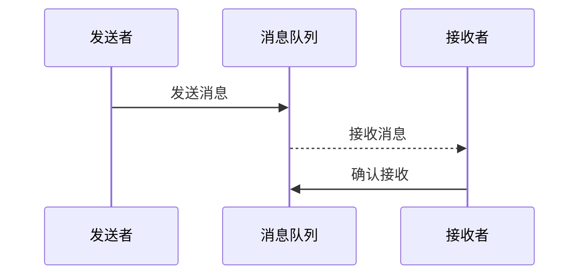

## 介绍

在操作系统中，**消息传递**是一种进程间通信（IPC）的方式，允许不同的进程通过发送和接收消息来交换数据。与共享内存等其他 IPC 机制不同，消息传递不需要进程共享内存空间，而是通过操作系统提供的通信通道进行数据传输。

消息传递的核心思想是：一个进程（发送者）将消息发送到另一个进程（接收者），接收者可以读取并处理这些消息。这种方式非常适合分布式系统或需要解耦的进程间通信场景。

## 消息传递的基本概念

### 1. 消息队列
消息队列是消息传递的核心数据结构。它是一个先进先出（FIFO）的队列，用于存储发送者发送的消息。接收者可以从队列中读取消息。

### 2. 发送和接收操作
- **发送操作**：发送者将消息放入消息队列。
- **接收操作**：接收者从消息队列中读取消息。

### 3. 同步与异步
- **同步消息传递**：发送者发送消息后，必须等待接收者接收并处理完消息后才能继续执行。
- **异步消息传递**：发送者发送消息后，无需等待接收者处理，可以继续执行其他任务。

## 消息传递的实现

### 1. 操作系统提供的 API
大多数操作系统提供了消息传递的 API。例如，在 POSIX 标准中，可以使用 `mq_send` 和 `mq_receive` 函数来实现消息传递。

```c
#include <mqueue.h>
#include <stdio.h>
#include <string.h>

int main() {
    mqd_t mq;
    struct mq_attr attr;
    char buffer[1024];
    ssize_t bytes_read;

    // 创建消息队列
    mq = mq_open("/my_queue", O_CREAT | O_RDWR, 0644, NULL);
    if (mq == (mqd_t)-1) {
        perror("mq_open");
        return 1;
    }

    // 发送消息
    const char *message = "Hello, World!";
    if (mq_send(mq, message, strlen(message), 0) == -1) {
        perror("mq_send");
        return 1;
    }

    // 接收消息
    bytes_read = mq_receive(mq, buffer, sizeof(buffer), NULL);
    if (bytes_read == -1) {
        perror("mq_receive");
        return 1;
    }

    // 打印接收到的消息
    buffer[bytes_read] = '\0';
    printf("Received: %s\n", buffer);

    // 关闭消息队列
    mq_close(mq);
    mq_unlink("/my_queue");

    return 0;
}
```

### 2. 消息传递的流程
以下是一个简单的消息传递流程：



## 实际应用场景

### 1. 分布式系统中的通信
在分布式系统中，不同节点之间的通信通常通过消息传递来实现。例如，一个节点可以将任务分配给其他节点，并通过消息传递来接收任务结果。

### 2. 微服务架构
在微服务架构中，各个服务之间通过消息队列进行通信。例如，订单服务可以将订单信息发送到消息队列，支付服务可以从队列中读取并处理订单。

### 3. 多线程编程
在多线程编程中，线程之间可以通过消息传递来共享数据。例如，一个线程可以将计算结果发送到消息队列，另一个线程可以从队列中读取并处理结果。

## 总结

消息传递是操作系统中一种重要的进程间通信机制，它通过消息队列实现了进程之间的数据交换。与共享内存相比，消息传递更加安全和灵活，特别适合分布式系统和微服务架构。

通过本文，你应该已经了解了消息传递的基本概念、实现方式以及实际应用场景。接下来，你可以尝试在自己的项目中实现消息传递，或者深入学习操作系统提供的其他 IPC 机制。

## 附加资源与练习

### 资源
- [POSIX 消息队列文档](https://pubs.opengroup.org/onlinepubs/9699919799/functions/mq_open.html)
- [操作系统概念（第10版）](https://www.os-book.com/) - 一本经典的操作系统教材，详细介绍了进程间通信机制。

### 练习
1. 尝试在 Linux 系统上使用 `mq_send` 和 `mq_receive` 实现一个简单的消息传递程序。
2. 修改上述代码，实现异步消息传递。
3. 研究其他 IPC 机制（如共享内存、管道等），并与消息传递进行比较。
