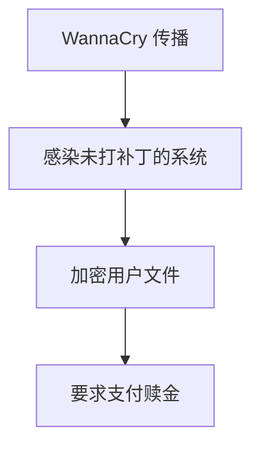

# 操作系统恶意软件防护

恶意软件（Malware）是指任何设计用于破坏、窃取数据或对计算机系统造成损害的软件。操作系统作为计算机的核心，承担着保护系统免受恶意软件侵害的重要责任。本文将介绍操作系统中的恶意软件防护机制，帮助你理解如何保护你的系统。

## 什么是恶意软件防护？

恶意软件防护是指操作系统通过一系列机制和技术，检测、阻止和清除恶意软件的过程。这些机制包括但不限于：

- **实时监控**：持续扫描系统中的文件和进程，检测潜在的恶意行为。
- **防火墙**：控制网络流量，阻止恶意软件的传播。
- **权限管理**：限制用户和程序的权限，防止恶意软件获取系统控制权。
- **更新与补丁**：及时修复系统漏洞，防止恶意软件利用已知漏洞进行攻击。

## 操作系统中的恶意软件防护机制

### 1. 实时监控

实时监控是操作系统防护恶意软件的第一道防线。它通过持续扫描系统中的文件和进程，检测潜在的恶意行为。例如，Windows Defender 是 Windows 操作系统内置的实时监控工具。

```bash
# 示例：在 Windows 中启用实时监控
Set-MpPreference -DisableRealtimeMonitoring $false
```

:::note
实时监控可能会占用一定的系统资源，因此在性能较低的设备上可能需要权衡。
:::

### 2. 防火墙

防火墙是操作系统中的另一个重要防护机制。它通过控制网络流量，阻止恶意软件的传播。防火墙可以配置为允许或阻止特定的网络连接。

```bash
# 示例：在 Linux 中使用 UFW 配置防火墙规则
sudo ufw allow 22/tcp  # 允许 SSH 连接
sudo ufw deny 80/tcp   # 阻止 HTTP 连接
```

:::tip
定期检查防火墙规则，确保只有必要的网络连接被允许。
:::

### 3. 权限管理

权限管理是防止恶意软件获取系统控制权的重要手段。操作系统通过用户账户控制（UAC）和访问控制列表（ACL）来限制用户和程序的权限。

```bash
# 示例：在 Linux 中设置文件权限
chmod 755 myfile  # 设置文件权限为 rwxr-xr-x
```

:::caution
避免以管理员身份运行不必要的程序，以减少恶意软件获取系统控制权的风险。
:::

### 4. 更新与补丁

及时更新操作系统和应用程序是防止恶意软件利用已知漏洞进行攻击的关键。操作系统通常会提供自动更新功能，确保系统始终处于最新状态。

```bash
# 示例：在 Ubuntu 中更新系统
sudo apt update
sudo apt upgrade
```

:::warning
忽略系统更新可能会导致系统暴露在已知漏洞中，增加被恶意软件攻击的风险。
:::

## 实际案例

### 案例：WannaCry 勒索软件

2017 年，WannaCry 勒索软件利用 Windows 操作系统的漏洞，迅速传播并加密用户文件，要求支付赎金。微软在事件发生后迅速发布了补丁，修复了漏洞。这一事件凸显了及时更新系统的重要性。



:::note
WannaCry 事件提醒我们，及时更新系统和备份数据是防止恶意软件侵害的重要措施。
:::

## 总结

操作系统恶意软件防护是保护计算机系统安全的关键。通过实时监控、防火墙、权限管理和及时更新，我们可以有效减少恶意软件对系统的威胁。作为初学者，理解这些机制并养成良好的安全习惯，将有助于你在编程和系统管理中更好地保护你的设备和数据。

## 附加资源与练习

- **资源**：
  - [Windows Defender 官方文档](https://docs.microsoft.com/en-us/windows/security/threat-protection/)
  - [Linux UFW 防火墙指南](https://help.ubuntu.com/community/UFW)
  - [WannaCry 事件分析](https://www.csoonline.com/article/3227906/wannacry-ransomware-attack-explained.html)

- **练习**：
  1. 在你的操作系统中启用实时监控，并观察其对系统性能的影响。
  2. 配置防火墙规则，阻止不必要的网络连接。
  3. 检查并更新你的操作系统和应用程序，确保它们处于最新状态。

通过学习和实践，你将能够更好地理解和应用操作系统中的恶意软件防护机制。