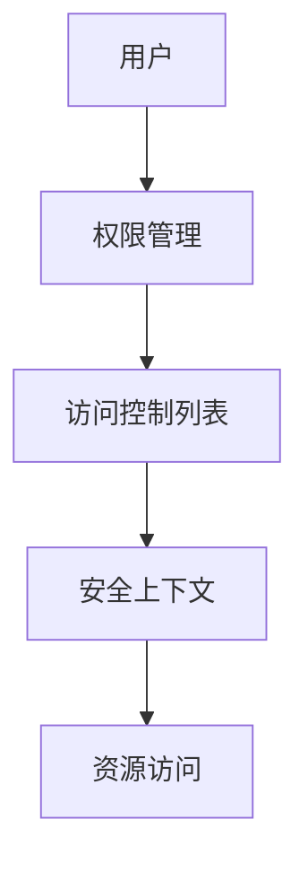

## 介绍

操作系统安全模型是计算机系统中用于保护资源和数据免受未经授权访问的核心机制。它定义了如何管理用户权限、控制资源访问以及确保系统的整体安全性。理解操作系统安全模型对于开发安全应用程序和系统至关重要。

## 基本概念

### 1. 用户与权限

操作系统通过用户账户来管理权限。每个用户都有一个唯一的标识符（UID），系统根据用户的权限级别来决定其可以访问的资源。

```bash
# 查看当前用户的UID
$ id -u
1000
```

### 2. 访问控制列表（ACL）

访问控制列表是一种用于定义哪些用户或系统进程可以访问特定资源的机制。ACL通常包含允许或拒绝访问的规则。

```bash
# 查看文件的ACL
$ getfacl example.txt
# file: example.txt
# owner: user
# group: user
user::rw-
group::r--
other::r--
```

### 3. 安全上下文

安全上下文是操作系统用来标识对象（如文件、进程）的安全属性的集合。例如，在SELinux中，每个文件和进程都有一个安全上下文。

```bash
# 查看文件的安全上下文
$ ls -Z example.txt
-rw-r--r--. user user system_u:object_r:user_home_t:s0 example.txt
```

## 实际案例

### 案例1：Linux中的SELinux

SELinux（Security-Enhanced Linux）是一个Linux内核模块，提供了强制访问控制（MAC）机制。它通过定义安全策略来限制进程的权限。

```bash
# 查看SELinux状态
$ sestatus
SELinux status:                 enabled
SELinuxfs mount:                /sys/fs/selinux
SELinux root directory:         /etc/selinux
Loaded policy name:             targeted
Current mode:                   enforcing
Mode from config file:          enforcing
```

### 案例2：Windows中的用户账户控制（UAC）

Windows的用户账户控制（UAC）是一种安全功能，旨在防止未经授权的更改。当用户尝试执行需要管理员权限的操作时，UAC会提示用户确认。

```powershell
# 以管理员身份运行PowerShell
Start-Process powershell -Verb runAs
```

## 图表展示

以下是一个简单的Mermaid图表，展示了操作系统安全模型的基本组成部分。



## 总结

操作系统安全模型是确保计算机系统安全的关键机制。通过理解用户与权限、访问控制列表和安全上下文等基本概念，初学者可以更好地理解如何保护系统资源。实际案例如Linux中的SELinux和Windows中的UAC展示了这些概念在实际中的应用。

## 附加资源与练习

- **练习1**：在Linux系统中，尝试使用`chmod`命令更改文件权限，并观察其对文件访问的影响。
- **练习2**：在Windows系统中，尝试禁用UAC并观察系统行为的变化。
- **资源**：阅读更多关于SELinux和UAC的官方文档，深入了解其工作原理和配置方法。

:::tip
建议初学者在学习操作系统安全模型时，结合实际操作和实验，以加深理解。
:::