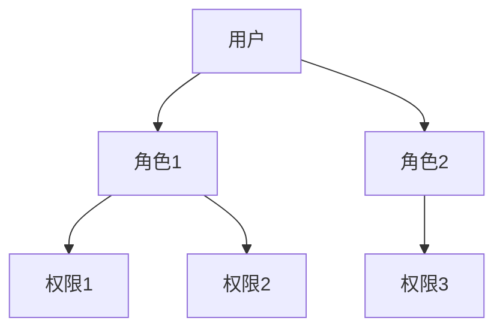

# 操作系统访问控制

## 介绍

操作系统访问控制是计算机安全的核心机制之一，用于管理用户和程序对系统资源的访问权限。通过访问控制，操作系统可以确保只有经过授权的用户或程序才能访问特定的资源，从而防止未经授权的访问和潜在的安全威胁。

访问控制通常基于**权限模型**，常见的模型包括**自主访问控制（DAC）**、**强制访问控制（MAC）**和**基于角色的访问控制（RBAC）**。接下来，我们将逐步讲解这些概念，并通过实际案例帮助你更好地理解。

---

## 访问控制的基本概念

### 1. 自主访问控制（DAC）

自主访问控制是最常见的访问控制模型。在这种模型中，资源的所有者可以自主决定谁可以访问该资源以及访问的权限（如读、写、执行）。例如，在 Linux 系统中，文件的权限可以通过 `chmod` 命令设置。

```bash
# 设置文件权限为所有者可读写，组用户可读，其他用户无权限
chmod 640 myfile.txt
```

- 输入：`chmod 640 myfile.txt`
- 输出：文件 `myfile.txt` 的权限被设置为 `-rw-r-----`。

:::tip
在 Linux 中，权限分为三组：所有者（owner）、组（group）和其他用户（others）。每组权限用三位二进制数表示，分别对应读（r）、写（w）和执行（x）。
:::

### 2. 强制访问控制（MAC）

强制访问控制是一种更严格的模型，通常用于高安全性环境（如军事或政府系统）。在 MAC 中，访问权限由系统管理员或安全策略决定，用户无法更改。例如，SELinux（Security-Enhanced Linux）就是一种实现 MAC 的机制。

```bash
# 查看 SELinux 状态
sestatus
```

- 输入：`sestatus`
- 输出：显示 SELinux 的当前状态（如 `Enforcing`、`Permissive` 或 `Disabled`）。

### 3. 基于角色的访问控制（RBAC）

基于角色的访问控制通过角色来管理权限。用户被分配到一个或多个角色，每个角色具有特定的权限。这种方法适用于大型组织，可以简化权限管理。



:::note
RBAC 的优势在于权限的分配更加灵活，管理员只需管理角色和权限的关系，而不需要为每个用户单独设置权限。
:::

---

## 实际应用场景

### 场景 1：文件系统权限管理

在 Linux 系统中，文件权限是访问控制的典型应用。例如，假设你有一个包含敏感数据的文件 `secret.txt`，你希望只有特定用户可以访问它。

```bash
# 设置文件权限为仅所有者可读写
chmod 600 secret.txt
```

- 输入：`chmod 600 secret.txt`
- 输出：文件 `secret.txt` 的权限被设置为 `-rw-------`，其他用户无法访问。

### 场景 2：数据库访问控制

在数据库中，访问控制用于限制用户对数据的操作。例如，MySQL 中可以通过以下命令为用户分配权限：

```sql
-- 授予用户 'alice' 对数据库 'mydb' 的只读权限
GRANT SELECT ON mydb.* TO 'alice'@'localhost';
```

- 输入：`GRANT SELECT ON mydb.* TO 'alice'@'localhost';`
- 输出：用户 `alice` 只能读取 `mydb` 数据库中的数据，无法修改或删除。

---

## 总结

操作系统访问控制是保护系统资源的关键机制。通过自主访问控制、强制访问控制和基于角色的访问控制，操作系统可以有效地管理用户和程序的权限，防止未经授权的访问。

:::caution
在实际应用中，访问控制的配置需要谨慎，错误的设置可能导致安全漏洞或系统功能受限。
:::

---

## 附加资源与练习

### 资源
- [Linux 文件权限详解](https://linux.die.net/man/1/chmod)
- [SELinux 官方文档](https://selinuxproject.org/page/Main_Page)
- [MySQL 权限管理指南](https://dev.mysql.com/doc/refman/8.0/en/privileges.html)

### 练习
1. 在 Linux 系统中创建一个文件，并尝试使用 `chmod` 命令设置不同的权限，观察效果。
2. 在 MySQL 中创建一个新用户，并为其分配特定的数据库权限。
3. 研究 SELinux 的工作原理，并尝试在系统中启用它。

通过以上学习和练习，你将更好地理解操作系统访问控制的重要性和实际应用。