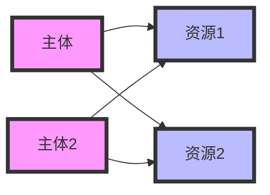

# 操作系统访问矩阵

## 介绍

在操作系统中，**访问矩阵**（Access Matrix）是一种用于描述系统中不同主体（如用户、进程）对资源（如文件、设备）的访问权限的模型。它通过矩阵的形式清晰地展示了谁可以访问什么资源，以及可以进行哪些操作（如读、写、执行等）。访问矩阵是操作系统安全与保护机制的核心组成部分，帮助系统管理员和开发者管理资源的访问权限。

## 访问矩阵的基本结构

访问矩阵通常由行和列组成：

- **行**：代表系统中的主体（Subject），例如用户或进程。
- **列**：代表系统中的资源（Object），例如文件、设备或内存区域。
- **单元格**：每个单元格包含主体对资源的访问权限，例如读（`r`）、写（`w`）、执行（`x`）等。

以下是一个简单的访问矩阵示例：



在表格形式中，访问矩阵可以表示为：

| 主体 \ 资源 | 文件A | 文件B | 设备C |
|-------------|-------|-------|-------|
| 用户1       | r, w  | r     | -     |
| 用户2       | r     | r, w  | x     |
| 用户3       | -     | -     | r     |

:::note
- `r`：读权限
- `w`：写权限
- `x`：执行权限
- `-`：无权限
:::

## 访问矩阵的工作原理

访问矩阵的核心思想是通过矩阵的形式明确每个主体对每个资源的访问权限。操作系统在每次访问请求时，会检查访问矩阵，以确定请求是否合法。

### 访问控制流程

1. **请求访问**：主体（如用户或进程）请求访问某个资源。
2. **查找权限**：操作系统查找访问矩阵中对应主体和资源的单元格。
3. **验证权限**：检查请求的操作是否在权限范围内。
4. **允许或拒绝**：如果权限允许，则执行操作；否则，拒绝请求并返回错误。

### 示例代码

以下是一个简单的伪代码示例，展示如何实现访问矩阵的权限检查：

```python
# 定义访问矩阵
access_matrix = {
    "用户1": {"文件A": ["r", "w"], "文件B": ["r"]},
    "用户2": {"文件A": ["r"], "文件B": ["r", "w"], "设备C": ["x"]},
    "用户3": {"设备C": ["r"]}
}

def check_permission(user, resource, operation):
    if user in access_matrix and resource in access_matrix[user]:
        if operation in access_matrix[user][resource]:
            return True
    return False

# 示例：检查用户1是否有权限写文件A
user = "用户1"
resource = "文件A"
operation = "w"

if check_permission(user, resource, operation):
    print(f"{user} 可以 {operation} {resource}")
else:
    print(f"{user} 不能 {operation} {resource}")
```

**输出：**
```
用户1 可以 w 文件A
```

## 实际应用场景

### 1. 文件系统权限管理

在文件系统中，访问矩阵用于管理用户对文件的访问权限。例如，Linux 系统中的文件权限（`rwx`）就是一种访问矩阵的实现。

### 2. 数据库访问控制

数据库管理系统（DBMS）使用访问矩阵来控制用户对表、视图等数据库对象的访问权限。

### 3. 多用户操作系统

在多用户操作系统中，访问矩阵确保不同用户之间的资源隔离，防止未经授权的访问。

## 总结

访问矩阵是操作系统中用于管理资源访问权限的重要工具。它通过矩阵的形式清晰地描述了主体与资源之间的关系，并帮助系统实现安全与保护机制。理解访问矩阵的概念和实现方式，对于学习操作系统安全和资源管理至关重要。

## 附加资源与练习

### 资源
- [操作系统安全机制](https://example.com/operating-system-security)
- [访问控制模型详解](https://example.com/access-control-models)

### 练习
1. 设计一个访问矩阵，描述三个用户对四个资源的访问权限。
2. 编写一个简单的程序，模拟访问矩阵的权限检查功能。
3. 思考并讨论：访问矩阵在实际系统中可能面临的性能问题，以及如何优化。

:::tip
尝试将访问矩阵与现实生活中其他权限管理系统（如门禁系统）进行类比，以加深理解。
:::