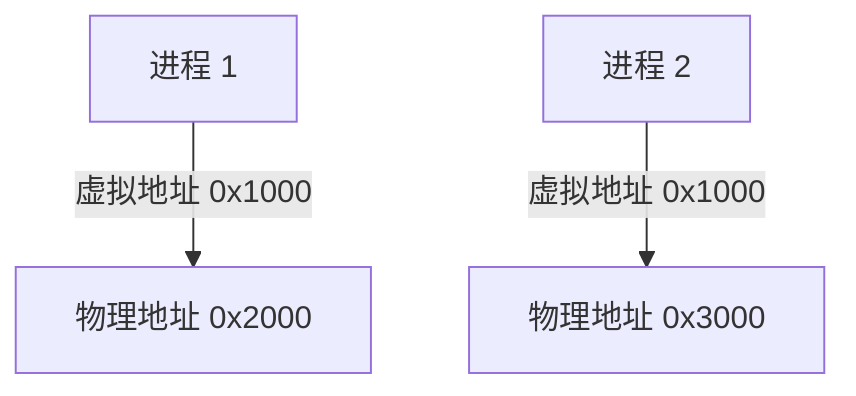

# 操作系统保护域

## 介绍

操作系统保护域（Protection Domain）是操作系统中的一个重要概念，用于隔离不同进程或用户之间的资源访问权限。通过保护域，操作系统可以确保一个进程无法随意访问或修改另一个进程的内存、文件或其他资源，从而提高系统的安全性和稳定性。

保护域的核心思想是将系统资源划分为不同的“域”，并为每个域分配特定的访问权限。每个进程或用户只能在其所属的域内操作，从而防止未经授权的访问或破坏。

## 保护域的基本概念

### 什么是保护域？

保护域是操作系统中的一个逻辑边界，用于限制进程或用户对系统资源的访问。每个保护域包含一组资源和相应的访问权限。操作系统通过保护域来确保进程只能访问其被授权的资源，而不能越界访问其他域的资源。

### 保护域的工作原理

操作系统通过硬件和软件的结合来实现保护域。硬件部分通常由内存管理单元（MMU）提供支持，而软件部分则由操作系统的内核负责管理。

1. **硬件支持**：MMU 负责将虚拟地址映射到物理地址，并为每个内存页设置访问权限（如读、写、执行）。通过这些权限，操作系统可以限制进程对内存的访问。

2. **软件管理**：操作系统内核负责创建和管理保护域。每个进程在启动时会被分配到一个保护域，并根据其权限访问相应的资源。

### 保护域的类型

保护域可以分为以下几种类型：

1. **用户域**：普通用户进程运行在用户域中，权限较低，只能访问有限的系统资源。
2. **内核域**：操作系统内核运行在内核域中，拥有最高权限，可以访问所有系统资源。
3. **特权域**：某些特殊进程（如设备驱动程序）可能运行在特权域中，拥有比用户域更高的权限，但仍低于内核域。

## 代码示例：保护域的实际应用

以下是一个简单的代码示例，展示了如何在操作系统中使用保护域来限制进程的访问权限。

```c
#include <stdio.h>
#include <stdlib.h>
#include <unistd.h>

int main() {
    // 尝试访问受保护的内存区域
    int *ptr = (int *)0x1000; // 假设这是一个受保护的地址
    *ptr = 42; // 尝试写入数据

    // 检查是否成功
    if (*ptr == 42) {
        printf("写入成功！\n");
    } else {
        printf("写入失败，访问被拒绝！\n");
    }

    return 0;
}
```

**输入**：运行上述代码。

**输出**：
```
写入失败，访问被拒绝！
```

在这个示例中，操作系统通过保护域阻止了进程对受保护内存区域的访问，从而避免了潜在的安全问题。

## 实际案例：保护域在操作系统中的应用

### 案例 1：多用户系统中的权限隔离

在多用户操作系统中，每个用户都有自己的保护域。用户 A 的文件和资源不能被用户 B 访问，除非用户 A 明确授权。这种隔离机制确保了用户数据的安全性和隐私性。

### 案例 2：虚拟内存管理

操作系统通过保护域来管理虚拟内存。每个进程都有自己的虚拟地址空间，操作系统通过 MMU 将这些虚拟地址映射到物理内存，并为每个内存页设置访问权限。这样，即使两个进程使用相同的虚拟地址，它们也不会相互干扰。



在这个图中，进程 1 和进程 2 都使用了虚拟地址 `0x1000`，但它们被映射到了不同的物理地址，从而实现了内存隔离。

## 总结

操作系统保护域是系统安全的重要组成部分。通过将资源划分为不同的域并为每个域分配访问权限，操作系统可以有效地隔离进程和用户，防止未经授权的访问和破坏。理解保护域的概念对于学习操作系统和系统安全至关重要。

## 附加资源与练习

### 附加资源

- [操作系统概念（第 10 版）](https://www.os-book.com/)：深入讲解操作系统的基本概念，包括保护域。
- [Linux 内核文档](https://www.kernel.org/doc/)：了解 Linux 内核如何实现保护域。

### 练习

1. 编写一个程序，尝试访问受保护的内存区域，并观察操作系统的反应。
2. 研究 Linux 中的 `chroot` 命令，了解它如何通过创建新的保护域来限制进程的访问权限。

通过学习和实践，你将更好地理解操作系统保护域的工作原理及其在系统安全中的重要性。