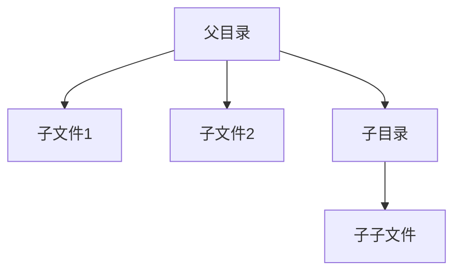

## 介绍

在操作系统中，权限管理是确保系统安全和资源保护的核心机制。它通过控制用户和程序对系统资源的访问权限，防止未经授权的访问和操作。权限管理不仅保护了系统的完整性，还确保了用户数据的隐私和安全。

## 权限管理的基本概念

### 用户和组

在操作系统中，每个用户都有一个唯一的标识符（UID），而组则是用户的集合，每个组也有一个唯一的标识符（GID）。通过将用户分配到不同的组，可以更方便地管理权限。

### 文件和目录权限

在类 Unix 系统中，每个文件和目录都有三组权限：所有者（Owner）、组（Group）和其他用户（Others）。每组权限包括读（r）、写（w）和执行（x）三种操作。

```bash
$ ls -l
-rw-r--r-- 1 user group 4096 Oct  1 12:34 example.txt
```

在上面的例子中，`example.txt` 文件的权限为 `-rw-r--r--`，表示：
- 所有者（user）有读写权限（rw-）。
- 组（group）有读权限（r--）。
- 其他用户有读权限（r--）。

### 权限的表示方法

权限可以用符号表示（如 `rwx`），也可以用数字表示。数字表示法中，读（r）为 4，写（w）为 2，执行（x）为 1。因此，`rwxr-xr--` 可以表示为 `754`。

```bash
$ chmod 754 example.txt
```

上面的命令将 `example.txt` 的权限设置为 `rwxr-xr--`。

## 权限管理的实际应用

### 案例 1：保护敏感文件

假设你有一个包含敏感信息的文件 `secret.txt`，你希望只有你自己可以读写，其他人无法访问。

```bash
$ chmod 600 secret.txt
```

执行上述命令后，`secret.txt` 的权限将变为 `-rw-------`，只有文件所有者可以读写，其他用户无法访问。

### 案例 2：共享目录

假设你有一个目录 `shared`，你希望团队成员可以读取和写入文件，但不能删除他人的文件。

```bash
$ chmod 1777 shared
```

执行上述命令后，`shared` 目录的权限将变为 `drwxrwxrwt`，其中 `t` 表示粘滞位（sticky bit），确保只有文件所有者可以删除自己的文件。

## 权限管理的进阶概念

### 访问控制列表（ACL）

在某些操作系统中，标准的权限管理可能不足以满足复杂的需求。访问控制列表（ACL）提供了更细粒度的权限控制，允许为特定用户或组设置不同的权限。

```bash
$ setfacl -m u:alice:rw- example.txt
```

上面的命令为 `example.txt` 文件添加了一个 ACL 条目，允许用户 `alice` 读写该文件。

### 权限继承

在某些文件系统中，权限可以继承自父目录。这意味着在父目录中设置的权限会自动应用到子文件和子目录中。



在上面的图表中，父目录的权限会自动继承到子文件和子目录中。

## 总结

操作系统权限管理是保护系统资源和数据安全的重要机制。通过合理设置文件和目录的权限，可以有效地防止未经授权的访问和操作。在实际应用中，权限管理可以用于保护敏感文件、共享资源等场景。

## 附加资源

- [Linux 权限管理指南](https://example.com/linux-permissions-guide)
- [Unix 文件权限详解](https://example.com/unix-file-permissions)
- [ACL 使用手册](https://example.com/acl-manual)

## 练习

1. 创建一个文件 `test.txt`，并设置权限为 `rw-r-----`。
2. 创建一个目录 `shared`，并设置权限为 `rwxr-xr-x`。
3. 使用 ACL 为 `test.txt` 文件添加一个用户 `bob` 的读写权限。

通过完成这些练习，你将更好地理解操作系统权限管理的实际应用。