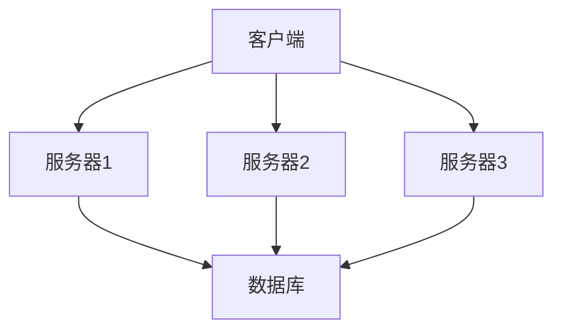

# 操作系统容错机制

在现代计算环境中，操作系统需要具备高度的可靠性和稳定性。容错机制是确保系统在硬件或软件故障时仍能正常运行的关键技术。本文将详细介绍操作系统中的容错机制，包括其基本原理、实现方式以及实际应用场景。

## 什么是容错机制？

容错机制是指系统在出现故障时，能够继续正常运行或快速恢复的能力。容错机制的目标是最大限度地减少故障对系统的影响，确保系统的高可用性和数据完整性。

## 容错机制的基本原理

容错机制通常基于以下几个基本原理：

1. **冗余**：通过增加额外的硬件或软件组件，确保在某个组件失效时，其他组件可以接管其功能。
2. **检查点**：定期保存系统的状态，以便在故障发生时能够恢复到最近的一个稳定状态。
3. **恢复策略**：定义在故障发生后，系统如何恢复到正常状态的具体步骤。

## 容错机制的实现方式

### 1. 冗余

冗余是容错机制中最常见的一种实现方式。常见的冗余技术包括：

- **硬件冗余**：例如，使用多个硬盘组成RAID阵列，确保在某个硬盘失效时，数据仍然可用。
- **软件冗余**：例如，使用多个服务器运行相同的服务，确保在某个服务器失效时，其他服务器可以继续提供服务。



### 2. 检查点

检查点技术通过定期保存系统的状态，确保在故障发生时能够恢复到最近的一个稳定状态。检查点可以应用于进程、线程或整个系统。

```python
import pickle

def save_checkpoint(state, filename):
    with open(filename, 'wb') as f:
        pickle.dump(state, f)

def load_checkpoint(filename):
    with open(filename, 'rb') as f:
        return pickle.load(f)

# 示例：保存和加载检查点
state = {'data': [1, 2, 3], 'step': 10}
save_checkpoint(state, 'checkpoint.pkl')
loaded_state = load_checkpoint('checkpoint.pkl')
print(loaded_state)  # 输出: {'data': [1, 2, 3], 'step': 10}
```

### 3. 恢复策略

恢复策略定义了在故障发生后，系统如何恢复到正常状态。常见的恢复策略包括：

- **回滚恢复**：将系统状态回滚到最近的检查点，并重新执行后续操作。
- **前向恢复**：尝试从故障点继续执行，跳过或修复导致故障的操作。

## 实际应用场景

### 1. 数据库系统

数据库系统通常使用事务日志和检查点技术来确保数据的一致性和持久性。在发生故障时，数据库可以通过回滚未完成的事务或重做已提交的事务来恢复数据。

### 2. 分布式系统

在分布式系统中，容错机制尤为重要。例如，Google的Spanner数据库使用多副本和分布式事务来确保数据的高可用性和一致性。

:::tip
在实际应用中，容错机制的设计需要权衡性能和可靠性。过多的冗余和检查点可能会增加系统的开销，因此需要根据具体需求进行优化。
:::

## 总结

容错机制是确保操作系统高可用性和数据完整性的关键技术。通过冗余、检查点和恢复策略，系统能够在故障发生时继续正常运行或快速恢复。理解并掌握这些机制，对于设计和维护可靠的系统至关重要。

## 附加资源

- [操作系统概念](https://www.os-book.com/) - 一本详细介绍操作系统原理的经典教材。
- [分布式系统：概念与设计](https://www.distributed-systems.net/) - 深入探讨分布式系统中的容错机制。

## 练习

1. 设计一个简单的冗余系统，使用Python模拟两个服务器，其中一个服务器失效时，另一个服务器可以接管其功能。
2. 实现一个检查点机制，定期保存程序的状态，并在程序崩溃后恢复到最近的检查点。

通过完成这些练习，你将更深入地理解容错机制的原理和实现方式。