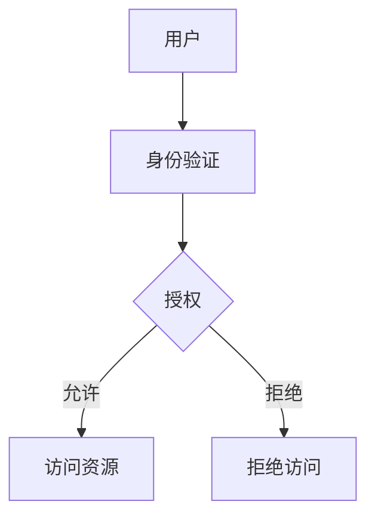

## 介绍

在分布式系统中，多个计算机通过网络协同工作，共享资源和数据。这种架构带来了许多优势，如可扩展性和容错性，但也引入了新的安全挑战。操作系统分布式安全是指在这些分布式环境中保护系统免受未经授权的访问、数据泄露和其他威胁的机制和策略。

## 关键概念

### 1. 身份验证（Authentication）

身份验证是确认用户或系统身份的过程。在分布式系统中，常见的身份验证方法包括密码、数字证书和生物识别技术。

```python
# 示例：使用Python进行简单的用户名和密码验证
def authenticate(username, password):
    # 假设我们有一个存储用户信息的字典
    users = {
        "alice": "password123",
        "bob": "securepass"
    }
    if username in users and users[username] == password:
        return True
    return False

# 输入
username = "alice"
password = "password123"

# 输出
print(authenticate(username, password))  # 输出: True
```

### 2. 授权（Authorization）

授权是确定已验证用户或系统可以访问哪些资源的过程。通常通过访问控制列表（ACL）或基于角色的访问控制（RBAC）来实现。



### 3. 加密（Encryption）

加密是保护数据在传输和存储过程中不被窃取或篡改的关键技术。常见的加密算法包括AES、RSA和SHA。

```python
# 示例：使用Python的cryptography库进行AES加密
from cryptography.fernet import Fernet

# 生成密钥
key = Fernet.generate_key()
cipher_suite = Fernet(key)

# 加密数据
text = "敏感数据"
encrypted_text = cipher_suite.encrypt(text.encode())

# 解密数据
decrypted_text = cipher_suite.decrypt(encrypted_text).decode()

# 输出
print(f"加密后的数据: {encrypted_text}")
print(f"解密后的数据: {decrypted_text}")
```

### 4. 审计（Auditing）

审计是记录和监控系统活动以检测和响应安全事件的过程。审计日志通常包括用户登录、文件访问和系统配置更改等信息。

```python
# 示例：简单的审计日志记录
import logging

logging.basicConfig(filename='system_audit.log', level=logging.INFO)

def log_event(event):
    logging.info(event)

# 记录事件
log_event("用户alice登录系统")
log_event("文件secret.txt被访问")
```

## 实际案例

### 案例1：电子商务平台的分布式安全

在一个电子商务平台中，用户数据、交易信息和库存管理分布在多个服务器上。通过使用SSL/TLS加密传输数据、OAuth进行身份验证和授权，以及定期审计日志，平台可以确保用户数据的安全性和隐私。

### 案例2：云存储服务的分布式安全

云存储服务如Dropbox或Google Drive使用分布式系统来存储用户文件。通过端到端加密、多因素身份验证和细粒度的访问控制，这些服务可以保护用户文件免受未经授权的访问。

## 总结

操作系统分布式安全是保护分布式系统免受各种威胁的关键。通过身份验证、授权、加密和审计等机制，可以有效地保护系统的安全性和数据的隐私。

## 附加资源

- [OWASP分布式系统安全指南](https://owasp.org/www-project-distributed-system-security/)
- [分布式系统安全：理论与实践](https://www.amazon.com/Distributed-Systems-Security-Theory-Practice/dp/0470510920)
- [Coursera上的分布式系统安全课程](https://www.coursera.org/learn/distributed-systems-security)

## 练习

1. 实现一个简单的分布式系统，使用Python的Flask框架创建一个REST API，并添加基本的身份验证和授权机制。
2. 研究并实现一个使用AES加密的客户端-服务器通信程序。
3. 设计一个审计日志系统，记录用户登录和文件访问事件，并分析日志以检测潜在的安全威胁。