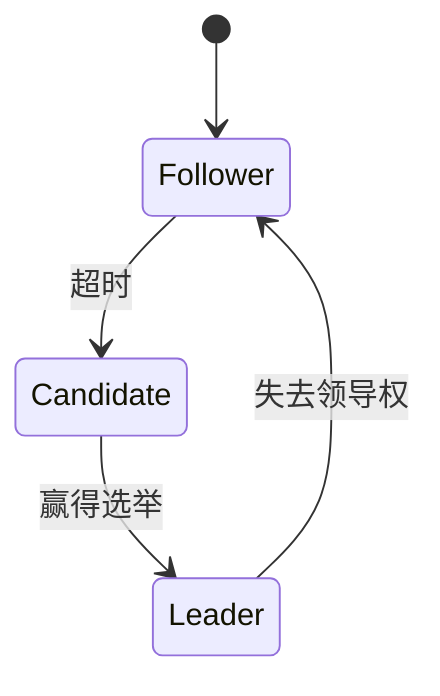

# 操作系统分布式算法

## 介绍

在现代计算环境中，分布式系统变得越来越重要。分布式系统由多个独立的计算机节点组成，这些节点通过网络进行通信和协作，以完成共同的任务。操作系统中的分布式算法是确保这些节点能够高效、可靠地协同工作的关键。

分布式算法涉及多个方面，包括一致性、容错性、负载均衡和资源管理等。本文将介绍一些常见的分布式算法，并通过代码示例和实际案例帮助初学者理解这些概念。

## 基本概念

### 1. 一致性算法

一致性算法用于确保分布式系统中的所有节点在某个时间点上对系统的状态达成一致。常见的一致性算法包括 Paxos 和 Raft。

#### Paxos 算法

Paxos 是一种用于解决分布式系统中一致性问题的算法。它通过多个阶段的投票来确保系统中的节点对某个值达成一致。

```python
# 伪代码示例
def paxos_algorithm():
    # 阶段1：准备阶段
    prepare_request = send_prepare_request()
    prepare_response = receive_prepare_response()

    if prepare_response.majority_agreed:
        # 阶段2：接受阶段
        accept_request = send_accept_request()
        accept_response = receive_accept_response()

        if accept_response.majority_accepted:
            # 阶段3：学习阶段
            learn_value()
```

#### Raft 算法

Raft 是一种更易于理解的一致性算法，它将一致性分解为领导选举、日志复制和安全性三个子问题。



### 2. 容错性算法

容错性算法确保系统在部分节点发生故障时仍能继续运行。常见的容错性算法包括拜占庭容错算法。

#### 拜占庭容错算法

拜占庭容错算法用于解决分布式系统中节点可能发送错误信息的问题。它通过多数表决机制来确保系统的正确性。

```python
# 伪代码示例
def byzantine_fault_tolerance():
    messages = receive_messages()
    valid_messages = filter_valid_messages(messages)
    decision = majority_vote(valid_messages)
    return decision
```

## 实际案例

### 案例1：分布式数据库

在分布式数据库中，一致性算法用于确保数据在不同节点之间的同步。例如，Google 的 Spanner 数据库使用 Paxos 算法来实现全球范围的一致性。

### 案例2：区块链

区块链技术中的共识算法（如 Proof of Work 和 Proof of Stake）是分布式算法的一种应用。这些算法确保所有节点对区块链的状态达成一致。

## 总结

操作系统中的分布式算法是构建高效、可靠分布式系统的基石。通过理解一致性算法和容错性算法，开发者可以设计出能够在复杂环境中稳定运行的系统。

## 附加资源

- [Paxos 算法详解](https://en.wikipedia.org/wiki/Paxos_(computer_science))
- [Raft 算法官方网站](https://raft.github.io/)
- [拜占庭容错算法论文](https://www.microsoft.com/en-us/research/publication/byzantine-fault-tolerance/)

## 练习

1. 实现一个简单的 Paxos 算法模拟器。
2. 研究 Raft 算法中的领导选举过程，并编写代码模拟该过程。
3. 思考并讨论在分布式系统中如何应用拜占庭容错算法。

:::tip
建议初学者从 Raft 算法开始学习，因为它的设计更易于理解和实现。
:::