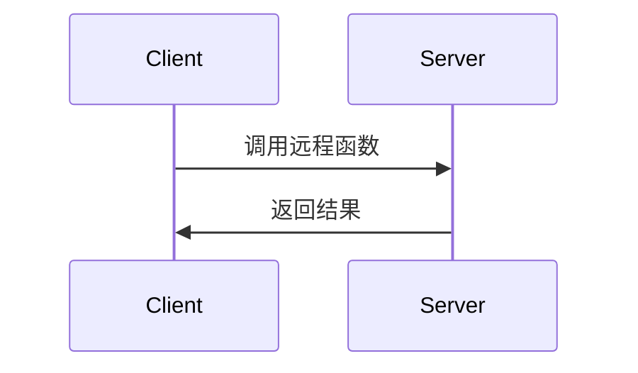

# 操作系统远程过程调用

## 介绍

远程过程调用（Remote Procedure Call，简称 RPC）是一种允许程序调用位于另一台计算机上的过程或函数的机制。它使得分布式系统中的不同节点能够像调用本地函数一样调用远程函数，从而简化了分布式应用的开发。

RPC 的核心思想是隐藏网络通信的复杂性，让开发者能够专注于业务逻辑。通过 RPC，客户端可以像调用本地函数一样调用服务器端的函数，而无需关心底层的网络细节。

## RPC 的工作原理

RPC 的工作流程可以分为以下几个步骤：

1. **客户端调用**：客户端调用一个本地存根（stub）函数，该函数看起来像是一个普通的本地函数。
2. **参数打包**：客户端存根将函数参数打包成消息，并通过网络发送到服务器。
3. **服务器接收**：服务器端的存根接收消息，并将其解包为函数参数。
4. **函数执行**：服务器端执行实际的函数，并将结果打包成消息发送回客户端。
5. **结果返回**：客户端存根接收消息，并将其解包为函数返回值，返回给调用者。



## 代码示例

以下是一个简单的 RPC 示例，使用 Python 的 `xmlrpc` 库实现。

### 服务器端代码

```python
from xmlrpc.server import SimpleXMLRPCServer

def add(x, y):
    return x + y

server = SimpleXMLRPCServer(("localhost", 8000))
server.register_function(add, "add")
server.serve_forever()
```

### 客户端代码

```python
import xmlrpc.client

proxy = xmlrpc.client.ServerProxy("http://localhost:8000/")
result = proxy.add(2, 3)
print(result)  # 输出: 5
```

在这个示例中，客户端通过 RPC 调用服务器端的 `add` 函数，并返回结果。

## 实际应用场景

RPC 在分布式系统中有广泛的应用，以下是一些常见的场景：

1. **微服务架构**：在微服务架构中，不同的服务通常运行在不同的机器上，RPC 可以用于服务之间的通信。
2. **分布式数据库**：分布式数据库系统通常使用 RPC 来协调不同节点之间的操作。
3. **云计算**：云服务提供商使用 RPC 来实现客户端与云服务之间的交互。

:::tip
在实际应用中，RPC 的性能和可靠性是关键考虑因素。为了提高性能，可以使用异步 RPC 或批处理调用。为了提高可靠性，可以使用重试机制和超时处理。
:::

## 总结

远程过程调用（RPC）是分布式系统中的重要技术，它简化了跨网络的过程调用，使得开发者能够像调用本地函数一样调用远程函数。通过理解 RPC 的工作原理和实现方式，开发者可以更好地设计和实现分布式应用。

## 附加资源与练习

- **资源**：
  - [gRPC 官方文档](https://grpc.io/docs/)
  - [Apache Thrift 官方文档](https://thrift.apache.org/docs/)
  - [XML-RPC 官方文档](https://docs.python.org/3/library/xmlrpc.html)

- **练习**：
  1. 使用 Python 的 `xmlrpc` 库实现一个简单的计算器服务，支持加、减、乘、除操作。
  2. 尝试使用 gRPC 或 Apache Thrift 实现一个更复杂的 RPC 服务，并比较其与 XML-RPC 的差异。

通过学习和实践，你将能够掌握 RPC 的核心概念，并在实际项目中应用这一技术。