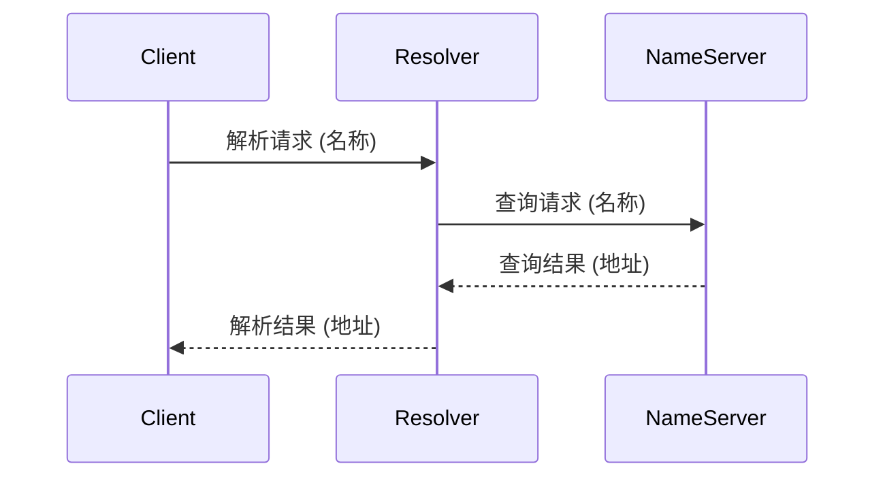

## 介绍

在分布式系统中，**命名服务**是一个关键组件，用于管理和解析资源的名称与地址之间的映射关系。命名服务的主要功能是将用户友好的名称（如主机名、服务名）转换为系统可识别的地址（如IP地址、端口号）。这种映射关系在分布式系统中尤为重要，因为系统中的资源可能分布在不同的节点上，且它们的地址可能会动态变化。

命名服务不仅简化了资源的访问，还提高了系统的可扩展性和灵活性。例如，当某个服务的地址发生变化时，只需更新命名服务中的映射关系，而不需要修改所有依赖该服务的客户端代码。

## 命名服务的工作原理

命名服务的核心是一个**名称解析器**，它负责将名称转换为地址。名称解析器通常通过查询一个**名称服务器**来完成这一任务。名称服务器存储了名称与地址的映射关系，并对外提供查询接口。

### 名称解析的基本流程

1. **客户端请求**：客户端向名称解析器发送一个名称解析请求，请求中包含需要解析的名称。
2. **名称解析器查询**：名称解析器接收到请求后，向名称服务器发送查询请求。
3. **名称服务器响应**：名称服务器查找映射关系，并将结果返回给名称解析器。
4. **结果返回**：名称解析器将解析结果返回给客户端。



### 代码示例

以下是一个简单的名称解析器的伪代码示例：

```python
class NameResolver:
    def __init__(self, name_server):
        self.name_server = name_server

    def resolve(self, name):
        return self.name_server.lookup(name)

class NameServer:
    def __init__(self):
        self.mapping = {
            "service1": "192.168.1.1",
            "service2": "192.168.1.2"
        }

    def lookup(self, name):
        return self.mapping.get(name, "Unknown")

# 使用示例
name_server = NameServer()
resolver = NameResolver(name_server)
address = resolver.resolve("service1")
print(f"Resolved address: {address}")
```

**输出：**
```
Resolved address: 192.168.1.1
```

## 命名服务的实际应用

### DNS（域名系统）

**DNS** 是互联网中最常见的命名服务之一。它将人类可读的域名（如 `www.example.com`）转换为机器可读的IP地址（如 `93.184.216.34`）。DNS 是一个分布式的命名系统，由多个层次的名称服务器组成，每个服务器负责管理一部分域名空间。

:::tip
DNS 不仅用于解析域名，还支持其他类型的记录，如邮件服务器（MX记录）、文本记录（TXT记录）等。
:::

### 服务发现

在微服务架构中，**服务发现** 是一种常见的命名服务应用。服务发现机制允许服务实例在启动时向注册中心注册自己的地址，并在需要时查询其他服务的地址。常见的服务发现工具包括 **Consul**、**Eureka** 和 **Zookeeper**。

:::note
服务发现通常与负载均衡结合使用，以确保请求被均匀地分配到多个服务实例上。
:::

## 总结

命名服务是分布式系统中不可或缺的一部分，它简化了资源的访问和管理，提高了系统的可扩展性和灵活性。通过名称解析，客户端可以轻松地找到所需的资源，而无需关心资源的实际位置。

在实际应用中，命名服务的形式多种多样，从互联网的DNS到微服务架构中的服务发现，它们都在各自的领域中发挥着重要作用。

## 附加资源与练习

### 附加资源

- [DNS 详解](https://en.wikipedia.org/wiki/Domain_Name_System)
- [Consul 官方文档](https://www.consul.io/docs)
- [Zookeeper 官方文档](https://zookeeper.apache.org/doc/current/)

### 练习

1. 实现一个简单的名称解析器，支持动态添加和删除名称与地址的映射关系。
2. 研究并比较 DNS 和服务发现的异同点。
3. 使用 Consul 或 Eureka 实现一个简单的服务发现机制。

通过以上内容的学习和练习，你将能够更好地理解命名服务在分布式系统中的重要性及其实际应用。