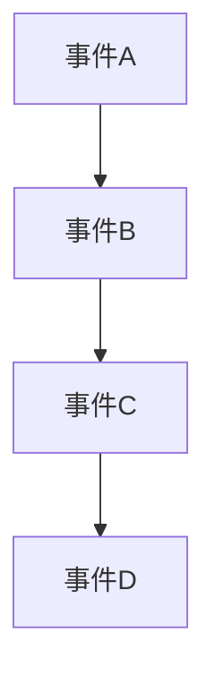

# 操作系统时钟同步

在分布式系统中，多个计算机节点需要协同工作以完成复杂的任务。为了实现这种协同，节点之间的时间同步至关重要。操作系统时钟同步是指通过某种机制，确保分布式系统中所有节点的时钟保持一致。本文将详细介绍时钟同步的概念、实现方法以及实际应用场景。

## 什么是时钟同步？

在单机系统中，操作系统通常依赖于硬件时钟（如CPU的时钟）来维护时间。然而，在分布式系统中，每个节点都有自己的硬件时钟，这些时钟可能会因为硬件差异、温度变化等原因而出现偏差。如果这些偏差不加以纠正，可能会导致数据不一致、任务调度错误等问题。

时钟同步的目标是通过某种协议或算法，使得分布式系统中所有节点的时钟保持一致或接近一致。

## 时钟同步的必要性

1. **事件排序**：在分布式系统中，事件的顺序非常重要。如果节点之间的时钟不同步，可能会导致事件的错误排序。
2. **任务调度**：分布式任务调度依赖于时间戳来协调任务的执行。如果时钟不同步，可能会导致任务执行顺序混乱。
3. **数据一致性**：在分布式数据库中，时间戳用于确保数据的一致性。如果时钟不同步，可能会导致数据不一致。

## 时钟同步的实现方法

### 1. 网络时间协议（NTP）

NTP（Network Time Protocol）是最常用的时钟同步协议之一。它通过分层的时间服务器体系结构，将时间从高精度的时钟源传递到分布式系统中的各个节点。

#### NTP的工作原理

1. **时间服务器**：NTP使用一组时间服务器来提供准确的时间。这些服务器通常连接到高精度的时钟源，如原子钟或GPS。
2. **时间同步**：客户端节点定期向时间服务器发送请求，获取当前时间，并根据响应调整本地时钟。

#### 代码示例

以下是一个简单的Python示例，展示如何使用NTP同步时间：

```python
import ntplib
from time import ctime

def sync_time():
    client = ntplib.NTPClient()
    response = client.request('pool.ntp.org')
    print("Current time: ", ctime(response.tx_time))

sync_time()
```

**输出**：
```
Current time:  Wed Oct 11 12:34:56 2023
```

### 2. 逻辑时钟

在某些情况下，物理时钟同步可能不可行或不必要。逻辑时钟（Logical Clock）是一种基于事件顺序的时钟同步方法，它不依赖于物理时间，而是通过事件的发生顺序来维护时间一致性。

#### Lamport逻辑时钟

Lamport逻辑时钟是一种简单的逻辑时钟算法，它通过为每个事件分配一个时间戳来维护事件的顺序。



#### 代码示例

以下是一个简单的Python示例，展示如何使用Lamport逻辑时钟：

```python
class LamportClock:
    def __init__(self):
        self.time = 0

    def increment(self):
        self.time += 1

    def update(self, received_time):
        self.time = max(self.time, received_time) + 1

# 示例使用
clock = LamportClock()
clock.increment()
print("Current Lamport time: ", clock.time)

clock.update(5)
print("Updated Lamport time: ", clock.time)
```

**输出**：
```
Current Lamport time:  1
Updated Lamport time:  6
```

## 实际应用场景

### 1. 分布式数据库

在分布式数据库中，时间戳用于确保数据的一致性。例如，Google Spanner使用TrueTime API来实现全球范围内的时钟同步，从而确保事务的全局一致性。

### 2. 金融交易系统

在金融交易系统中，时间戳用于记录交易的顺序。如果时钟不同步，可能会导致交易的错误排序，从而引发严重的后果。

### 3. 分布式任务调度

在分布式任务调度系统中，时间戳用于协调任务的执行顺序。如果时钟不同步，可能会导致任务执行顺序混乱，从而影响系统的整体性能。

## 总结

操作系统时钟同步是分布式系统中的关键技术之一。通过NTP、逻辑时钟等方法，可以确保分布式系统中所有节点的时钟保持一致或接近一致。时钟同步在分布式数据库、金融交易系统、分布式任务调度等场景中有着广泛的应用。

## 附加资源与练习

- **练习1**：尝试在本地环境中配置NTP服务器，并使用NTP客户端同步时间。
- **练习2**：实现一个简单的Lamport逻辑时钟，并模拟多个节点之间的时间同步。
- **资源**：
  - [NTP官方文档](https://www.ntp.org/)
  - [Lamport逻辑时钟论文](https://lamport.azurewebsites.net/pubs/time-clocks.pdf)

通过本文的学习，你应该对操作系统时钟同步有了初步的了解。希望你能通过实践进一步掌握这一重要概念。