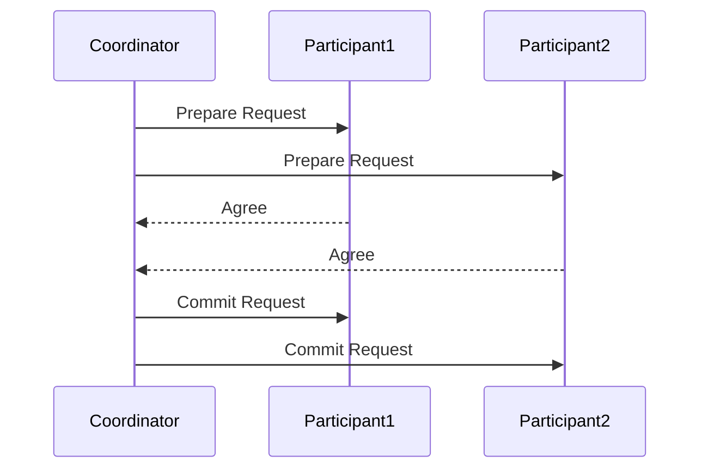
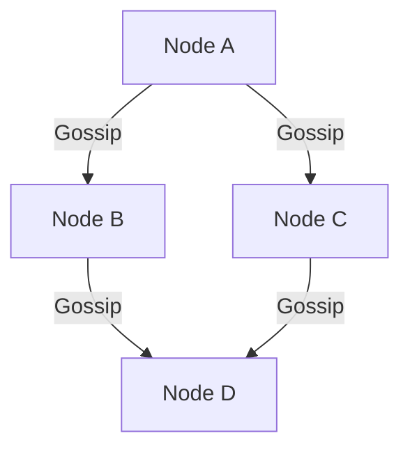

# 操作系统一致性协议

在分布式系统中，**操作系统一致性协议**是确保多个节点之间数据一致性的关键机制。由于分布式系统的节点可能分布在不同的地理位置，且网络通信可能存在延迟或故障，因此需要一种机制来保证所有节点对数据的操作是一致的。本文将详细介绍操作系统一致性协议的基本概念、工作原理及其实际应用。

## 什么是操作系统一致性协议？

操作系统一致性协议是分布式系统中用于确保多个节点之间数据一致性的协议。它定义了节点之间如何通信、如何同步数据以及如何处理冲突。一致性协议的目标是让所有节点在某个时间点上看到相同的数据状态，即使这些节点分布在不同的地理位置。

### 为什么需要一致性协议？

在分布式系统中，数据通常会被复制到多个节点以提高可用性和容错性。然而，这种复制也带来了数据一致性的问题。例如，当一个节点更新了数据，其他节点可能还没有收到更新，从而导致数据不一致。一致性协议就是为了解决这个问题而设计的。

## 一致性协议的类型

一致性协议可以分为多种类型，常见的有：

1. **强一致性**：所有节点在任何时刻看到的数据都是一致的。
2. **弱一致性**：允许节点在一段时间内看到不一致的数据，但最终会达到一致。
3. **最终一致性**：系统保证在没有新的更新操作的情况下，最终所有节点都会看到一致的数据。

### 强一致性协议

强一致性协议确保所有节点在任何时刻看到的数据都是一致的。这种协议通常需要较高的通信开销，因为它要求所有节点在每次更新操作后立即同步数据。

#### 示例：两阶段提交协议（2PC）

两阶段提交协议是一种经典的强一致性协议。它分为两个阶段：

1. **准备阶段**：协调者向所有参与者发送准备请求，询问是否可以提交事务。
2. **提交阶段**：如果所有参与者都同意提交，协调者发送提交请求；否则，发送回滚请求。

### 弱一致性协议

弱一致性协议允许节点在一段时间内看到不一致的数据，但最终会达到一致。这种协议通常用于对一致性要求不高的场景，如缓存系统。

#### 示例：Gossip协议

Gossip协议是一种弱一致性协议，它通过节点之间随机交换信息来传播更新。每个节点定期随机选择其他节点发送自己的数据，从而逐步传播更新。

## 实际应用场景

### 分布式数据库

在分布式数据库中，一致性协议用于确保多个副本之间的数据一致性。例如，Google的Spanner数据库使用Paxos协议来实现强一致性。

### 分布式文件系统

在分布式文件系统中，一致性协议用于确保文件在不同节点之间的同步。例如，HDFS（Hadoop分布式文件系统）使用最终一致性协议来保证文件的一致性。

## 总结

操作系统一致性协议是分布式系统中确保数据一致性的关键机制。根据不同的应用场景，可以选择强一致性、弱一致性或最终一致性协议。理解这些协议的工作原理及其应用场景，对于设计和实现分布式系统至关重要。

## 附加资源

- [分布式系统：概念与设计](https://www.amazon.com/Distributed-Systems-Concepts-Design-5th/dp/0132143011)
- [Paxos算法详解](https://en.wikipedia.org/wiki/Paxos_(computer_science))
- [Gossip协议](https://en.wikipedia.org/wiki/Gossip_protocol)

## 练习

1. 实现一个简单的两阶段提交协议，模拟协调者和参与者之间的通信。
2. 研究Gossip协议在实际系统中的应用，并编写一个简单的Gossip协议模拟器。
