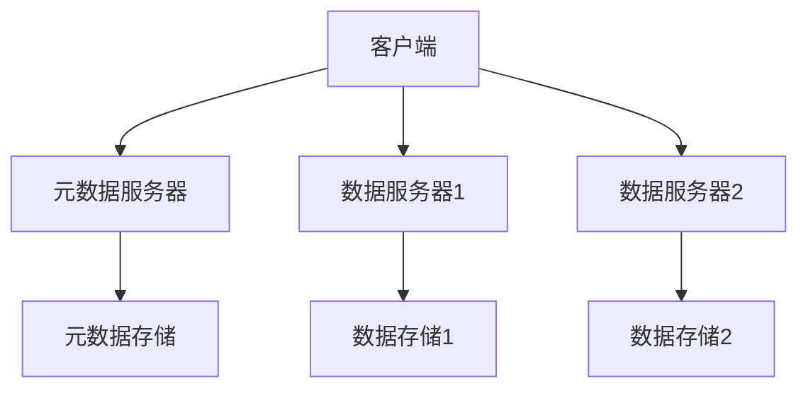

# 操作系统分布式文件系统

## 介绍

分布式文件系统（Distributed File System, DFS）是一种允许通过网络在多台计算机上存储和访问文件的系统。它为用户提供了一个统一的文件系统视图，无论文件实际存储在哪台计算机上，用户都可以像访问本地文件一样访问这些文件。分布式文件系统是现代分布式系统的核心组件之一，广泛应用于云计算、大数据处理和分布式存储等领域。

## 分布式文件系统的基本概念

### 1. 文件系统抽象

分布式文件系统为用户提供了一个抽象的文件系统接口，隐藏了底层存储的复杂性。用户可以通过标准的文件操作（如打开、读取、写入、关闭）来访问文件，而不需要关心文件实际存储在哪台机器上。

### 2. 数据分布与复制

为了提高可靠性和性能，分布式文件系统通常会将文件数据分布到多个节点上，并进行数据复制。这样即使某个节点发生故障，系统仍然可以从其他节点获取数据。

### 3. 一致性模型

分布式文件系统需要处理多个客户端同时访问同一文件的情况，因此需要定义一致性模型。常见的一致性模型包括强一致性、最终一致性和会话一致性等。

## 分布式文件系统的架构

分布式文件系统通常采用客户端-服务器架构，其中客户端负责与用户交互，服务器负责存储和管理文件数据。以下是一个典型的分布式文件系统架构：



在这个架构中，元数据服务器负责管理文件的元数据（如文件名、权限、位置等），而数据服务器负责存储实际的文件数据。

## 实际应用场景

### 1. 云计算存储

在云计算环境中，分布式文件系统被广泛用于存储用户数据和应用程序数据。例如，Amazon S3 和 Google Cloud Storage 都是基于分布式文件系统的云存储服务。

### 2. 大数据处理

在大数据处理中，分布式文件系统（如 Hadoop HDFS）用于存储海量数据，并支持并行处理。这使得大数据处理框架（如 MapReduce）能够高效地处理和分析数据。

### 3. 分布式数据库

分布式文件系统也被用于分布式数据库的底层存储。例如，Cassandra 和 MongoDB 都使用分布式文件系统来存储数据。

## 代码示例

以下是一个简单的 Python 示例，展示了如何使用 `hdfs` 库与 Hadoop 分布式文件系统（HDFS）进行交互：

```python
from hdfs import InsecureClient

# 连接到 HDFS
client = InsecureClient('http://namenode:50070', user='hadoop')

# 创建一个新文件并写入数据
with client.write('/user/hadoop/testfile.txt', encoding='utf-8') as writer:
    writer.write('Hello, HDFS!')

# 读取文件内容
with client.read('/user/hadoop/testfile.txt', encoding='utf-8') as reader:
    content = reader.read()
    print(content)  # 输出: Hello, HDFS!
```

在这个示例中，我们首先连接到 HDFS，然后创建一个新文件并写入数据，最后读取文件内容并打印出来。

## 总结

分布式文件系统是现代分布式系统的核心组件之一，它通过提供统一的文件系统视图、数据分布与复制以及一致性模型，使得用户能够高效地存储和访问分布式环境中的文件。分布式文件系统在云计算、大数据处理和分布式数据库等领域有着广泛的应用。

## 附加资源与练习

### 附加资源

- [Hadoop HDFS 官方文档](https://hadoop.apache.org/docs/stable/hadoop-project-dist/hadoop-hdfs/HdfsUserGuide.html)
- [Google File System 论文](https://static.googleusercontent.com/media/research.google.com/en//archive/gfs-sosp2003.pdf)
- [Amazon S3 开发者指南](https://docs.aws.amazon.com/AmazonS3/latest/dev/Welcome.html)

### 练习

1. 尝试在本地搭建一个 Hadoop 集群，并使用 HDFS 存储和访问文件。
2. 编写一个 Python 脚本，使用 `hdfs` 库与 HDFS 进行交互，实现文件的创建、读取和删除操作。
3. 研究其他分布式文件系统（如 Ceph 或 GlusterFS），并比较它们与 HDFS 的异同。

通过以上学习和练习，你将能够更好地理解分布式文件系统的工作原理，并掌握其在实际应用中的使用方法。