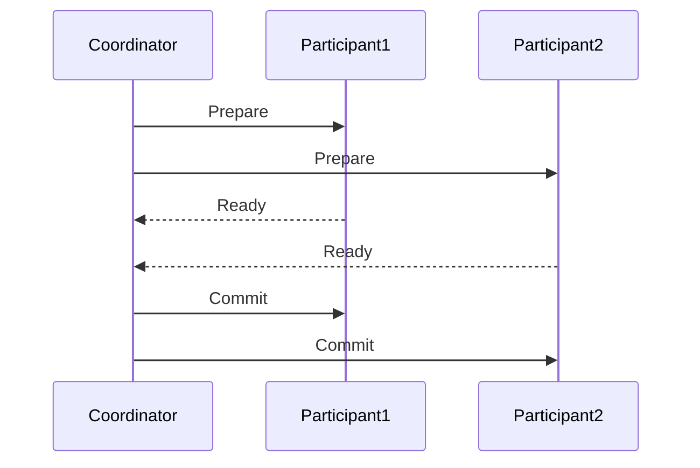
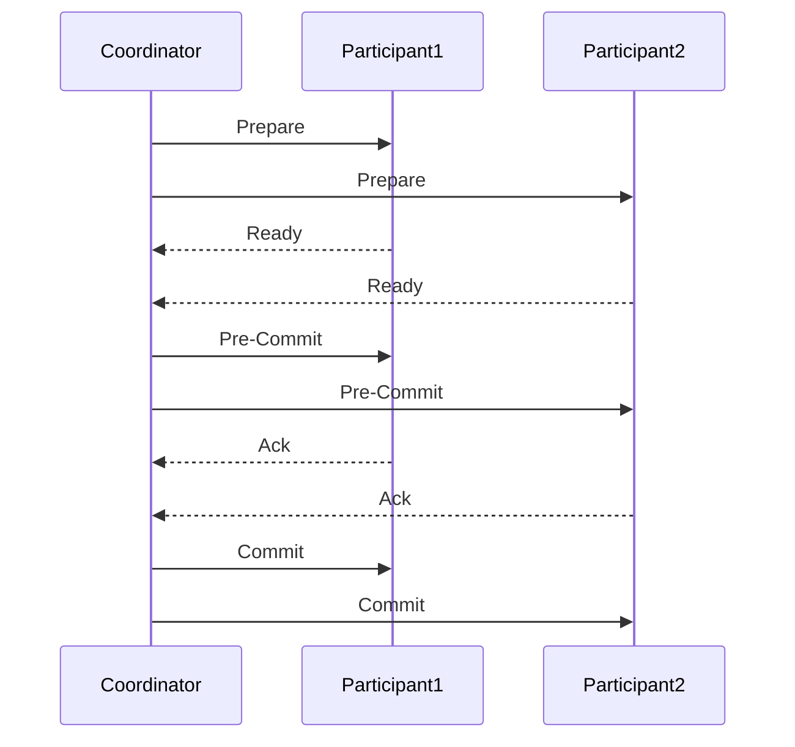

# 操作系统分布式事务

## 介绍

在分布式系统中，多个独立的计算节点协同工作以完成共同的任务。由于这些节点分布在不同的物理位置，如何确保数据的一致性和事务的原子性成为了一个关键问题。**分布式事务**就是为了解决这一问题而提出的概念。它允许跨多个节点的事务操作要么全部成功，要么全部失败，从而保证系统的数据一致性。

## 什么是分布式事务？

分布式事务是指跨越多个分布式节点的事务操作。这些节点可能位于不同的物理服务器上，甚至可能位于不同的地理位置。分布式事务的核心目标是确保所有参与节点的事务操作要么全部提交，要么全部回滚，从而保证数据的一致性。

### 事务的 ACID 属性

在讨论分布式事务之前，我们需要回顾一下事务的 **ACID** 属性：

- **原子性（Atomicity）**：事务中的所有操作要么全部成功，要么全部失败。
- **一致性（Consistency）**：事务执行前后，系统状态保持一致。
- **隔离性（Isolation）**：并发执行的事务之间互不干扰。
- **持久性（Durability）**：事务一旦提交，其结果将永久保存。

在分布式系统中，实现这些属性变得更加复杂，因为数据分布在多个节点上，网络延迟和故障可能导致数据不一致。

## 分布式事务的实现方式

### 两阶段提交（2PC）

两阶段提交（2PC）是分布式事务中最常用的协议之一。它通过两个阶段来确保所有节点的事务操作要么全部提交，要么全部回滚。

#### 阶段 1：准备阶段

1. 事务协调者向所有参与者发送“准备”请求。
2. 每个参与者执行事务操作，并将结果（成功或失败）返回给协调者。

#### 阶段 2：提交阶段

1. 如果所有参与者都返回“成功”，协调者发送“提交”请求。
2. 如果有任何一个参与者返回“失败”，协调者发送“回滚”请求。

:::note
两阶段提交的主要缺点是它的阻塞性。如果协调者在第二阶段崩溃，参与者可能会一直等待，导致系统不可用。
:::

### 三阶段提交（3PC）

三阶段提交（3PC）是对两阶段提交的改进，通过引入一个“预提交”阶段来减少阻塞的可能性。

#### 阶段 1：准备阶段

1. 事务协调者向所有参与者发送“准备”请求。
2. 每个参与者执行事务操作，并将结果（成功或失败）返回给协调者。

#### 阶段 2：预提交阶段

1. 如果所有参与者都返回“成功”，协调者发送“预提交”请求。
2. 参与者确认预提交，并返回“确认”消息。

#### 阶段 3：提交阶段

1. 协调者发送“提交”请求，参与者执行提交操作。

:::tip
三阶段提交通过引入预提交阶段，减少了阻塞的可能性，但增加了协议的复杂性。
:::

## 实际应用场景

### 分布式数据库

在分布式数据库中，数据通常分布在多个节点上。为了确保数据的一致性，分布式事务是必不可少的。例如，Google 的 Spanner 数据库使用了两阶段提交协议来确保跨区域的事务一致性。

### 微服务架构

在微服务架构中，每个服务可能都有自己的数据库。当一个业务操作需要跨多个服务时，分布式事务可以确保所有服务的数据一致性。例如，在一个电商系统中，下单操作可能涉及库存服务、订单服务和支付服务，分布式事务可以确保这些服务的操作要么全部成功，要么全部失败。

## 总结

分布式事务是分布式系统中确保数据一致性的关键技术。通过两阶段提交和三阶段提交等协议，系统可以在多个节点之间协调事务操作，确保事务的原子性和一致性。尽管这些协议存在一定的复杂性和性能开销，但在许多实际应用场景中，分布式事务是不可或缺的。

## 附加资源与练习

- **资源**：
  - [分布式系统：概念与设计](https://www.amazon.com/Distributed-Systems-Concepts-Design-5th/dp/0132143011)
  - [Google Spanner 论文](https://research.google/pubs/pub39966/)

- **练习**：
  1. 实现一个简单的两阶段提交协议。
  2. 在一个分布式系统中，模拟网络分区对两阶段提交协议的影响。
  3. 比较两阶段提交和三阶段提交的性能差异。

:::caution
在实现分布式事务时，务必考虑网络延迟、节点故障等现实问题，并设计相应的容错机制。
:::