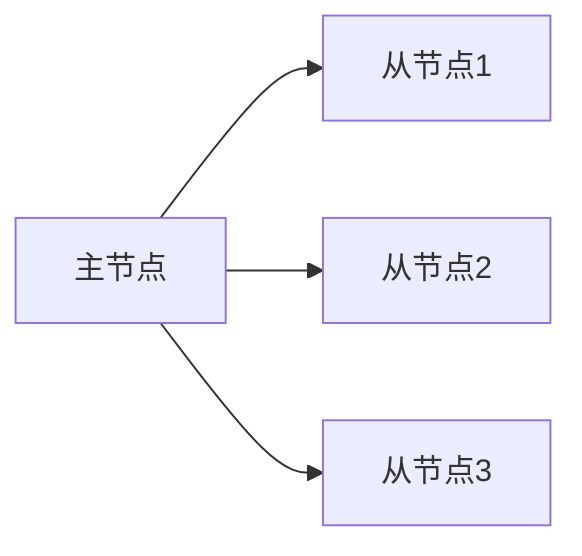
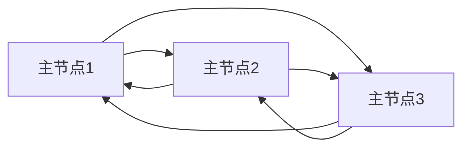

# 操作系统复制技术

在分布式系统中，**复制技术**是一种关键的技术手段，用于提高系统的可靠性、可用性和性能。通过复制，系统可以在多个节点上保存相同的数据或服务副本，从而在某个节点发生故障时，其他节点可以继续提供服务。本文将详细介绍操作系统中的复制技术，帮助初学者理解其原理和应用。

## 什么是复制技术？

复制技术是指在分布式系统中，将数据或服务在多个节点上进行复制，以确保系统的高可用性和容错能力。复制可以分为**数据复制**和**服务复制**两种类型：

- **数据复制**：将数据在多个节点上保存多个副本，确保数据的高可用性和一致性。
- **服务复制**：将服务在多个节点上运行多个实例，确保服务的高可用性和负载均衡。

## 复制技术的实现方式

### 1. 主从复制（Master-Slave Replication）

在主从复制中，有一个主节点（Master）和多个从节点（Slave）。主节点负责处理所有的写操作，并将写操作的结果复制到从节点。从节点只能处理读操作。



**优点**：
- 简单易实现。
- 读操作可以分散到多个从节点，提高读性能。

**缺点**：
- 主节点是单点故障，如果主节点宕机，系统将无法处理写操作。
- 从节点的数据可能会有延迟。

### 2. 多主复制（Multi-Master Replication）

在多主复制中，有多个主节点，每个主节点都可以处理写操作，并将写操作的结果复制到其他主节点。



**优点**：
- 没有单点故障，系统的高可用性更高。
- 写操作可以分散到多个主节点，提高写性能。

**缺点**：
- 实现复杂，需要解决数据冲突问题。
- 数据一致性难以保证。

### 3. 链式复制（Chain Replication）

在链式复制中，数据按照一定的顺序在多个节点之间传递。每个节点只负责将数据传递给下一个节点。


**优点**：
- 数据一致性容易保证。
- 适合需要强一致性的场景。

**缺点**：
- 链中的任何一个节点故障都会影响整个系统的可用性。
- 写操作的延迟较高。

## 实际应用场景

### 1. 数据库复制

在数据库系统中，复制技术被广泛用于提高数据的可用性和性能。例如，MySQL 支持主从复制和多主复制，用户可以根据需求选择合适的复制方式。

```sql
-- 主从复制配置示例
CHANGE MASTER TO
    MASTER_HOST='master_host_name',
    MASTER_USER='replication_user_name',
    MASTER_PASSWORD='replication_password',
    MASTER_LOG_FILE='recorded_log_file_name',
    MASTER_LOG_POS=recorded_log_position;
```

### 2. 分布式文件系统

在分布式文件系统中，复制技术用于确保文件的高可用性和容错能力。例如，HDFS（Hadoop Distributed File System）通过将文件块复制到多个数据节点来提高系统的可靠性。

```bash
# HDFS 复制因子设置
hdfs dfs -setrep -w 3 /path/to/file
```

### 3. 分布式缓存

在分布式缓存系统中，复制技术用于提高缓存的可用性和性能。例如，Redis 支持主从复制，用户可以通过配置多个从节点来提高读性能。

```bash
# Redis 主从复制配置
slaveof 192.168.1.1 6379
```

## 总结

复制技术是分布式系统中提高系统可靠性、可用性和性能的重要手段。通过主从复制、多主复制和链式复制等不同的实现方式，系统可以在不同的场景下选择合适的复制策略。在实际应用中，复制技术被广泛用于数据库、分布式文件系统和分布式缓存等场景。

## 附加资源与练习

- **资源**：
  - [《分布式系统：概念与设计》](https://example.com) - 一本经典的分布式系统教材，深入讲解了复制技术的原理和应用。
  - [MySQL 复制文档](https://dev.mysql.com/doc/refman/8.0/en/replication.html) - MySQL 官方文档中关于复制的详细说明。

- **练习**：
  1. 尝试在本地搭建一个 MySQL 主从复制环境，并测试其高可用性。
  2. 使用 Redis 配置一个主从复制集群，并观察从节点的数据同步情况。
  3. 研究 HDFS 的复制机制，并尝试修改复制因子，观察系统行为的变化。

:::tip
**提示**：在实际应用中，选择合适的复制策略需要根据系统的需求和场景进行权衡。强一致性、高可用性和性能之间往往存在 trade-off，理解这些权衡是设计分布式系统的关键。
:::