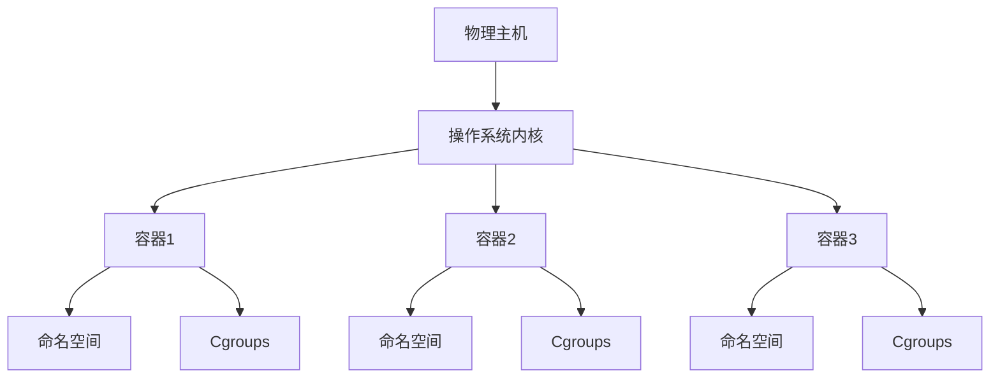

## 什么是操作系统虚拟化？

操作系统虚拟化是一种技术，它允许在单个物理主机上运行多个独立的操作系统实例。这些实例被称为**容器**或**虚拟环境**，它们共享主机的操作系统内核，但彼此之间是隔离的。与传统的虚拟机（VM）不同，操作系统虚拟化不需要为每个实例模拟完整的硬件环境，因此更加轻量级和高效。

:::tip
操作系统虚拟化的核心思想是**资源共享**和**隔离**。它通过利用主机的操作系统内核，避免了重复的资源分配，从而提高了资源利用率。
:::

## 操作系统虚拟化的工作原理

操作系统虚拟化通过以下方式实现：

1. **命名空间（Namespaces）**：命名空间用于隔离不同容器之间的资源视图。例如，每个容器可以有自己的进程树、网络接口和文件系统视图。
2. **控制组（Cgroups）**：控制组用于限制和分配资源（如 CPU、内存、磁盘 I/O）给每个容器，确保它们不会相互干扰。
3. **联合文件系统（Union File System）**：联合文件系统允许多个文件系统层叠加在一起，形成一个单一的文件系统视图。这使得容器可以共享基础镜像，同时保留自己的修改。



## 操作系统虚拟化的实际应用

### 1. 容器化应用部署

操作系统虚拟化最常见的应用场景是**容器化应用部署**。通过使用容器技术（如 Docker），开发者可以将应用程序及其依赖打包到一个轻量级的容器中，然后在任何支持容器的主机上运行。

```bash
# 示例：使用 Docker 运行一个简单的容器
docker run -it ubuntu bash
```

**输入**：运行上述命令后，你将进入一个基于 Ubuntu 的容器环境。<br />
**输出**：你可以在容器内执行命令，就像在一个独立的 Ubuntu 系统中一样。

### 2. 微服务架构

在微服务架构中，每个服务可以运行在独立的容器中。这种隔离性使得服务之间的依赖关系更加清晰，同时也便于扩展和维护。

```bash
# 示例：使用 Docker Compose 启动多个微服务
version: '3'
services:
  web:
    image: nginx
    ports:
      - "80:80"
  api:
    image: my-api
    ports:
      - "8080:8080"
```

**输入**：运行 `docker-compose up` 后，Nginx 和自定义 API 服务将同时启动。<br />
**输出**：你可以通过浏览器访问 `http://localhost` 和 `http://localhost:8080` 来分别访问这两个服务。

### 3. 持续集成与持续部署（CI/CD）

操作系统虚拟化在 CI/CD 管道中也扮演着重要角色。通过容器化构建和测试环境，开发者可以确保每次构建都在一致的环境中运行，从而减少“在我机器上可以运行”的问题。

```bash
# 示例：在 CI 管道中使用 Docker 构建应用
docker build -t my-app .
docker run my-app npm test
```

**输入**：运行上述命令后，Docker 将构建应用镜像并运行测试。<br />
**输出**：测试结果将显示在终端中。

## 总结

操作系统虚拟化通过资源共享和隔离，提供了一种高效、轻量级的虚拟化解决方案。它在容器化应用部署、微服务架构和 CI/CD 管道中有着广泛的应用。对于初学者来说，理解操作系统虚拟化的基本概念是掌握现代云计算和 DevOps 实践的重要一步。

## 附加资源与练习

- **资源**：
  - [Docker 官方文档](https://docs.docker.com/)
  - [Linux 命名空间详解](https://man7.org/linux/man-pages/man7/namespaces.7.html)
  - [Cgroups 官方文档](https://www.kernel.org/doc/Documentation/cgroup-v1/cgroups.txt)

- **练习**：
  1. 使用 Docker 创建一个简单的容器，并在其中运行一个 Python 脚本。
  2. 尝试使用 Docker Compose 启动一个包含多个服务的微服务应用。
  3. 研究 Linux 命名空间，并尝试手动创建一个隔离的进程环境。

:::caution
在实验过程中，请确保你理解每个命令的作用，避免在生产环境中随意操作。
:::