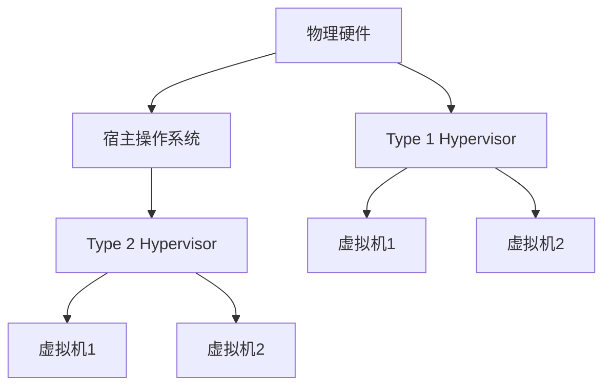

# 操作系统虚拟机

## 介绍

操作系统虚拟机（Operating System Virtual Machine，简称 OS VM）是一种虚拟化技术，它允许在单个物理计算机上运行多个独立的操作系统实例。每个虚拟机（VM）都像一台独立的计算机，拥有自己的操作系统、应用程序和资源。通过虚拟化技术，物理资源（如 CPU、内存、存储和网络）被抽象化并分配给多个虚拟机，从而实现资源的高效利用。

操作系统虚拟机的主要优点包括：
- **资源隔离**：每个虚拟机独立运行，互不干扰。
- **灵活性**：可以在同一台物理机上运行不同的操作系统。
- **成本效益**：减少硬件需求，降低维护成本。

## 操作系统虚拟机的工作原理

操作系统虚拟机通过**虚拟机监控器**（Hypervisor）来实现。Hypervisor 是一种软件层，它位于物理硬件和虚拟机之间，负责管理和分配硬件资源。Hypervisor 可以分为两种类型：

1. **Type 1 Hypervisor**（裸机 Hypervisor）：直接运行在物理硬件上，无需宿主操作系统。例如 VMware ESXi 和 Microsoft Hyper-V。
2. **Type 2 Hypervisor**（托管 Hypervisor）：运行在宿主操作系统之上。例如 Oracle VirtualBox 和 VMware Workstation。

以下是一个简单的示意图，展示了 Type 1 和 Type 2 Hypervisor 的区别：



## 操作系统虚拟机的实际应用

### 1. 开发和测试环境

开发人员可以使用虚拟机来创建多个独立的开发和测试环境。例如，可以在同一台物理机上运行 Windows、Linux 和 macOS 虚拟机，以测试应用程序在不同操作系统上的兼容性。

```bash
# 示例：使用 VirtualBox 创建虚拟机
VBoxManage createvm --name "UbuntuVM" --ostype "Ubuntu_64" --register
VBoxManage modifyvm "UbuntuVM" --memory 2048 --cpus 2
VBoxManage createhd --filename "UbuntuVM.vdi" --size 20000
VBoxManage storagectl "UbuntuVM" --name "SATA Controller" --add sata --controller IntelAHCI
VBoxManage storageattach "UbuntuVM" --storagectl "SATA Controller" --port 0 --device 0 --type hdd --medium "UbuntuVM.vdi"
```

### 2. 服务器虚拟化

在企业环境中，服务器虚拟化可以显著提高资源利用率。通过将多个虚拟机运行在一台物理服务器上，企业可以减少硬件成本，同时提高系统的灵活性和可扩展性。

```bash
# 示例：使用 VMware ESXi 创建虚拟机
esxcli vm create --name "WebServerVM" --memory 4096 --cpus 4 --disk 50GB --network "VM Network"
```

### 3. 云计算

云计算平台（如 AWS、Azure 和 Google Cloud）广泛使用虚拟机技术来提供弹性计算资源。用户可以根据需求快速创建、启动和停止虚拟机实例。

```bash
# 示例：使用 AWS CLI 创建 EC2 实例
aws ec2 run-instances --image-id ami-0abcdef1234567890 --instance-type t2.micro --key-name MyKeyPair --security-group-ids sg-903004f8
```

## 总结

操作系统虚拟机是一种强大的虚拟化技术，它允许在单个物理计算机上运行多个独立的操作系统实例。通过虚拟机监控器（Hypervisor），操作系统虚拟机实现了资源的抽象和分配，从而提高了资源利用率、灵活性和成本效益。

操作系统虚拟机在开发、测试、服务器虚拟化和云计算等领域有着广泛的应用。无论是个人用户还是企业用户，都可以通过虚拟机技术来满足不同的计算需求。

## 附加资源

- [VirtualBox 官方文档](https://www.virtualbox.org/wiki/Documentation)
- [VMware ESXi 用户指南](https://docs.vmware.com/en/VMware-vSphere/index.html)
- [AWS EC2 入门指南](https://aws.amazon.com/ec2/getting-started/)

## 练习

1. 使用 VirtualBox 创建一个 Ubuntu 虚拟机，并安装 Apache Web 服务器。
2. 在 VMware ESXi 上创建一个 Windows Server 虚拟机，并配置 IIS 服务。
3. 使用 AWS CLI 创建一个 EC2 实例，并部署一个简单的 Web 应用程序。

通过完成这些练习，你将更深入地理解操作系统虚拟机的实际应用和操作。