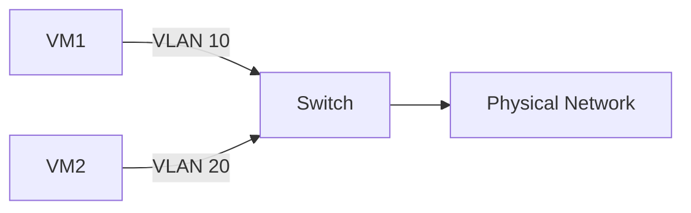

# 操作系统虚拟化安全

## 介绍

操作系统虚拟化是一种将操作系统及其资源抽象化的技术，允许多个独立的操作系统实例在同一台物理机上运行。这种技术广泛应用于云计算、容器化（如 Docker）和虚拟化平台（如 VMware、KVM）中。然而，虚拟化环境的安全性至关重要，因为攻击者可能利用虚拟化层的漏洞来破坏整个系统。

本文将介绍操作系统虚拟化安全的基本概念、常见威胁以及如何通过最佳实践来保护虚拟化环境。

## 什么是操作系统虚拟化安全？

操作系统虚拟化安全是指通过技术手段和管理策略，确保虚拟化环境中的操作系统实例及其资源免受未经授权的访问、数据泄露和其他安全威胁。虚拟化安全的核心目标是隔离性（Isolation）和完整性（Integrity），即确保每个虚拟机（VM）或容器之间相互隔离，且其运行环境不被篡改。

## 虚拟化安全的挑战

虚拟化环境面临多种安全挑战，包括但不限于：

1. **虚拟机逃逸（VM Escape）**：攻击者通过虚拟机中的漏洞，突破虚拟化层的隔离，直接访问宿主机或其他虚拟机。
2. **资源竞争（Resource Contention）**：多个虚拟机共享同一物理资源时，可能导致资源耗尽或性能下降，进而影响安全性。
3. **镜像安全（Image Security）**：虚拟机或容器镜像可能包含恶意软件或配置错误，导致运行时出现安全问题。
4. **网络隔离（Network Isolation）**：虚拟网络配置不当可能导致虚拟机之间的通信被窃听或篡改。

## 虚拟化安全的最佳实践

### 1. 使用安全的虚拟化平台

选择经过安全认证的虚拟化平台（如 VMware、KVM、Hyper-V），并确保其始终运行最新版本，以修复已知漏洞。

### 2. 强化虚拟机隔离

通过配置虚拟机的资源限制（如 CPU、内存、磁盘 I/O）和网络隔离策略，确保虚拟机之间的资源竞争不会影响安全性。

```bash
# 示例：使用 KVM 限制虚拟机的 CPU 使用率
virsh schedinfo <vm-name> --set vcpu_quota=50
```

### 3. 定期更新和扫描镜像

确保虚拟机或容器镜像来自可信来源，并定期扫描镜像中的漏洞和恶意软件。

```bash
# 示例：使用 Trivy 扫描 Docker 镜像
trivy image <image-name>
```

### 4. 配置虚拟网络安全性

使用虚拟局域网（VLAN）或软件定义网络（SDN）技术，确保虚拟机之间的网络通信是隔离的。



### 5. 监控和日志记录

启用虚拟化环境的监控和日志记录功能，及时发现异常行为并采取相应措施。

```bash
# 示例：使用 syslog 记录虚拟机事件
virsh event --list <vm-name>
```

## 实际案例

### 案例 1：防止虚拟机逃逸

某云服务提供商发现其虚拟化平台存在一个漏洞，攻击者可以通过恶意虚拟机逃逸到宿主机。通过及时更新虚拟化平台并启用严格的资源隔离策略，成功防止了进一步的攻击。

### 案例 2：容器镜像安全

某开发团队在部署 Docker 容器时，使用了未经验证的第三方镜像，导致容器运行时被植入恶意软件。通过引入镜像扫描工具（如 Trivy）和镜像签名机制，团队成功避免了类似问题。

## 总结

操作系统虚拟化安全是确保虚拟化环境稳定运行的关键。通过选择安全的虚拟化平台、强化隔离、定期更新镜像、配置网络安全性以及启用监控和日志记录，可以有效降低虚拟化环境的安全风险。

## 附加资源

- [KVM 官方文档](https://www.linux-kvm.org/page/Main_Page)
- [Docker 安全最佳实践](https://docs.docker.com/engine/security/)
- [Trivy 镜像扫描工具](https://github.com/aquasecurity/trivy)

## 练习

1. 使用 KVM 或 VMware 创建一个虚拟机，并配置其资源限制。
2. 使用 Trivy 扫描一个 Docker 镜像，并分析扫描结果。
3. 配置虚拟网络，确保两个虚拟机之间的通信是隔离的。
