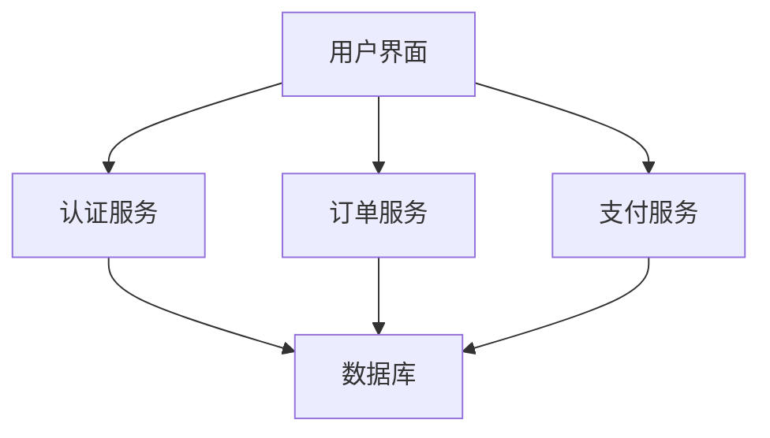

# 操作系统云计算基础

## 介绍

云计算是一种通过互联网提供计算资源（如服务器、存储、数据库、网络等）的技术。操作系统（OS）在云计算中扮演着至关重要的角色，因为它管理硬件资源并为应用程序提供运行环境。理解操作系统在云计算中的基础概念，是掌握现代计算技术的关键。

## 虚拟化与云计算

虚拟化是云计算的核心技术之一。它允许在单个物理服务器上运行多个虚拟机（VM），每个虚拟机都可以运行不同的操作系统和应用程序。虚拟化技术通过抽象硬件资源，提高了资源利用率，并简化了管理和维护。

### 虚拟化的类型

1. **硬件虚拟化**：通过虚拟机监控器（Hypervisor）在物理硬件上创建虚拟机。
2. **操作系统虚拟化**：也称为容器化，通过容器技术（如Docker）在单个操作系统实例上运行多个隔离的用户空间实例。

### 虚拟化的优势

- **资源优化**：提高硬件利用率，减少资源浪费。
- **灵活性**：快速部署和迁移虚拟机或容器。
- **隔离性**：确保不同虚拟机或容器之间的安全隔离。

## 容器化技术

容器化是一种轻量级的虚拟化技术，它允许在同一操作系统内核上运行多个隔离的用户空间实例。与虚拟机相比，容器共享操作系统内核，因此启动更快、资源占用更少。

### Docker 示例

以下是一个简单的 Docker 示例，展示如何创建一个运行 Ubuntu 的容器：

```bash
# 拉取 Ubuntu 镜像
docker pull ubuntu

# 运行 Ubuntu 容器
docker run -it ubuntu /bin/bash
```

**输入**：上述命令将启动一个交互式的 Ubuntu 容器。

**输出**：你将进入容器的命令行界面，可以在其中执行命令。

## 实际应用场景

### 1. 微服务架构

微服务架构是一种将应用程序拆分为多个小型、独立服务的设计模式。每个服务可以独立部署和扩展，通常使用容器化技术来实现。



### 2. 持续集成与持续部署（CI/CD）

CI/CD 是一种软件开发实践，通过自动化构建、测试和部署流程，提高开发效率和软件质量。容器化技术在 CI/CD 中广泛应用，确保开发、测试和生产环境的一致性。

## 总结

操作系统在云计算中扮演着核心角色，虚拟化和容器化技术是云计算的基础。通过虚拟化，我们可以高效地利用硬件资源；通过容器化，我们可以快速部署和扩展应用程序。理解这些基础概念，将为你进一步学习云计算和现代计算技术打下坚实的基础。

## 附加资源与练习

- **资源**：
  - [Docker 官方文档](https://docs.docker.com/)
  - [Kubernetes 官方文档](https://kubernetes.io/docs/)
- **练习**：
  - 尝试在本地机器上安装 Docker，并运行一个简单的容器。
  - 使用 Docker Compose 部署一个包含多个服务的微服务应用。

:::tip
**提示**：在学习过程中，建议使用虚拟机或云服务提供商的免费层来实践这些概念。
:::