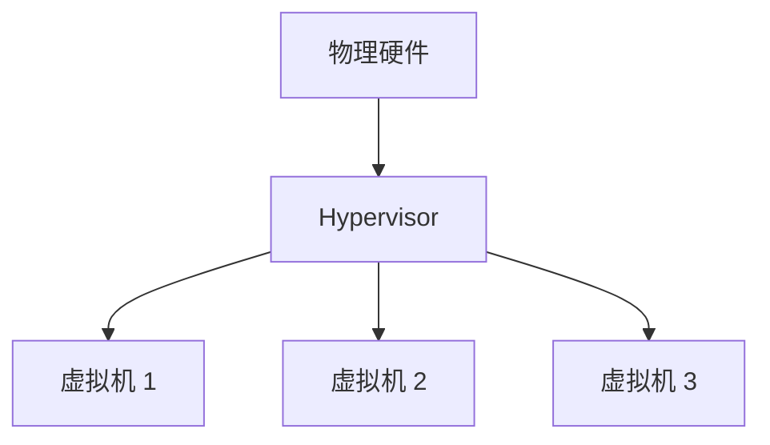

## 介绍

操作系统虚拟化管理是一种通过软件技术将物理计算机资源抽象、隔离和分配的技术。它允许多个操作系统实例在同一台物理机器上运行，每个实例都认为自己独占硬件资源。这种技术广泛应用于云计算、服务器管理和开发测试环境中。

虚拟化管理的核心在于**虚拟机监控器（Hypervisor）**，它负责管理和分配硬件资源，确保各个虚拟机（VM）之间的隔离性和安全性。

## 虚拟化的类型

操作系统虚拟化主要分为两种类型：

1. **全虚拟化**：虚拟机完全模拟硬件，无需修改操作系统。例如，VMware 和 VirtualBox。
2. **半虚拟化**：虚拟机需要对操作系统进行修改，以便与 Hypervisor 协作。例如，Xen。

## 操作系统虚拟化的工作原理

操作系统虚拟化通过 Hypervisor 实现资源管理。Hypervisor 分为两类：

- **Type 1 Hypervisor**：直接运行在硬件上，也称为“裸机” Hypervisor。例如，VMware ESXi 和 Microsoft Hyper-V。
- **Type 2 Hypervisor**：运行在宿主操作系统之上。例如，VMware Workstation 和 Oracle VirtualBox。

以下是一个简单的虚拟化架构图：



## 操作系统虚拟化管理的实际应用

### 案例 1：云计算平台

云计算平台（如 AWS、Azure 和 Google Cloud）广泛使用虚拟化技术来提供弹性计算资源。用户可以在云平台上创建虚拟机实例，按需分配 CPU、内存和存储资源。

### 案例 2：开发与测试环境

开发人员可以使用虚拟化技术创建多个独立的开发环境，每个环境运行不同的操作系统或软件版本。例如，使用 Docker 容器虚拟化技术来快速部署和测试应用程序。

## 代码示例：使用 VirtualBox 创建虚拟机

以下是一个简单的命令行示例，展示如何使用 VirtualBox 创建虚拟机：

```bash
# 创建一个新的虚拟机
VBoxManage createvm --name "MyVM" --ostype "Ubuntu_64" --register

# 配置虚拟机的内存和 CPU
VBoxManage modifyvm "MyVM" --memory 2048 --cpus 2

# 创建一个虚拟硬盘
VBoxManage createhd --filename "MyVM.vdi" --size 20000

# 将虚拟硬盘附加到虚拟机
VBoxManage storagectl "MyVM" --name "SATA Controller" --add sata
VBoxManage storageattach "MyVM" --storagectl "SATA Controller" --port 0 --device 0 --type hdd --medium "MyVM.vdi"

# 启动虚拟机
VBoxManage startvm "MyVM"
```

:::note
确保已安装 VirtualBox 并正确配置环境变量。
:::

## 总结

操作系统虚拟化管理是现代计算环境中不可或缺的技术。它通过 Hypervisor 实现资源的抽象和隔离，为云计算、开发和测试等场景提供了灵活性和效率。对于初学者来说，理解虚拟化的基本概念和工作原理是掌握更高级技术的基础。

## 附加资源与练习

- **推荐阅读**：
  - 《虚拟化技术入门指南》
  - 《深入理解 Hypervisor 架构》
- **练习**：
  - 使用 VirtualBox 或 VMware 创建一个虚拟机，并安装 Linux 操作系统。
  - 尝试在虚拟机中运行一个简单的 Web 服务器，并通过宿主机访问。

通过实践和深入学习，你将能够更好地掌握操作系统虚拟化管理的核心概念和应用技巧。