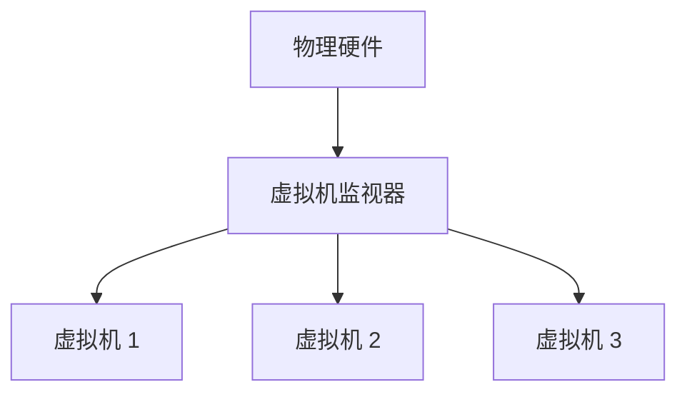

# 操作系统虚拟机监视器

## 介绍

操作系统虚拟机监视器（Hypervisor），也称为虚拟机监视器（VMM），是一种允许在单个物理主机上运行多个操作系统的软件或硬件。它负责管理和分配硬件资源，确保每个虚拟机（VM）能够独立运行，互不干扰。虚拟机监视器是虚拟化技术的核心组件之一，广泛应用于云计算、服务器整合和测试环境等领域。

## 虚拟机监视器的类型

虚拟机监视器主要分为两类：

1. **类型 1：裸机虚拟机监视器（Bare-metal Hypervisor）**
   - 直接运行在物理硬件上，无需依赖宿主操作系统。
   - 例如：VMware ESXi、Microsoft Hyper-V、Xen。

2. **类型 2：宿主型虚拟机监视器（Hosted Hypervisor）**
   - 运行在宿主操作系统之上，依赖宿主操作系统管理硬件资源。
   - 例如：Oracle VirtualBox、VMware Workstation。

## 工作原理

虚拟机监视器通过在物理硬件和虚拟机之间创建一个抽象层，实现对硬件资源的管理和分配。它负责处理虚拟机的创建、启动、暂停、恢复和销毁等操作，并确保每个虚拟机都能访问所需的硬件资源。



## 实际应用场景

### 云计算

在云计算环境中，虚拟机监视器用于在物理服务器上运行多个虚拟机实例。每个虚拟机可以运行不同的操作系统和应用程序，从而实现资源的高效利用和灵活管理。

### 服务器整合

企业可以通过虚拟机监视器将多个物理服务器整合到一台物理主机上，从而减少硬件成本、节省空间和降低能耗。

### 测试和开发

开发人员可以使用虚拟机监视器创建多个独立的测试环境，每个环境可以运行不同的操作系统和软件配置，从而简化测试和开发过程。

## 代码示例

以下是一个简单的虚拟机创建示例，使用 `libvirt` 库在 Linux 系统上创建一个虚拟机：

```bash
# 安装 libvirt 和相关工具
sudo apt-get install qemu-kvm libvirt-daemon-system libvirt-clients bridge-utils virt-manager

# 启动 libvirt 服务
sudo systemctl start libvirtd

# 创建一个虚拟机配置文件
cat <<EOF > myvm.xml
<domain type='kvm'>
  <name>myvm</name>
  <memory unit='KiB'>1048576</memory>
  <vcpu placement='static'>1</vcpu>
  <os>
    <type arch='x86_64' machine='pc-i440fx-2.9'>hvm</type>
    <boot dev='hd'/>
  </os>
  <devices>
    <disk type='file' device='disk'>
      <driver name='qemu' type='qcow2'/>
      <source file='/var/lib/libvirt/images/myvm.qcow2'/>
      <target dev='vda' bus='virtio'/>
    </disk>
    <interface type='network'>
      <source network='default'/>
      <model type='virtio'/>
    </interface>
    <graphics type='vnc' port='-1' autoport='yes'/>
  </devices>
</domain>
EOF

# 使用 virsh 命令创建虚拟机
virsh define myvm.xml
virsh start myvm
```

:::note
**注意**：上述代码示例假设你已经安装了 `libvirt` 和相关工具，并且有一个可用的虚拟机镜像文件（如 `myvm.qcow2`）。
:::

## 总结

操作系统虚拟机监视器是虚拟化技术的核心组件，它允许在单个物理主机上运行多个操作系统实例。通过虚拟机监视器，用户可以高效地管理和分配硬件资源，实现云计算、服务器整合和测试开发等多种应用场景。

## 附加资源

- [VMware ESXi 官方文档](https://docs.vmware.com/en/VMware-vSphere/index.html)
- [Microsoft Hyper-V 官方文档](https://docs.microsoft.com/en-us/windows-server/virtualization/hyper-v/hyper-v-technology-overview)
- [Oracle VirtualBox 用户手册](https://www.virtualbox.org/manual/)

## 练习

1. 在你的计算机上安装一个虚拟机监视器（如 VirtualBox 或 VMware Workstation），并创建一个虚拟机。
2. 尝试使用 `libvirt` 命令行工具管理虚拟机，如启动、暂停和销毁虚拟机。
3. 研究不同类型的虚拟机监视器（类型 1 和类型 2），并比较它们的优缺点。