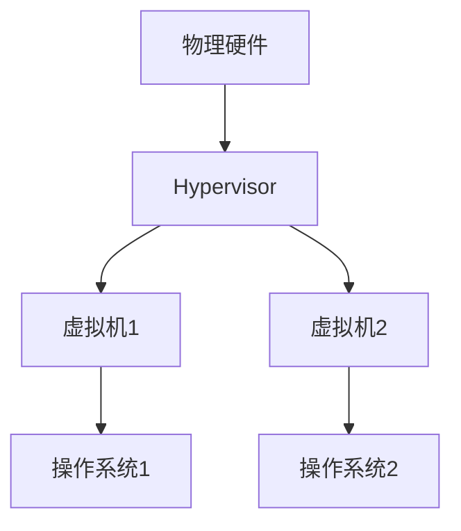

# 操作系统全虚拟化

## 介绍

操作系统全虚拟化（Full Virtualization）是一种虚拟化技术，它允许在物理硬件上运行多个独立的操作系统实例。每个实例都认为自己独占硬件资源，但实际上它们共享同一套物理硬件。全虚拟化的核心在于通过虚拟化层（Hypervisor）模拟硬件环境，使得多个操作系统可以在同一台物理机上并行运行。

全虚拟化的主要优势在于它能够完全隔离不同的操作系统实例，使得它们互不干扰。这种技术广泛应用于云计算、服务器虚拟化以及开发和测试环境中。

## 工作原理

全虚拟化通过一个称为 **Hypervisor** 的软件层来实现。Hypervisor 直接运行在物理硬件上，负责管理和分配硬件资源给各个虚拟机（Virtual Machine, VM）。每个虚拟机都运行一个完整的操作系统，并且这些操作系统不需要进行任何修改即可运行。

### Hypervisor 的类型

1. **Type 1 Hypervisor（裸机 Hypervisor）**：直接运行在物理硬件上，不需要宿主操作系统。例如：VMware ESXi、Microsoft Hyper-V。
2. **Type 2 Hypervisor（宿主型 Hypervisor）**：运行在宿主操作系统之上，依赖于宿主操作系统来管理硬件资源。例如：Oracle VirtualBox、VMware Workstation。

### 虚拟化层的工作方式

Hypervisor 通过模拟硬件设备（如 CPU、内存、磁盘、网络接口等）来为每个虚拟机提供独立的运行环境。虚拟机中的操作系统通过 Hypervisor 与物理硬件进行交互，而 Hypervisor 则负责将这些虚拟硬件请求转换为实际的物理硬件操作。



## 代码示例

以下是一个简单的 Python 脚本，用于模拟虚拟机的创建和管理。这个示例展示了如何使用 Python 的 `subprocess` 模块来启动一个虚拟机实例。

```python
import subprocess

def start_vm(vm_name):
    # 使用 VirtualBox 命令行工具启动虚拟机
    command = f"VBoxManage startvm {vm_name}"
    result = subprocess.run(command, shell=True, capture_output=True, text=True)
    
    if result.returncode == 0:
        print(f"虚拟机 {vm_name} 启动成功！")
    else:
        print(f"虚拟机 {vm_name} 启动失败：{result.stderr}")

# 启动名为 "UbuntuVM" 的虚拟机
start_vm("UbuntuVM")
```

**输出示例：**
```
虚拟机 UbuntuVM 启动成功！
```

## 实际应用场景

### 云计算

在云计算环境中，全虚拟化技术被广泛用于提供虚拟机实例。云服务提供商（如 AWS、Azure、Google Cloud）使用全虚拟化技术来为用户提供灵活的计算资源。用户可以根据需求快速创建、启动和销毁虚拟机实例，而无需关心底层硬件的细节。

### 开发和测试

开发人员经常使用全虚拟化技术来创建多个独立的开发环境。例如，一个开发团队可以在同一台物理服务器上运行多个虚拟机，每个虚拟机运行不同的操作系统或软件版本，以便进行兼容性测试和开发。

### 服务器整合

企业可以使用全虚拟化技术将多个物理服务器整合到一台高性能服务器上。通过虚拟化，企业可以减少硬件成本、降低能耗，并简化服务器管理。

## 总结

操作系统全虚拟化是一种强大的技术，它允许在单一物理硬件上运行多个独立的操作系统实例。通过 Hypervisor 的管理，虚拟机可以完全隔离，互不干扰。全虚拟化在云计算、开发和测试、服务器整合等领域有着广泛的应用。

## 附加资源

- [VMware 官方文档](https://docs.vmware.com/)
- [Microsoft Hyper-V 文档](https://docs.microsoft.com/en-us/windows-server/virtualization/hyper-v/hyper-v-technology-overview)
- [Oracle VirtualBox 用户手册](https://www.virtualbox.org/manual/)

## 练习

1. 使用 VirtualBox 或 VMware Workstation 创建一个虚拟机，并安装一个 Linux 发行版。
2. 编写一个脚本，自动启动和停止虚拟机。
3. 研究并比较 Type 1 和 Type 2 Hypervisor 的优缺点。

:::tip
如果你对虚拟化技术感兴趣，可以进一步学习容器化技术（如 Docker）和半虚拟化（Paravirtualization）等高级主题。
:::