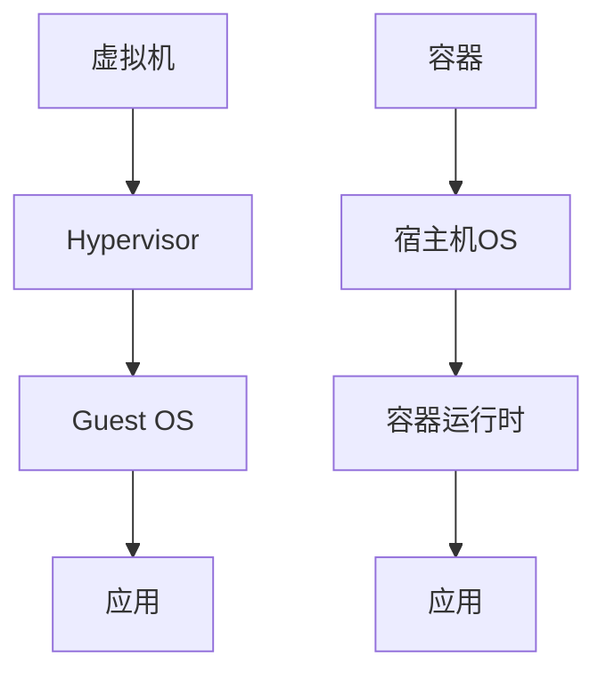

## 什么是操作系统容器技术？

操作系统容器技术是一种轻量级的虚拟化技术，它允许在同一操作系统内核上运行多个隔离的用户空间实例。与传统的虚拟机不同，容器不需要为每个实例提供完整的操作系统，而是共享宿主机的操作系统内核。这使得容器更加轻量、启动更快，并且资源利用率更高。

容器技术的核心思想是通过**命名空间（Namespaces）**和**控制组（cgroups）**来实现资源的隔离和限制。命名空间用于隔离进程的视图，使得每个容器都有自己的文件系统、网络、进程树等。而控制组则用于限制和监控容器的资源使用，如 CPU、内存等。

## 容器与虚拟机的区别

为了更好地理解容器技术，我们可以将其与传统的虚拟机进行对比：



- **虚拟机**：每个虚拟机都包含一个完整的操作系统（Guest OS），运行在 Hypervisor 之上。虚拟机提供了完全的隔离，但资源开销较大。
- **容器**：容器共享宿主机的操作系统内核，只包含应用及其依赖。容器更加轻量，启动更快，资源利用率更高。

## 容器的工作原理

### 命名空间（Namespaces）

命名空间是 Linux 内核提供的一种机制，用于隔离不同容器的资源视图。常见的命名空间包括：

- **PID 命名空间**：隔离进程 ID，使得每个容器都有自己的进程树。
- **网络命名空间**：隔离网络接口，使得每个容器都有自己的网络栈。
- **挂载命名空间**：隔离文件系统挂载点，使得每个容器都有自己的文件系统视图。
- **用户命名空间**：隔离用户和用户组 ID，增强安全性。

### 控制组（cgroups）

控制组用于限制和监控容器的资源使用。通过 cgroups，可以为每个容器设置 CPU、内存、磁盘 I/O 等资源的限制。例如，可以限制某个容器最多只能使用 1GB 的内存。

## 容器技术的实际应用

### Docker

Docker 是最流行的容器技术之一。它提供了一个简单易用的命令行工具，使得容器的创建、运行和管理变得非常方便。以下是一个简单的 Docker 示例：

```bash
# 拉取一个 Ubuntu 镜像
docker pull ubuntu

# 运行一个 Ubuntu 容器
docker run -it ubuntu /bin/bash
```

在这个示例中，我们拉取了一个 Ubuntu 镜像，并运行了一个交互式的 Ubuntu 容器。容器启动后，我们可以像在普通的 Ubuntu 系统中一样执行命令。

### Kubernetes

Kubernetes 是一个开源的容器编排平台，用于自动化容器的部署、扩展和管理。它可以帮助你在多个主机上运行和管理大量的容器。以下是一个简单的 Kubernetes 部署示例：

```yaml
apiVersion: apps/v1
kind: Deployment
metadata:
  name: nginx-deployment
spec:
  replicas: 3
  selector:
    matchLabels:
      app: nginx
  template:
    metadata:
      labels:
        app: nginx
    spec:
      containers:
      - name: nginx
        image: nginx:1.14.2
        ports:
        - containerPort: 80
```

在这个示例中，我们定义了一个 Kubernetes 部署，它会在集群中运行 3 个 Nginx 容器。

## 总结

操作系统容器技术是一种轻量级的虚拟化技术，它通过命名空间和控制组实现了资源的隔离和限制。与传统的虚拟机相比，容器更加轻量、启动更快，并且资源利用率更高。Docker 和 Kubernetes 是容器技术的两个重要应用，它们使得容器的创建、运行和管理变得更加简单和高效。

## 附加资源与练习

- **练习 1**：使用 Docker 创建一个简单的 Python Web 应用容器，并将其部署到本地环境中。
- **练习 2**：学习 Kubernetes 的基本概念，并尝试在本地环境中部署一个简单的应用。

:::tip
想要深入学习容器技术？可以查看 [Docker 官方文档](https://docs.docker.com/) 和 [Kubernetes 官方文档](https://kubernetes.io/docs/home/)。
:::