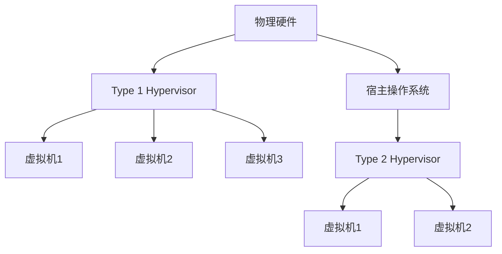

# 操作系统资源虚拟化

## 介绍

操作系统资源虚拟化是一种技术，它允许将物理资源（如 CPU、内存、存储和网络）抽象为多个虚拟资源，从而在同一台物理机器上运行多个独立的操作系统实例。这种技术广泛应用于云计算、虚拟机和容器化环境中。

## 什么是操作系统资源虚拟化？

操作系统资源虚拟化通过软件层（称为**虚拟机监控器**或**Hypervisor**）将物理资源划分为多个虚拟资源。每个虚拟资源可以独立运行一个操作系统实例，这些实例被称为**虚拟机**（VM）。虚拟化技术使得多个操作系统可以共享同一台物理机器的资源，而不会相互干扰。

## 虚拟化的类型

### 1. 全虚拟化

在全虚拟化中，虚拟机监控器完全模拟硬件，使得虚拟机中的操作系统无需修改即可运行。常见的全虚拟化工具有 VMware 和 VirtualBox。

### 2. 半虚拟化

在半虚拟化中，虚拟机中的操作系统需要进行修改，以便与虚拟机监控器协同工作。这种方式的性能通常优于全虚拟化，但需要对操作系统进行定制。Xen 是一个典型的半虚拟化工具。

### 3. 硬件辅助虚拟化

硬件辅助虚拟化利用 CPU 的硬件特性（如 Intel VT-x 和 AMD-V）来提高虚拟化的性能。这种方式结合了全虚拟化和半虚拟化的优点，常见的实现包括 KVM 和 Hyper-V。

## 虚拟化的工作原理

虚拟化技术的核心是虚拟机监控器（Hypervisor），它负责管理和分配物理资源给虚拟机。Hypervisor 可以分为两类：

1. **Type 1 Hypervisor**：直接运行在物理硬件上，也称为裸机 Hypervisor。例如 VMware ESXi 和 Microsoft Hyper-V。
2. **Type 2 Hypervisor**：运行在宿主操作系统之上，例如 VMware Workstation 和 VirtualBox。



## 实际应用场景

### 1. 云计算

云计算平台（如 AWS、Azure 和 Google Cloud）广泛使用虚拟化技术来提供弹性计算资源。用户可以根据需求动态分配和释放虚拟机实例。

### 2. 开发和测试

开发人员可以使用虚拟机来创建隔离的开发和测试环境，避免影响生产系统。例如，使用 VirtualBox 创建一个与生产环境相同的虚拟机进行测试。

### 3. 容器化

虽然容器化（如 Docker）与虚拟化有所不同，但它也依赖于操作系统的资源隔离机制。容器共享宿主操作系统的内核，但通过命名空间和控制组（cgroups）实现资源隔离。

## 代码示例

以下是一个简单的 Python 脚本，使用 `libvirt` 库来管理虚拟机：

```python
import libvirt

# 连接到本地 Hypervisor
conn = libvirt.open('qemu:///system')

# 列出所有虚拟机
domains = conn.listAllDomains()
for domain in domains:
    print(domain.name())

# 关闭连接
conn.close()
```

**输出示例：**
```
vm1
vm2
vm3
```

## 总结

操作系统资源虚拟化是现代计算基础设施的重要组成部分。它通过抽象物理资源，使得多个操作系统实例可以在同一台物理机器上运行，从而提高了资源利用率和灵活性。无论是云计算、开发测试还是容器化，虚拟化技术都发挥着关键作用。

## 附加资源

- [VMware 官方文档](https://docs.vmware.com/)
- [KVM 虚拟化指南](https://www.linux-kvm.org/page/Main_Page)
- [Docker 官方文档](https://docs.docker.com/)

## 练习

1. 使用 VirtualBox 创建一个虚拟机，并安装一个 Linux 发行版。
2. 使用 `libvirt` 库编写一个脚本，启动和停止虚拟机。
3. 研究 Docker 的命名空间和控制组机制，理解其与虚拟化的区别。

:::tip
虚拟化技术是云计算和现代 IT 基础设施的基石，掌握它将为你的职业生涯带来巨大的优势。
:::