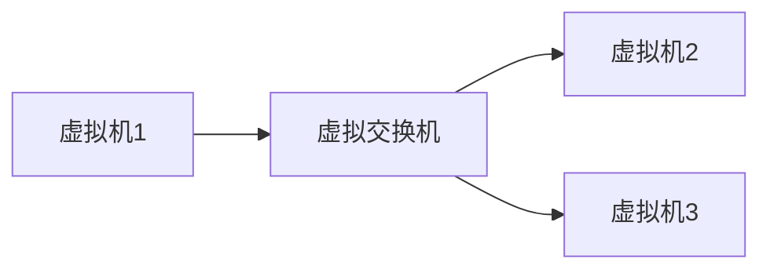

## 介绍

操作系统网络虚拟化是一种技术，它允许在单个物理主机上创建多个虚拟网络接口和网络环境。这些虚拟网络可以独立运行，就像它们位于不同的物理机器上一样。网络虚拟化是现代云计算和数据中心的核心技术之一，它使得资源分配更加灵活，同时提高了硬件利用率。

## 基本概念

### 虚拟网络接口

在操作系统网络虚拟化中，虚拟网络接口（Virtual Network Interface, VNI）是一个关键概念。它允许操作系统为每个虚拟机或容器创建一个独立的网络接口。这些接口可以配置独立的IP地址、子网掩码和路由表。

```bash
# 创建一个虚拟网络接口
sudo ip link add veth0 type veth peer name veth1
```

### 虚拟交换机

虚拟交换机（Virtual Switch）是网络虚拟化的另一个重要组件。它负责在虚拟网络接口之间转发数据包。虚拟交换机可以配置不同的网络策略，如VLAN、QoS等。



### 网络命名空间

网络命名空间（Network Namespace）是Linux内核提供的一种隔离机制，它允许每个命名空间拥有独立的网络栈。这意味着每个命名空间可以有自己独立的网络接口、IP地址、路由表等。

```bash
# 创建一个新的网络命名空间
sudo ip netns add ns1
```

## 实际案例

### 容器网络

在容器技术中，网络虚拟化被广泛应用。每个容器通常运行在自己的网络命名空间中，拥有独立的网络接口和IP地址。这使得容器之间的网络通信就像它们位于不同的物理机器上一样。

```bash
# 在Docker中创建一个容器并查看其网络命名空间
docker run -d --name my_container nginx
docker inspect my_container --format '{{.NetworkSettings.SandboxKey}}'
```

### 虚拟机网络

在虚拟机（VM）环境中，网络虚拟化允许每个虚拟机拥有独立的网络接口和IP地址。虚拟交换机负责在虚拟机之间以及虚拟机与外部网络之间转发数据包。

```bash
# 在KVM中创建一个虚拟机并配置其网络接口
virt-install --name my_vm --ram 2048 --disk path=/var/lib/libvirt/images/my_vm.qcow2,size=10 --vcpus 2 --os-type linux --os-variant ubuntu20.04 --network bridge=br0
```

## 总结

操作系统网络虚拟化是现代计算环境中不可或缺的一部分。它通过虚拟网络接口、虚拟交换机和网络命名空间等技术，实现了资源的灵活分配和高效利用。无论是在容器还是虚拟机环境中，网络虚拟化都发挥着重要作用。

## 附加资源

- [Linux Network Namespaces](https://man7.org/linux/man-pages/man7/network_namespaces.7.html)
- [Docker Networking](https://docs.docker.com/network/)
- [KVM Networking](https://libvirt.org/formatnetwork.html)

## 练习

1. 使用 `ip` 命令创建一个虚拟网络接口，并将其分配给一个新的网络命名空间。
2. 在Docker中创建一个容器，并查看其网络命名空间。
3. 使用KVM创建一个虚拟机，并配置其网络接口连接到虚拟交换机。

通过完成这些练习，你将更深入地理解操作系统网络虚拟化的实际应用。