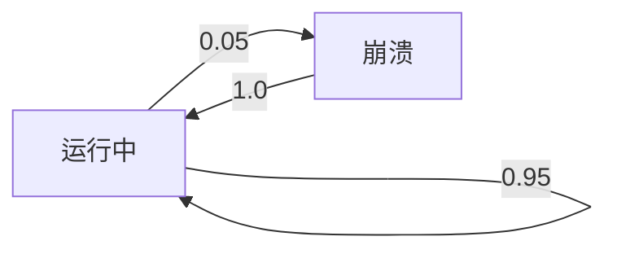

# PRISM 简介

PRISM（**Probabilistic Symbolic Model Checker**）是一个开源的**概率模型检测工具**，专为分析**随机性**和**不确定性**系统而设计。它支持多种概率模型（如马尔可夫链、马尔可夫决策过程等），并能通过形式化验证回答“系统满足某属性的概率是多少？”这类问题。以下是初学者的全面指南。

---

## 什么是PRISM？

PRISM通过数学建模和算法验证，帮助用户分析包含概率行为的系统，例如：
- **通信协议**（如Wi-Fi重传机制）
- **生物系统**（如基因调控网络）
- **安全协议**（如概率性加密算法）

:::note 核心能力
- **概率计算**：量化“系统在10分钟内崩溃的概率”
- **最优策略生成**：找到最大化成功率的控制策略
- **高效符号表示**：利用二元决策图(BDD)压缩模型
:::

---

## PRISM 的核心组件

### 1. 建模语言
PRISM使用自定义语言描述系统。以下是一个简单的**离散时间马尔可夫链(DTMC)**示例，模拟硬币投掷：

```prism
// 文件名: coin.pm
dtmc

module Coin
  state : [0..1] init 0; // 0=头, 1=尾
  [] state=0 -> 0.5 : (state'=0) + 0.5 : (state'=1); // 公平硬币
  [] state=1 -> 0.5 : (state'=0) + 0.5 : (state'=1);
endmodule
```

**输入命令验证概率**：
```bash
P=? [ F state=0 ]  // 最终回到“头”状态的概率
```
**输出结果**：
```
Result: 1.0 (所有路径最终都会回到“头”)
```

### 2. 属性规范
使用**PCTL**（概率计算树逻辑）或**LTL**表达属性：
- `P>=0.99 [ G !fail ]`：系统永不失败的概率≥99%
- `R{"energy"}<=10 [ C<=100 ]`：100步内能耗期望≤10

---

## 实际案例：云服务器可靠性

假设一个云服务器有：
- 95%概率正常运行
- 5%概率崩溃后需重启（耗时1分钟）

**PRISM模型片段**：
```prism
module Server
  state : [0..1]; // 0=运行, 1=崩溃
  [] state=0 -> 0.95 : (state'=0) + 0.05 : (state'=1);
  [] state=1 -> 1 : (state'=0); // 重启恢复
endmodule

// 验证“一小时内的停机概率”
P=? [ F<=60 state=1 ]
```

:::tip 结果解读
若输出`0.92`，表示有92%的概率在一小时内至少发生一次崩溃。
:::

---

## 可视化模型状态



---

## 总结与练习

### 关键点总结
1. PRISM适用于**概率系统**的形式化验证
2. 支持**DTMC、MDP、CTMC**等模型
3. 通过**PCTL/LTL**表达复杂属性

### 练习建议
1. 修改`coin.pm`，模拟一个偏置硬币（头概率0.6）
2. 验证“连续三次出现头的概率”
3. 尝试为交通信号灯建模（添加黄色状态）

### 扩展资源
- [PRISM官方教程](http://www.prismmodelchecker.org/tutorial/)
- 《Principles of Model Checking》第10章（MIT Press）

通过本指南，您已掌握PRISM的基础概念。接下来可继续学习“PRISM模型构建”章节深入实践！