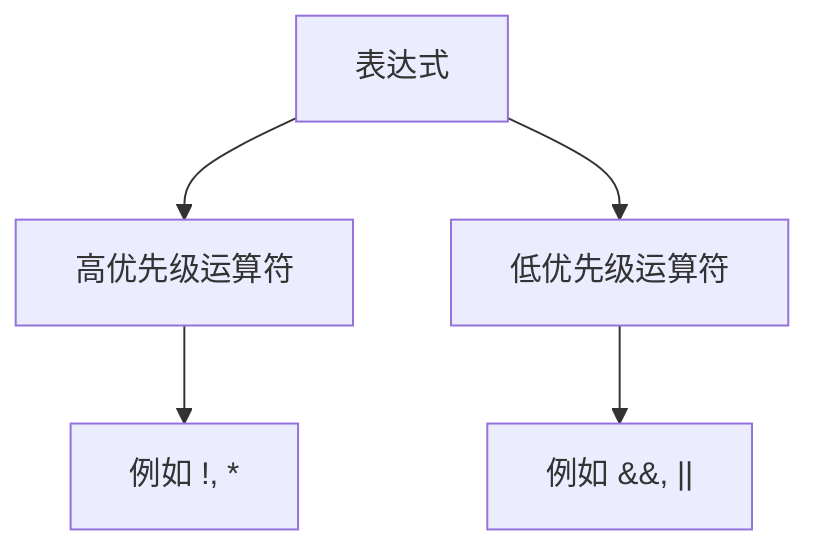

## 介绍

PRISM（Probabilistic Symbolic Model Checker）是一个用于建模和分析概率系统的工具。在PRISM中，运算符用于构建表达式，这些表达式可以描述系统的行为、属性和约束。理解PRISM的基本运算符是掌握其建模语言的关键一步。本章将详细介绍PRISM中的逻辑运算符、算术运算符和比较运算符，并通过示例展示它们的用法。

---

## 逻辑运算符

逻辑运算符用于组合布尔表达式，常见的逻辑运算符包括：

- `&&`：逻辑与（AND）
- `||`：逻辑或（OR）
- `!`：逻辑非（NOT）

### 示例：逻辑运算符的使用
以下是一个PRISM模型中的逻辑表达式示例：

```prism
// 检查状态是否满足条件
formula condition = (x > 0) && (y < 10);
formula is_valid = !(x == y);
```

:::note
逻辑运算符的优先级：`!` > `&&` > `||`。如果需要改变优先级，可以使用括号 `()`。
:::

---

## 算术运算符

算术运算符用于执行数学运算，包括：

- `+`：加法
- `-`：减法
- `*`：乘法
- `/`：除法
- `%`：取模（余数）

### 示例：算术运算符的使用
以下是一个PRISM模型中的算术表达式示例：

```prism
// 计算两个变量的和与积
formula sum = x + y;
formula product = x * y;
formula remainder = x % 2; // 检查x是否为偶数
```

:::tip
PRISM还支持幂运算，但需要使用函数 `pow(x, y)` 表示 `x^y`。
:::

---

## 比较运算符

比较运算符用于比较两个值的大小或相等性，包括：

- `==`：等于
- `!=`：不等于
- `<`：小于
- `<=`：小于或等于
- `>`：大于
- `>=`：大于或等于

### 示例：比较运算符的使用
以下是一个PRISM模型中的比较表达式示例：

```prism
// 检查变量之间的关系
formula is_equal = (x == y);
formula is_positive = (x > 0);
```

---

## 实际案例：使用运算符建模

假设我们需要建模一个简单的概率系统，其中某个事件发生的概率取决于两个变量的值。以下是PRISM模型的代码片段：

```prism
// 定义变量
const int x;
const int y;

// 定义概率条件
formula prob_condition = (x >= 5) && (y <= 20);

// 定义概率行为
module example
  s : [0..1] init 0;
  [] prob_condition -> 0.8: (s'=1) + 0.2: (s'=0);
endmodule
```

:::caution
在PRISM中，逻辑表达式的结果必须是布尔值（`true` 或 `false`），否则会导致模型错误。
:::

---

## 运算符优先级

PRISM中运算符的优先级从高到低如下：

1. `!`（逻辑非）
2. `*`, `/`, `%`（乘法、除法、取模）
3. `+`, `-`（加法、减法）
4. `<`, `<=`, `>`, `>=`（比较运算符）
5. `==`, `!=`（相等性比较）
6. `&&`（逻辑与）
7. `||`（逻辑或）

如果需要改变优先级，可以使用括号 `()`。



---

## 总结

PRISM的基本运算符是构建模型表达式的基石。通过逻辑运算符、算术运算符和比较运算符的组合，可以描述复杂的系统行为和属性。以下是本章的重点：

1. 逻辑运算符用于组合布尔表达式。
2. 算术运算符用于数学计算。
3. 比较运算符用于比较值的大小或相等性。
4. 运算符的优先级决定了表达式的求值顺序。

---

## 附加资源与练习

### 练习
1. 编写一个PRISM公式，检查变量 `x` 是否为偶数且大于 10。
2. 使用逻辑运算符组合两个比较表达式，例如 `(x < y) || (y == 0)`。

### 进一步学习
- 阅读PRISM官方文档中的[表达式语法](https://www.prismmodelchecker.org/manual/ThePRISMLanguage/Expressions)部分。
- 尝试在PRISM GUI中运行包含运算符的示例模型，观察结果。