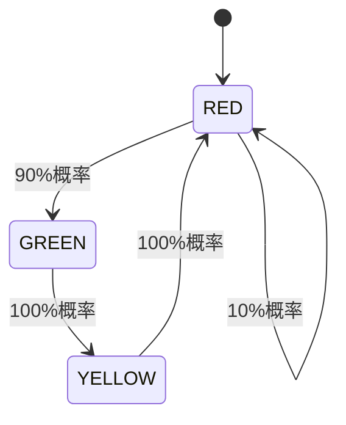

# PRISM 注释规范

## 引言

注释是编程中不可或缺的部分，它能帮助开发者理解代码逻辑、记录关键决策，并提高团队协作效率。在PRISM概率模型检测工具中，良好的注释规范尤为重要，因为模型文件往往涉及复杂的概率逻辑和状态转换。本文将详细介绍PRISM支持的注释语法、最佳实践以及实际应用场景。

## 注释类型

### 1. 单行注释
PRISM使用双斜杠 `//` 表示单行注释，从符号开始到行尾的内容会被解释器忽略：

```prism
// 这是一个单行注释
const int MAX = 100;  // 可以跟在代码后的注释
```

### 2. 多行注释
使用 `/* */` 包裹多行注释内容，适合大段说明：

```prism
/*
 * PRISM模型示例
 * 作者：Jane Doe
 * 描述：该模型描述天气状态转换
 */
module Weather
    // 模型内容...
endmodule
```

## 注释最佳实践

:::tip 专业建议
遵循这些原则让你的注释更有效：
:::

1. **解释为什么**：不要重复代码行为，而是说明设计意图
   ```prism
   // 使用几何分布模拟设备故障（而非泊松分布，因为故障概率随时间递增）
   const double p_fail = 0.1;
   ```

2. **标记TODO项**：
   ```prism
   // TODO: 需要添加温度影响因素
   formula temp_effect = 1.0;
   ```

3. **版本变更记录**：
   ```prism
   /* 
    * 修改记录：
    * v1.1 (2023-05-20) - 修正状态转移概率矩阵
    * v1.0 (2023-04-15) - 初始版本
    */
   ```

## 实际案例

### 交通信号灯模型注释
```prism
/*
 * 城市交叉路口信号灯系统
 * 状态：RED(0), YELLOW(1), GREEN(2)
 * 周期：RED->GREEN->YELLOW->RED
 */
module TrafficLight
    state : [0..2] init 0;  // 初始状态为RED

    // 状态转移规则
    [tick] state=0 -> 0.9: (state'=2) + 0.1: (state'=0);  // 90%概率变绿灯
    [tick] state=2 -> (state'=1);  // 绿灯必变黄灯
    [tick] state=1 -> (state'=0);  // 黄灯必变红灯
endmodule
```

### 状态转移图表示


## 常见错误

:::caution 避免这些注释陷阱
1. **过期注释**：更新代码后忘记更新注释
   ```prism
   // 最大重试次数3次（错误：实际代码已改为5次）
   const int MAX_RETRY = 5;
   ```

2. **无意义注释**：
   ```prism
   i = i + 1;  // i加1（这种注释毫无价值）
   ```
:::

## 总结

| 注释类型 | 语法 | 适用场景 |
|----------|------|----------|
| 单行注释 | `//` | 简短说明、行尾备注 |
| 多行注释 | `/* */` | 文件头、模块说明、复杂逻辑 |

**附加练习**：
1. 为你现有的PRISM模型添加模块说明注释
2. 找出模型中3处需要解释设计决策的位置添加注释
3. 创建版本变更记录区块

通过规范的注释实践，你的PRISM模型将更易维护、更利于团队协作，同时也能帮助未来的自己快速理解当初的设计思路。