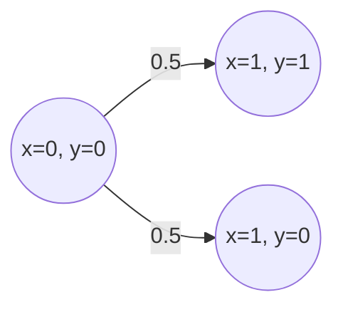

## 介绍

PRISM（Probabilistic Symbolic Model Checker）是一个用于建模和分析概率系统的工具。在PRISM中，**模型编译**是将用户编写的模型描述文件（通常以`.prism`或`.pm`为扩展名）转换为PRISM内部可处理的数学表示的过程。本教程将详细介绍PRISM模型编译的基本概念、语法规则和实际应用。

---

## PRISM 模型文件结构

一个典型的PRISM模型文件包含以下部分：
1. **模型类型声明**：定义模型是DTMC（离散时间马尔可夫链）、CTMC（连续时间马尔可夫链）还是其他类型。
2. **常量定义**：声明模型中使用的常量。
3. **全局变量**：定义全局变量及其初始值。
4. **模块**：描述系统的组件及其行为。
5. **公式和标签**：定义用于属性验证的公式或标签。

### 示例：简单的DTMC模型
```prism
// 模型类型声明
dtmc

// 常量定义
const int N = 3;

// 全局变量
global x : [0..N] init 0;

// 模块定义
module example
    // 局部变量
    y : [0..1] init 0;

    // 状态转移规则
    [] x < N -> 0.5: (x'=x+1) & (y'=1) + 0.5: (x'=x+1);
endmodule
```

---

## 编译过程详解

### 1. 模型类型检查
PRISM首先检查模型类型是否合法（如`dtmc`、`ctmc`或`mdp`），并验证语法是否正确。

:::note
如果模型类型未声明或声明错误，PRISM会报错：`Error: Model type must be specified.`
:::

### 2. 常量和变量解析
PRISM会解析所有常量和变量，检查其取值范围和初始值是否有效。例如：
- 常量`N`必须为整数。
- 变量`x`的范围`[0..N]`必须满足`N ≥ 0`。

### 3. 模块编译
每个模块会被转换为状态转移矩阵。例如，上述代码中的模块`example`会生成以下转移概率：
- 当`x < N`时，以概率`0.5`更新`x`和`y`，或以概率`0.5`仅更新`x`。



### 4. 输出内部表示
编译完成后，PRISM会将模型转换为以下内部表示之一：
- **稀疏矩阵**：适用于大型模型。
- **符号化表示（MTBDD）**：适用于结构化模型。

---

## 实际案例：通信协议重传机制

假设我们需要建模一个简单的通信协议，其中消息以概率`p`成功传输，失败时重试。

```prism
dtmc

const double p = 0.9; // 成功概率

module sender
    state : [0..1] init 0; // 0=等待发送, 1=发送成功
    [send] state=0 -> p: (state'=1) + (1-p): (state'=0);
endmodule
```

**编译结果**：
- 状态空间：`{state=0, state=1}`。
- 转移概率：从`state=0`到`state=1`的概率为`0.9`，自环概率为`0.1`。

---

## 常见错误与调试

1. **语法错误**：如缺少分号或括号。
   ```prism
   // 错误示例
   module test
       x : [0..1] init 0 // 缺少分号
   endmodule
   ```
   PRISM会提示：`Error: Unexpected token: endmodule`。

2. **范围冲突**：如变量初始值超出范围。
   ```prism
   x : [0..1] init 2; // 错误：初始值超出范围
   ```

---

## 总结

- PRISM模型编译是将高级模型描述转换为数学表示的关键步骤。
- 模型文件需正确定义类型、常量、变量和模块。
- 编译过程包括类型检查、变量解析和模块转换。

---

## 练习与资源

### 练习
1. 编写一个CTMC模型，描述服务器负载（状态：`low`, `medium`, `high`），并编译它。
2. 尝试在模型中添加一个公式`"success" = (state=1);`，观察编译结果。

### 附加资源
- [PRISM官方文档](http://www.prismmodelchecker.org/manual/)
- 《Principles of Model Checking》第10章（概率模型检测）