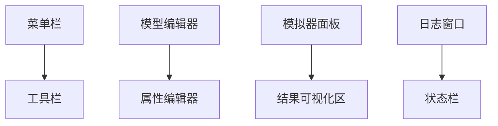
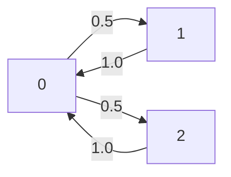

# PRISM 图形界面使用

## 介绍

PRISM是一款用于概率模型检测的开源工具，支持马尔可夫链、概率自动机等模型的建模与分析。其图形界面(GUI)为初学者提供了直观的操作方式，无需直接编写代码即可完成模型构建和属性验证。本节将详细介绍PRISM GUI的核心功能和操作流程。

:::tip 为什么使用图形界面？
- 可视化模型结构
- 交互式属性验证
- 直观的结果展示
- 适合不熟悉PRISM语言的初学者
:::

## 界面概览

PRISM GUI主要包含以下区域：



1. **菜单栏**：文件操作、模型检查等高级功能
2. **工具栏**：常用操作的快捷按钮
3. **模型编辑器**：编辑PRISM模型代码
4. **属性编辑器**：编写待验证的属性公式
5. **模拟器面板**：交互式模型模拟
6. **结果可视化区**：图表展示验证结果
7. **日志窗口**：显示操作反馈信息

## 基础操作流程

### 1. 创建新模型

通过 `File > New > PRISM Model` 创建空白模型，默认模板包含基本结构：

```prism
// 示例：简单DTMC模型
dtmc

module M1
    s : [0..2] init 0;
    
    [] s=0 -> 0.5:(s'=1) + 0.5:(s'=2);
    [] s=1 -> 1:(s'=0);
    [] s=2 -> 1:(s'=0);
endmodule
```

### 2. 模型语法检查

点击工具栏中的 `Check Model` 按钮（✓图标），日志窗口会显示：
```
Model type: DTMC
Modules: 1
Variables: 1
States: 3
Transitions: 5
Time for model construction: 0.001s
```

### 3. 添加验证属性

在属性编辑器输入PCTL/CSL公式，例如：
```prism
P=? [ F s=2 ]  // 最终到达状态2的概率
```
点击 `Check Property` 按钮进行验证，结果将显示：
```
Result: 0.5
```

## 高级功能详解

### 模型可视化

通过 `Model > Build Model` 生成状态转移图：



### 参数化分析

1. 在模型中使用参数：
```prism
const double p = 0.5; // 可调整参数
```
2. 在属性编辑器中设置参数范围：
```prism
P=? [ F s=2 ] {p:0.1..0.9 step 0.1}
```
3. 结果将显示为曲线图，展示概率随参数变化趋势

### 实验案例：网络协议分析

**场景**：验证无线网络协议的重传成功率

1. **模型构建**：
```prism
// 重传协议模型
mdp

const int MAX_RETRY = 3;
const double loss_prob = 0.3;

module Sender
    retry : [0..MAX_RETRY] init 0;
    
    [send] retry<MAX_RETRY -> 
        (1-loss_prob): (retry'=0)  // 成功
        + loss_prob: (retry'=retry+1);  // 失败
endmodule
```

2. **属性验证**：
```prism
Pmax=? [ F retry=MAX_RETRY ]  // 最大失败概率
```

3. **结果分析**：
```
Result: 0.027 (当MAX_RETRY=3时)
```

## 常见问题解决

:::caution 常见错误处理
1. **语法错误**：日志窗口会显示具体行号和错误描述
2. **模型不收敛**：尝试调整迭代方法（Options > PTAs/Model Checking）
3. **内存不足**：简化模型或使用命令行版本处理大型模型
:::

## 总结与练习

### 关键知识点
- 模型编辑与语法检查
- 属性公式的编写与验证
- 结果可视化分析
- 参数化实验设计

### 巩固练习
1. 创建一个CTMC模型，模拟服务器负载情况
2. 验证"在5分钟内系统保持响应"的概率属性
3. 对服务速率参数进行敏感性分析

### 扩展资源
- PRISM官方手册：GUI操作章节
- 示例模型库：安装目录下的 `/examples` 文件夹
- 在线课程：Probabilistic Model Checking专项课程