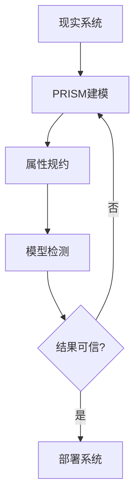

# PRISM 模型检测概念

## 引言

PRISM（Probabilistic Symbolic Model Checker）是一个用于分析**概率系统**的形式化验证工具。它能够自动验证系统是否满足特定的概率或时序属性，例如"消息在5秒内传递的概率超过99%"。本章将介绍PRISM的核心概念，包括模型类型、属性规约语言和验证流程。

## 模型检测基础

模型检测是一种**自动验证技术**，通过穷举系统所有可能状态来检查给定属性是否成立。PRISM扩展了传统模型检测，支持以下三类概率模型：

1. **离散时间马尔可夫链（DTMC）**：纯概率系统
2. **连续时间马尔可夫链（CTMC）**：带时间延迟的概率系统
3. **马尔可夫决策过程（MDP）**：结合概率和非确定性的系统


## PRISM 模型结构

PRISM模型由**模块**和**变量**组成。以下是一个简单的DTMC示例，模拟硬币投掷：

```prism
// 硬币投掷模型
dtmc

module Coin
    side : [0..1] init 0; // 0=正面, 1=反面
    
    [] side=0 -> 0.5 : (side'=0) + 0.5 : (side'=1);
    [] side=1 -> 0.5 : (side'=0) + 0.5 : (side'=1);
endmodule
```

**关键组成部分**：
- `dtmc` 声明模型类型
- `module` 定义系统组件
- `side` 是状态变量
- `[]` 开头的行是状态转移规则

:::tip 变量命名
PRISM变量名不能以数字开头，建议使用有意义的名称如`packet_delivered`而非`pd`
:::

## 属性规约

PRISM使用**PCTL**（概率计算树逻辑）或**CSL**（连续随机逻辑）表达要验证的属性：

| 属性类型       | 示例公式                     | 含义                          |
|----------------|------------------------------|-------------------------------|
| 概率可达性     | `P>=0.9 [ F side=1 ]`        | 出现反面的概率≥90%            |
| 期望值         | `R{"turns"}=? [ F side=0 ]`  | 首次出现正面时的期望投掷次数   |

## 实际案例：网络协议验证

考虑一个简单的重传协议，每次传输有70%成功概率，失败后重试：

```prism
// 重传协议模型
dtmc

module Sender
    sent : bool init false;
    attempts : [0..3] init 0;
    
    [] !sent & attempts<3 -> 0.7 : (sent'=true) 
                          + 0.3 : (attempts'=attempts+1);
    [] sent -> true;
endmodule
```

验证属性：
```prism
// 3次内发送成功的概率
P=? [ F<=3 sent=true ]

// 平均尝试次数
R{"attempts"}=? [ F sent=true ]
```

:::note 实际应用
这种分析可用于确定最优重试次数，平衡成功概率与资源消耗
:::

## 验证流程

1. **建模**：用PRISM语言描述系统
2. **规约**：编写要验证的概率属性
3. **验证**：运行PRISM获得定量结果
4. **调优**：根据结果调整系统参数



## 总结

PRISM模型检测的核心概念包括：
- 三种概率模型（DTMC/CTMC/MDP）的表示
- 模块化建模方法
- PCTL/CSL属性规约语言
- 自动化的概率验证流程

## 延伸练习

1. 修改硬币模型，使其有60%概率出现正面，验证相应属性
2. 为重传协议添加超时机制（如每次尝试后10%概率放弃）
3. 尝试用`simulate`命令生成样本路径

## 学习资源

- PRISM官方手册：模型定义章节
- 《Principles of Model Checking》第10章
- 在线案例库：查看`prism-examples`包中的案例