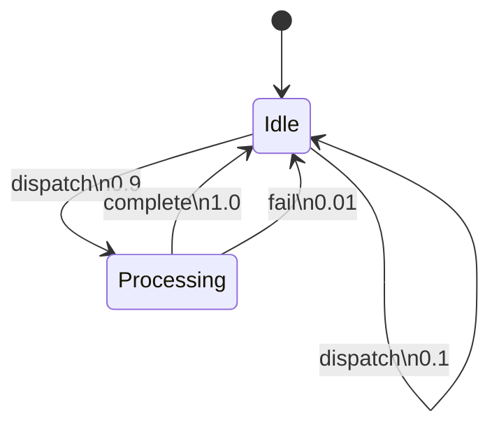

## 引言

PRISM语言是概率模型检测器PRISM的专用建模语言，用于描述**离散概率系统**的行为。它融合了传统状态机的模块化思想与概率/非确定性转移特性，支持：
- 马尔可夫链（DTMC/CTMC）
- 马尔可夫决策过程（MDP）
- 概率定时自动机（PTA）

本指南将通过实例演示如何用PRISM语言构建可验证的概率模型。

---

## 核心语法结构

### 1. 模块化设计
PRISM模型由多个交互的`module`组成，每个模块对应一个独立的状态机：

```prism
module Controller
    state : [0..2] init 0;
    [act] state=0 -> 0.8:(state'=1) + 0.2:(state'=2);
endmodule
```

:::note 关键元素
- `state`：有限范围的整数变量
- `[act]`：同步动作标签（可省略）
- `->`：转移概率分配
- `+`：概率分支分隔符
:::

### 2. 全局变量
使用`global`声明跨模块共享的变量：

```prism
global ready : bool init false;

module Process
    [start] !ready -> (ready'=true);
endmodule
```

---

## 概率转移详解

### 离散时间模型（DTMC）
确定性的概率分布：

```prism
module Dice
    face : [1..6] init 1;
    [roll] true -> 
        1/6:(face'=1) + 1/6:(face'=2) + 
        1/6:(face'=3) + 1/6:(face'=4) +
        1/6:(face'=5) + 1/6:(face'=6);
endmodule
```

### 连续时间模型（CTMC）
使用指数分布速率：

```prism
module Server
    status : [0..1] init 0; // 0=idle, 1=busy
    [request] status=0 -> 2.0:(status'=1);
    [complete] status=1 -> 5.0:(status'=0);
endmodule
```

---

## 奖励机制

PRISM支持两种奖励定义方式：

### 1. 状态奖励
```prism
rewards "Energy"
    state=0 : 1.5; // 空闲状态能耗
    state=1 : 4.0; // 工作状态能耗
endrewards
```

### 2. 瞬态奖励
```prism
rewards "Throughput"
    [request] true : 1;
endrewards
```

---

## 实际案例：云服务器集群

```prism
// 全局定义服务器数量
const int N = 3;

// 负载均衡器模块
module LoadBalancer
    jobs : [0..N] init 0;
    [arrive] jobs<N -> (jobs'=jobs+1);
    [dispatch] jobs>0 -> (jobs'=jobs-1);
endmodule

// 服务器模块（多实例）
module Server i=[1..N]
    status : [0..1] init 0;
    [dispatch] status=0 & jobs>0 -> 
        0.9:(status'=1) + 0.1:(status'=0);
    [fail] status=1 -> 0.01:(status'=0);
    [complete] status=1 -> 1.0:(status'=0);
endmodule
```



---

## 总结与练习

### 关键要点
- 模块化设计支持复杂系统建模
- 概率转移使用`->`和`+`组合
- 同步动作实现组件交互
- 奖励机制用于量化分析

### 练习建议
1. 修改云服务器案例，增加故障恢复机制
2. 为Dice模块添加"双骰子"变体
3. 设计一个带能耗奖励的传感器网络模型

:::tip 进阶学习
尝试用PRISM-GUI可视化上述模型，观察状态空间的变化规律。
:::